# Hướng dẫn theo luồng: từ tạo mặt hàng tới bán hàng

Một vòng đầy đủ, đúng thứ tự phải làm: **tạo mặt hàng → gán vị trí → mua hàng → nhập lô → in nhãn
→ duyệt phiếu nhập → xếp hàng → đơn bán → phiếu giao (lấy hàng) → hoá đơn**.

Tài liệu này đi theo *việc*. Muốn tra theo *chủ đề* (mã ô đọc thế nào, cây vị trí, bốn báo cáo,
tắt/bật kho…) thì xem `HDSD-quan-ly-vi-tri-kho.md`; các mục dưới đây có trỏ sang đúng chỗ.

> **Mọi ảnh và số liệu ở Bước 1–8 và 10 dưới đây là của một lần chạy thật trên site thử
> `erptest`, ngày 18/09/2026**, bằng mặt hàng `DEMO-LUONG-GANG-TAY`. Chứng từ của lần chạy đó
> **đã được huỷ sau khi chụp ảnh** nên mở lại sẽ thấy trạng thái "Đã huỷ"; số liệu giữ nguyên ở
> đây để đối chiếu từng bước. Ảnh minh hoạ trang **Lấy hàng** ở Bước 9 là của một lần chạy riêng
> (mặt hàng `T21-LH-DEMO`, phiếu `MAT-DN-2026-00060`, cùng ngày) — cũng đã huỷ sau khi chụp.

| Bước | Ai làm | Màn hình |
|---|---|---|
| 1. Tạo mặt hàng | Kế toán kho / quản lý | Item |
| 2. Gán vị trí cố định | Quản lý kho (`Stock Manager`) | Item → **Vị trí kho** |
| 3. Đơn mua → phiếu nhập (nháp) | Mua hàng | Purchase Order → Purchase Receipt |
| 4. Nhập lô | Thủ kho | Phiếu nhập → **Nhập lô & in nhãn** |
| 5. In nhãn lô | Thủ kho | Phiếu nhập lô → **In nhãn cả phiếu** |
| 6. Duyệt phiếu nhập | Thủ kho | Purchase Receipt |
| 7. Xếp hàng vào ô | Thủ kho (PDA) | **Xếp hàng vào ô** |
| 8. Đơn bán | Kinh doanh | Sales Order |
| 9. Phiếu giao — lấy hàng | Kinh doanh + thủ kho (PDA) | Delivery Note → **Lấy hàng** |
| 10. Hoá đơn bán | Kế toán | Sales Invoice |

---

## Bước 1 — Tạo mặt hàng

`/app/item/new`. Ba ô quyết định cả luồng sau này:

| Ô | Đặt gì | Vì sao |
|---|---|---|
| **Đơn vị tính tồn kho** | đơn vị **nhập – xuất – đếm** thật (Hộp, Cái, Chai…) | mọi số lượng về sau tính theo ô này; đổi sau khi đã có tồn là rất phiền |
| **Có lô** (`Có lô`) | **Bật** cho hàng có hạn dùng / cần truy vết | không bật thì không khai được số lô, không in được nhãn lô, và không truy được lô khi có sự cố |
| **Tạo lô mới tự động** | **Tắt** | số lô phải là **số lô của nhà cung cấp** in trên thùng, khai ở bước 4 — bật ô này là hệ tự đặt một dãy số vô nghĩa |

> **Đã bật "Có lô" rồi mới phát hiện thiếu?** ERPNext **không cho** bật "Có lô" cho mặt hàng đã
> phát sinh giao dịch kho. Lúc đó phải huỷ hết chứng từ kho của mặt hàng, hoặc lập một mã hàng
> mới. Nên quyết định ngay từ đầu.

---

## Bước 2 — Gán vị trí cố định cho mặt hàng

Mở mặt hàng → nút **Vị trí kho** → **Gán vị trí** → chọn kho → **Chọn trên cây vị trí**.

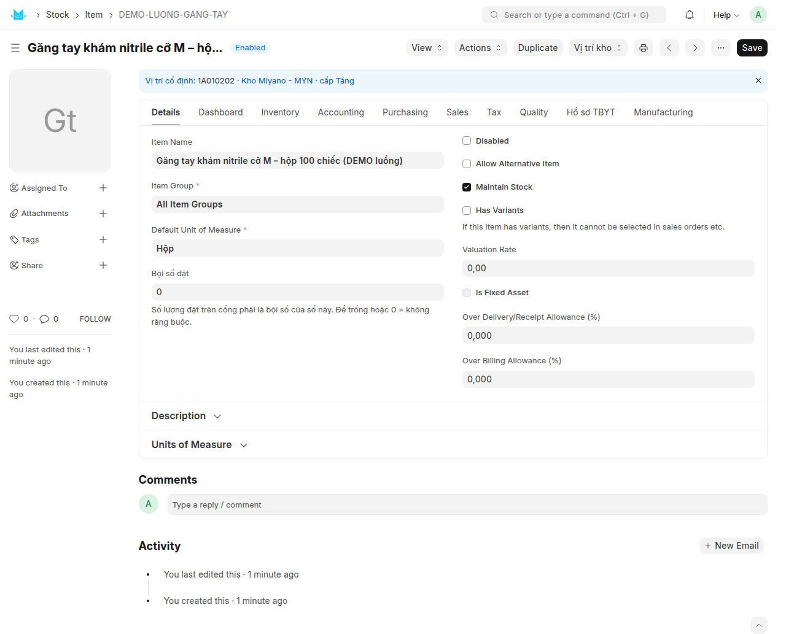

- Dòng xanh đầu form cho biết mặt hàng đang gán ở đâu. Chưa gán thì dòng đó **màu cam**: *"tem in
  ra sẽ trống ô vị trí"*.
- **Nên gán ở cấp TẦNG**, không gán một ô lẻ — hệ sẽ tự chọn ô trống trong tầng đó. Lý do đầy đủ:
  `HDSD-quan-ly-vi-tri-kho.md` mục 10.2.
- Hệ **chặn** gán chồng lấn: một nhánh đang có hàng của mặt hàng khác thì không gán được, và câu
  báo nêu đích danh ô nào đang vướng.

*Lần chạy thật: `DEMO-LUONG-GANG-TAY` gán ở tầng `1A010202`.*

---

## Bước 3 — Đơn mua và phiếu nhập kho (để nháp)

1. Lập **Purchase Order** như bình thường (`PUR-ORD-2026-00006`, 60 Hộp).
2. Từ đơn mua → **Create → Purchase Receipt**. **Chưa duyệt.**
3. **Một mặt hàng về nhiều lô thì tách thành nhiều dòng** trên phiếu nhập, mỗi dòng một lô, số
   lượng đúng theo từng lô.

*Lần chạy thật: `MAT-PRE-2026-00013` — dòng 1: 40 Hộp, dòng 2: 20 Hộp.*

---

## Bước 4 — Nhập lô (khai số lô của nhà cung cấp)

Trên phiếu nhập **còn nháp**, bấm **Nhập lô & in nhãn**.

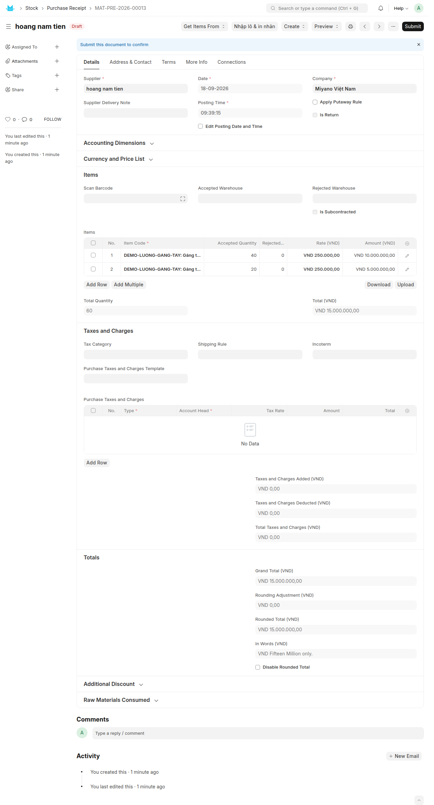

Hệ mở **Phiếu nhập lô** và **tự nạp** các dòng hàng có quản lý lô của phiếu nhập đó:

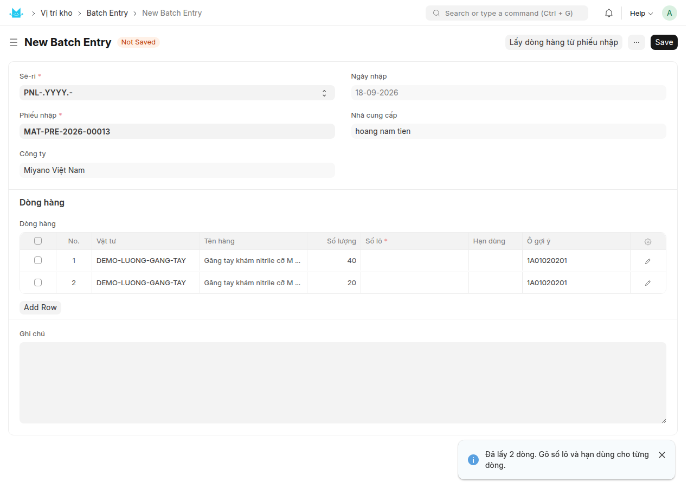

Khai cho từng dòng: **Số lô** (đúng như in trên thùng), **Hạn dùng**, **Ngày sản xuất** → **Lưu**
→ **Duyệt**.

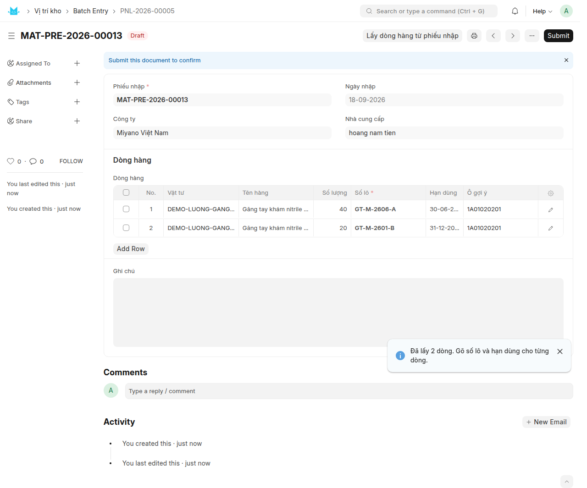

Duyệt xong, hệ:
- **tạo lô** trong ERPNext và ghi số lô ngược lại vào đúng dòng của phiếu nhập;
- sinh **số gói** (4 chữ số, in to trên nhãn) cho từng lô.

*Lần chạy thật: phiếu nhập lô `PNL-2026-00005` tạo 2 lô*

| Lô | Hạn dùng | Ngày SX | Số lượng | Số gói |
|---|---|---|---|---|
| `GT-M-2606-A` | 30/06/2027 | 01/06/2026 | 40 Hộp | 0009 |
| `GT-M-2601-B` | 31/12/2026 | 05/01/2026 | 20 Hộp | 0010 |

> **Số lô gõ sai kiểu gì thì hệ báo gì** — xem `HDSD-quan-ly-vi-tri-kho.md` mục 11.5. Ký tự tiếng
> Việt có dấu, hoặc quá dài, sẽ không mã hoá được thành mã vạch.

---

## Bước 5 — In nhãn lô (50 × 30 mm)

Trên phiếu nhập lô **đã duyệt**: **In nhãn cả phiếu**. In lại một lô lẻ: mở lô đó → **In nhãn**.

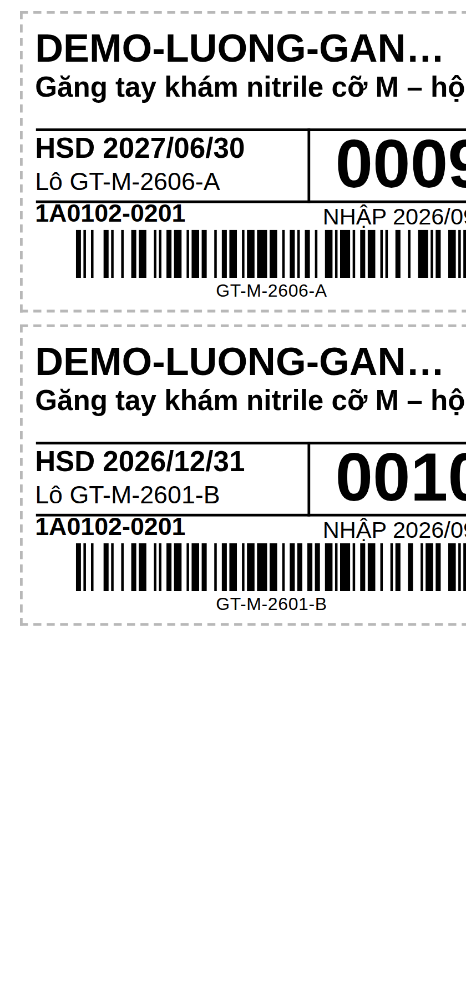

Trên nhãn: mã hàng, tên hàng, **hạn dùng**, số lô, **số gói** (số to bên phải), **ô vị trí** hệ
chốt cho lô này, ngày nhập, và **mã vạch mã hoá chính số lô** kèm dòng chữ số lô bên dưới để gõ
tay khi máy quét không đọc được.

- Ô in trên nhãn được **chốt ngay lúc in** (`1A0102-0201` trong lần chạy thật) — bước xếp hàng sau
  đó sẽ gợi ý đúng ô này.
- Trình duyệt chặn cửa sổ bật lên thì hệ báo *"Trình duyệt chặn cửa sổ in"*; cho phép pop-up rồi
  bấm lại, ô đã chốt nên tem in lần sau vẫn đúng tờ cũ.
- Máy in Zebra ZD421, khổ 50×30, 203 dpi. **Chưa ai in thử trên máy thật** — xem mục 11.8 của tài
  liệu tra cứu: phải in một con và quét thử trước khi in cả loạt.

---

## Bước 6 — Duyệt phiếu nhập kho

Quay lại phiếu nhập → **Submit**.

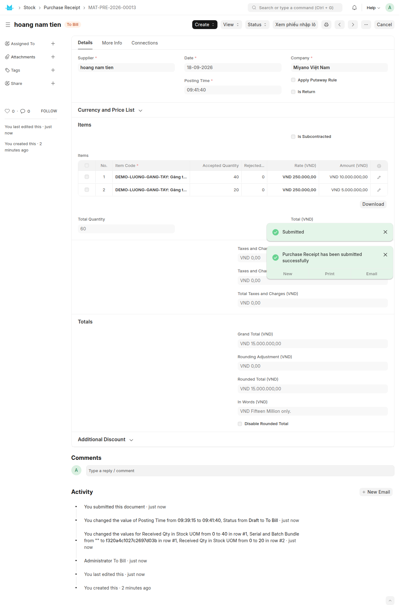

> ### ⚠ Thứ tự bắt buộc: NHẬP LÔ TRƯỚC, DUYỆT PHIẾU NHẬP SAU
> Kho đã bật quản lý vị trí sẽ **chặn duyệt** phiếu nhập có dòng hàng quản lý lô mà số lô không
> khai qua phiếu nhập lô. Câu báo chỉ đúng nút cần bấm. Lý do: duyệt trước thì số lô của nhà cung
> cấp mất, không có nhãn, và hàng không truy được.

Duyệt xong, toàn bộ hàng nằm ở **ô "Chưa xếp vị trí"** (`ZZZ-CHUA-XEP-<tên kho>`) — hàng đã vào
kho theo sổ ERPNext nhưng **chưa có chỗ trên kệ**.

*Lần chạy thật: 40 Hộp lô A + 20 Hộp lô B ở ô Chưa xếp.*

---

## Bước 7 — Xếp hàng vào ô (PDA)

Workspace **Vị trí kho** → **Xếp hàng vào ô**. Quét tem lô → quét tem ô trên kệ.

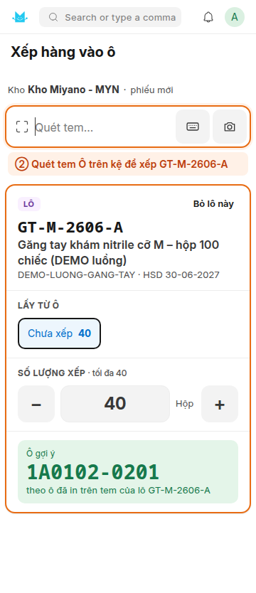

1. **Quét tem LÔ** trên thùng: hiện tên hàng, lô, hạn, số đang chờ xếp, và **ô in trên tem** —
   ô **bắt buộc** phải xếp vào (từ 19/09/2026). Lô chưa có ô trên tem thì PDA báo đỏ kèm nút
   **Đặt ô trên tem**: bấm rồi quét tem ô định để hàng là xếp tiếp được ngay (nhớ in lại tem trên
   máy tính). Cả loạt lô thiếu ô thì dùng trang **Đặt ô trên tem hàng loạt** (mục 15 tài liệu
   tra cứu).
2. **Quét tem Ô** nơi vừa đặt hàng. **Sai ô là không xếp được** — PDA rung, báo đỏ *"SAI Ô… tem
   ghi ô …"*. Không có lối vượt, kể cả trên máy tính.
3. Lặp cho thùng tiếp theo — tất cả dồn vào **một** phiếu xếp.
4. **Hoàn tất phiếu** → tồn theo ô đổi ngay.

*Lần chạy thật: phiếu xếp `XVT-2026-00008`, cả hai lô vào ô `1A01020201`.*

Chi tiết từng nút, các trường hợp ô không hợp lệ, phiếu nháp theo từng người: mục 13 của tài liệu
tra cứu. Không có PDA thì làm trên máy tính bằng **Phiếu xếp / chuyển vị trí** (mục 6.3).

---

## Bước 8 — Đơn bán

`Sales Order` như bình thường: khách hàng, mặt hàng, số lượng, **kho xuất** là kho đang quản lý vị
trí.

*Lần chạy thật: `SAL-ORD-2026-00148` — 50 Hộp.*

---

## Bước 9 — Phiếu giao: lấy hàng theo lô và theo ô

Từ đơn bán → **Create → Delivery Note**.

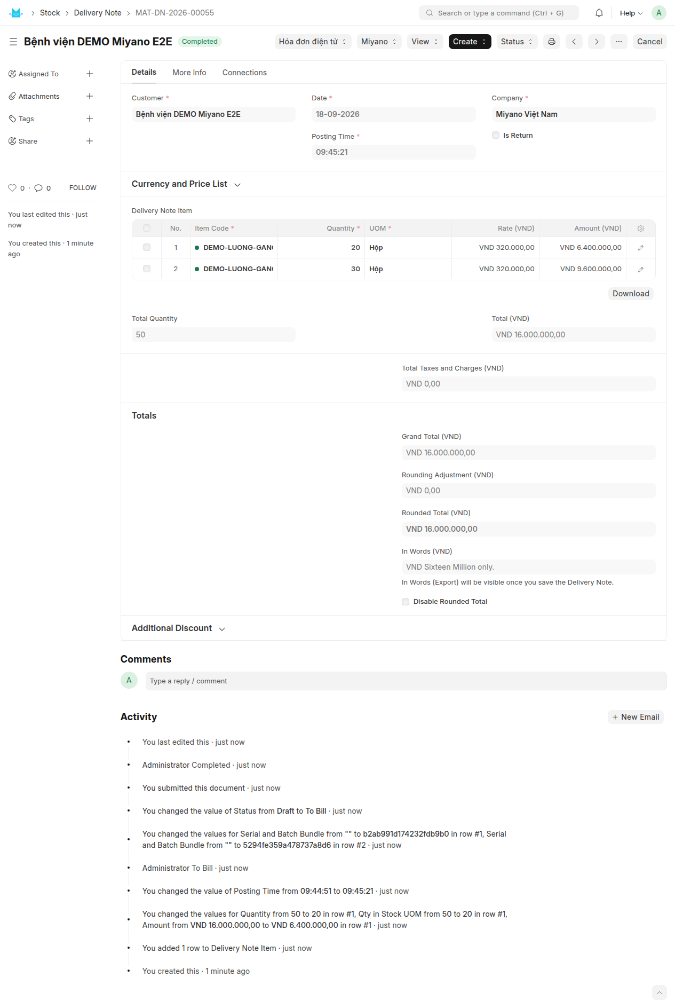

**Hai quyết định khác nhau, hai bên khác nhau quyết** — đây là chỗ dễ hiểu nhầm nhất:

| | Chọn **LÔ** nào | Trong lô đó, lấy ở **Ô** nào |
|---|---|---|
| Ai quyết | ERPNext gốc | phần vị trí của Miyano |
| Theo quy tắc | cấu hình `Stock Settings` → hiện đang để **FIFO** (lô tạo trước đi trước) | **hạn dùng gần nhất trước**, cùng hạn thì theo thứ tự lấy hàng của ô |
| Người dùng thấy ở đâu | ô **Số lô** trên từng dòng phiếu giao | **không thấy trước** — xem lại sau khi duyệt (bên dưới) |

**Việc phải làm khi lập phiếu giao:**

1. Khi lưu, hệ **tự điền một số lô** vào dòng. Kiểm lại: đó có phải lô cần xuất trước không (hạn
   gần nhất)?
2. **Một dòng chỉ mang được một lô.** Số lượng vượt quá lô đó thì **tách dòng**: mỗi lô một dòng,
   sửa số lượng cho khớp. Không tách thì lúc duyệt hệ báo *"Batch No … has negative stock"* —
   đúng lỗi gặp trong lần chạy thật khi để nguyên một dòng 50 Hộp. Từ trang **Lấy hàng** (bên
   dưới), việc tách dòng này KHÔNG cần làm tay nữa — xem mục "Lấy hàng trên PDA".
3. Không thao tác qua trang Lấy hàng thì mới cần tách dòng tay rồi **Submit thẳng trên form** —
   hệ vẫn tự trừ theo ô lúc đó (theo FEFO, mục 6.2 tài liệu *HDSD quản lý vị trí kho*).

*Lần chạy thật `MAT-DN-2026-00055`: tách dòng 1 = 20 Hộp lô `GT-M-2601-B` (hạn 31/12/2026, đi
trước), dòng 2 = 30 Hộp lô `GT-M-2606-A`. Sổ vị trí ghi −20 và −30 ở ô `1A01020201`; còn lại 10
Hộp lô A ở đúng ô đó.*

### Lấy hàng trên PDA (đường khuyến khích, từ 18/09/2026)

Thay vì lập phiếu giao rồi duyệt thẳng, **lưu phiếu giao (nháp) rồi bấm nút "Lấy hàng trên PDA"**
ở đầu form — trang **Lấy hàng** mở thẳng đúng phiếu này, không phải dò trong danh sách (vẫn vào
được theo lối cũ: ô bấm **Lấy hàng** ở trang **Vị trí kho**, rồi chọn phiếu). Trên trang, quét
xác nhận từng thùng đã lấy:

1. **① Quét tem lô** trên thùng — hệ nhận đúng dòng cần lấy của lô đó.
2. **② Quét tem ô** nơi thật sự lấy thùng xuống — lượt lấy được ghi ngay lên phiếu, tiến độ tăng.
3. Lô hết giữa chừng cần đổi sang lô khác: quét lại tem lô mới. **Trang tự tách dòng** (chốt dòng
   cũ ở số đã lấy, sinh dòng mới cho phần còn lại) — không cần tách tay như mục "Việc phải làm"
   ở trên.
4. Đủ hàng thì bấm **Hoàn tất phiếu** → xác nhận → hệ duyệt phiếu, sổ vị trí trừ **đúng các ô đã
   quét** (không phải ô hệ tự chọn theo FEFO nữa).

**Theo dõi ngay trên form phiếu giao (từ 19/09/2026):**

| Chỗ xem | Nói gì |
|---|---|
| Thanh **Lấy hàng** trên đầu form | Phiếu nháp: đã lấy xong bao nhiêu/bao nhiêu dòng, dòng chốt thiếu, dòng lấy tay (dịch vụ, bán theo đơn vị khác), ai đang lấy. Đã duyệt: trừ sổ theo ô thủ kho quét hay theo ô hệ tự chọn (FEFO). |
| Cột **Vị trí lấy** trên từng dòng hàng | Ô đã lấy × số lượng, ví dụ `1A0101-0101 ×5; 1A0101-0102 ×3` (mã in trên tem ô). Cập nhật ngay mỗi lượt quét; lúc duyệt ghi lại theo **sổ vị trí thật** — phiếu không quét trên PDA cũng có cột này (ô FEFO đã trừ). **Chưa có trên bản in** — mẫu in mặc định *Miyano - Phiếu xuất kho (02-VT)* thuộc app `miyano_portal`, chưa thêm cột này. Huỷ phiếu thì cột giữ nguyên để tra lại; bản sửa (amend) thì cột trống, chờ lấy lại. |
| Bảng **Phân bổ vị trí** dưới bảng hàng | Từng lượt quét: ô, lô, số lượng, người lấy, lúc lấy. |
| Tab **Connections → Vị trí kho → Sổ vị trí** | Sau khi duyệt: các dòng sổ vị trí của phiếu (ô nào bị trừ bao nhiêu, lô nào). |

Chi tiết từng bước, kể cả chốt thiếu và cách gỡ phân bổ khi cần duyệt thẳng trên form: xem mục
**14 "Lấy hàng (trên PDA)"** của tài liệu `HDSD-quan-ly-vi-tri-kho.md`.

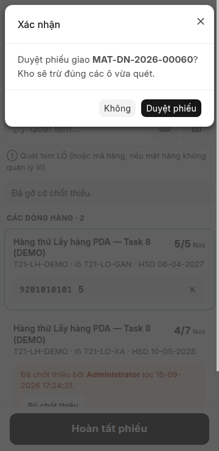

---

## Bước 10 — Hoá đơn bán

Từ phiếu giao → **Create → Sales Invoice** → duyệt. Hoá đơn lấy nguyên số lượng và lô của phiếu
giao, **không** đụng lại vào tồn kho (kho đã trừ ở bước 9).

*Lần chạy thật: `ACC-SINV-2026-00022`, tổng 16.000.000 ₫.*

---

## Kiểm lại sau một vòng

**1. Báo cáo Tồn kho theo vị trí** (`/app/query-report/Ton Kho Theo Vi Tri`) — lọc theo mặt hàng,
mở cây Khu → Dãy → Ô:

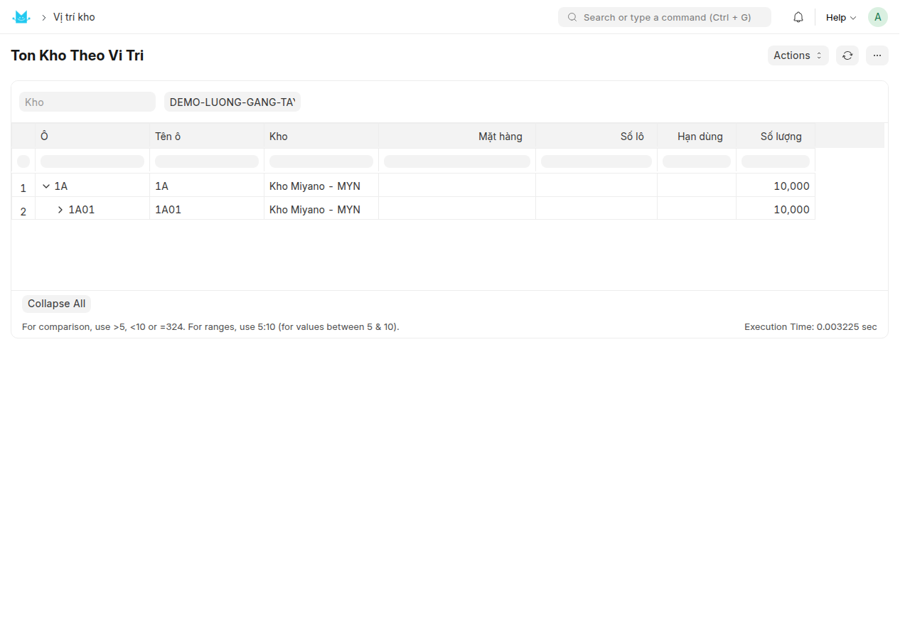

**2. Quét mã tra cứu** (workspace **Vị trí kho** → **Quét mã tra cứu**) — quét tem lô còn lại,
phải ra đúng: hạn dùng, ngày nhập, số phiếu nhập, nhà cung cấp, ô đang để, số còn lại:

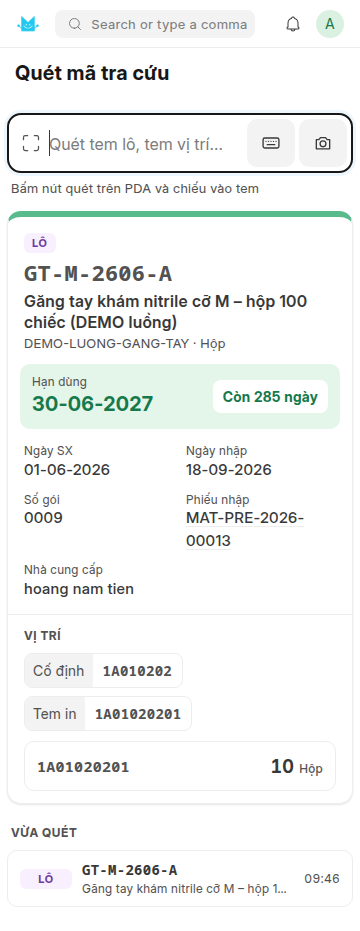

**3. Đối soát tồn vị trí** (`/app/query-report/Doi Soat Ton Vi Tri`) — phải **khớp**, 0 dòng lệch,
0 ô âm. Lần chạy thật: khớp.

**4. Huỷ ngược cả vòng** (đã làm sau khi chụp ảnh, để trả site thử về như cũ): huỷ theo thứ tự
**hoá đơn → phiếu giao → đơn bán → phiếu xếp → phiếu nhập → phiếu nhập lô → đơn mua**. Đo được:

- huỷ **phiếu giao** trả hàng về **đúng ô đã lấy** (`1A01020201`), không phải về ô Chưa xếp;
- huỷ **phiếu xếp** đẩy hàng ngược từ ô về ô Chưa xếp;
- huỷ **phiếu nhập** đưa tồn về 0; đối soát vẫn khớp, không ô nào âm.

Nếu huỷ **sai thứ tự** (ví dụ huỷ phiếu xếp khi hàng đã bán mất) thì hệ chặn vì ô sẽ âm — huỷ
từ chứng từ cuối cùng ngược lên.

---

## Bảng tóm tắt một vòng chạy thật (18/09/2026, site `erptest`)

| Bước | Chứng từ | Kết quả |
|---|---|---|
| 1–2 | mặt hàng `DEMO-LUONG-GANG-TAY` | gán tầng `1A010202` |
| 3 | `PUR-ORD-2026-00006` → `MAT-PRE-2026-00013` | 2 dòng: 40 + 20 Hộp |
| 4 | `PNL-2026-00005` | lô `GT-M-2606-A` (HSD 30/06/2027), `GT-M-2601-B` (HSD 31/12/2026) |
| 5 | — | 2 nhãn 50×30, ô in `1A0102-0201` |
| 6 | duyệt `MAT-PRE-2026-00013` | 60 Hộp ở ô Chưa xếp |
| 7 | `XVT-2026-00008` | 40 + 20 Hộp vào ô `1A01020201` |
| 8 | `SAL-ORD-2026-00148` | 50 Hộp |
| 9 | `MAT-DN-2026-00055` | 20 lô B + 30 lô A, trừ ở ô `1A01020201` |
| 10 | `ACC-SINV-2026-00022` | 16.000.000 ₫ |
| Kiểm | đối soát | khớp, còn 10 Hộp lô A ở `1A01020201` |

---

## Những chỗ còn thiếu, cần quyết

1. **`Stock Settings` → "Pick Serial / Batch Based On" đang để `FIFO`**, tức giữa hai lô **còn
   hạn**, hệ ưu tiên lô **tạo trước**, không phải lô **sắp hết hạn**. Với vật tư y tế, đây là
   quyết định của công ty: đổi sang `Expiry` thì cả hai tầng đều theo hạn dùng. Xem mục 6.2 tài
   liệu tra cứu để biết bằng chứng đo được.
2. **Ngưỡng "cận date" 90 ngày** (màu cam trên trang quét mã) là do bên thi công đặt tạm, chưa hỏi
   kho.
3. **Chưa in thử nhãn trên máy Zebra ZD421 thật** và chưa quét thử bằng máy quét của kho.
4. **Mở phân bổ ngay lúc nhập hàng** (chọn ô cho phiếu nhập thay vì bước xếp riêng) và
   **`Location Count`** (kiểm kê theo ô) — chưa làm, xem báo cáo bàn giao Task 8.

---

## Tài liệu liên quan

| File | Nội dung |
|---|---|
| `HDSD-quan-ly-vi-tri-kho.md` | tra cứu theo chủ đề: mã ô, cây vị trí, báo cáo, nhập lô, nhãn, quét mã, xếp hàng PDA |
| `BAN-GIAO-nen-tang-vi-tri-kho.md` | kỹ thuật: kiến trúc và cách bảo trì |
| `QUYET-DINH-thi-cong-khoi-C.md` | những chỗ đã tự chốt trong lúc làm và cái giá nếu chốt sai |
