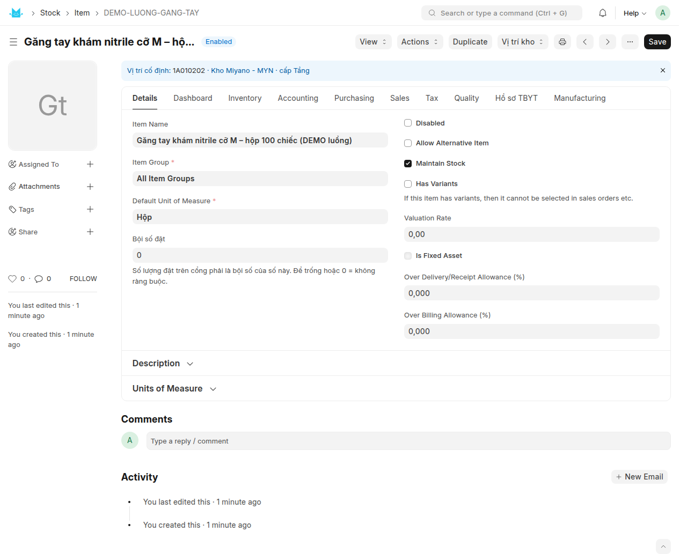

# Hướng dẫn sử dụng — Cài đặt kho, vị trí và mặt hàng (thao tác trên máy tính)

Miyano ERP · Module **Quản lý kho** · Cập nhật **25/09/2026** · Dành cho: **người triển khai và quản lý kho**

Quyển này hướng dẫn những việc **làm một lần khi mở một kho mới**: tạo kho, khai sơ đồ giá kệ, sinh mã ô hàng loạt, in tem dán kệ, bật quản lý vị trí cho kho, tạo mặt hàng và gán vị trí cố định cho mặt hàng. Làm xong quyển này thì kho đã sẵn sàng nhận hàng. Việc nhập hàng hằng ngày nằm ở quyển kia: **HDSD-may-tinh-02-nhap-hang-va-xep-len-ke.md**.

Toàn bộ quyển này thao tác trên **máy tính** (giao diện Desk). Có một đường riêng trên máy PDA cầm tay cho thủ kho, xem `HDSD-app-pda.md`.

---

## 1. Bức tranh chung

### 1.1 Quản lý vị trí là gì

ERPNext gốc chỉ biết **hàng nằm ở kho nào**. Bật quản lý vị trí thì hệ biết thêm **hàng nằm ở ô kệ nào trong kho đó**, tách tới từng lô.

Kho được chia thành **năm cấp**: Khu → Dãy → Khoang → Tầng → Ô. Mỗi Ô là một chỗ có thật trên giá kệ, có một mã riêng và một con tem dán lên kệ.

Làm xong quyển này thì bạn có:

- Một danh mục ô kệ (doctype **Storage Location**), hiện được ở dạng cây.
- Tem dán kệ cho từng ô, quét được bằng máy quét mã vạch.
- Kho đã bật quản lý vị trí: mọi phiếu nhập, phiếu xuất, phiếu kiểm kê từ nay tự ghi thêm một **sổ vị trí** ở phía sau, không phải khai tay gì thêm.
- Bốn báo cáo soi số liệu: **Tồn kho theo vị trí**, **Hàng chưa xếp vị trí**, **Đối soát tồn vị trí**, **Hàng nằm sai vị trí**.
- Mỗi mặt hàng có **vị trí cố định** của nó, để tem lô in ra mang sẵn ô và nút *Xếp hàng lên kệ* tự điền ô đến.

### 1.2 Thứ tự bắt buộc

Các bước dưới đây **không đổi thứ tự được** — máy chặn, không phải khuyến nghị.

| Thứ tự | Bước | Mục |
|---|---|---|
| 1 | Thống nhất bảng "Khu nào thuộc kho nào" cho TOÀN HỆ | 2.3 |
| 2 | Tạo kho (Warehouse), kho cụ thể chứ không phải kho tổng | 2 |
| 3 | Khai sơ đồ và sinh mã ô hàng loạt | 4 |
| 4 | In tem dán kệ | 5 |
| 5 | Bật quản lý vị trí cho kho | 6 |
| 6 | Tạo mặt hàng (bật lô, hạn dùng, đơn vị, mã vạch) | 7 |
| 7 | Gán vị trí cố định cho mặt hàng | 8 |

Ba chỗ máy chặn cứng nếu bạn làm sai thứ tự:

- Sinh ô cho một **kho tổng** (ô **Is Group Warehouse** có tích) bị từ chối: *"… là kho tổng, không chứa hàng thật nên không đặt ô kệ vào đó được. Chọn một kho cụ thể."*
- **Gán vị trí trước khi bật kho** bị từ chối: *"Dòng 1: Kho … chưa bật quản lý vị trí."* Trên màn hình còn nhẹ hơn thế: hộp chọn kho khi gán **chỉ hiện những kho đã bật**, nên kho chưa bật đơn giản là không có trong danh sách.
- **Bật kho khi chưa sinh ô nào** thì bật được, nhưng toàn bộ tồn dồn vào ô hệ thống "Chưa xếp vị trí" và không có ô thật nào để xếp ra. Sinh ô trước.

> **Vì sao:** bật quản lý vị trí không phải tích một ô vuông. Nó là một lần **chuyển đổi dữ liệu** — đọc toàn bộ tồn hiện có tách theo lô, ghi vào sổ vị trí, rồi đối soát lại. Sai thứ tự thì số liệu sai ngay từ giây đầu tiên mà không ai biết.

### 1.3 Ai làm bước nào

| Việc | Vai trò cần có |
|---|---|
| Tạo kho (Warehouse) | `System Manager` hoặc `Item Manager` (phân quyền ERPNext gốc — `Stock Manager` chỉ ĐỌC được Warehouse) |
| Sinh mã ô hàng loạt (Location Generator) | `System Manager` hoặc `Stock Manager` |
| Tạo / sửa / xoá ô trong Storage Location | `System Manager` hoặc `Stock Manager` |
| Bật, tắt, đồng bộ lại quản lý vị trí | `System Manager` hoặc `Stock Manager` |
| In tem vị trí | thêm `Stock User` |
| Xem cây vị trí, xem bốn báo cáo, xem các bản gán | thêm `Stock User` |
| Tạo / sửa mặt hàng (Item) | `System Manager` hoặc `Item Manager` |
| Gán vị trí cố định cho mặt hàng | `System Manager` hoặc `Stock Manager` |

Hai điểm dễ nhầm:

- `Stock Manager` **không** sửa được mặt hàng (trên Item chỉ có quyền đọc), nhưng **gán được vị trí** cho mặt hàng đó — vì việc gán ghi vào doctype riêng `Item Location Preference`, nơi `Stock Manager` có đủ quyền.
- Khách hàng đăng nhập cổng (`Website User`) **không vào được gì** của phần này. Mọi lệnh gọi máy chủ của module đều tự kiểm vai trò, không chỉ dựa vào phân quyền doctype.

Câu báo khi thiếu quyền chép nguyên dạng: *"Bạn không có quyền sinh mã ô."* · *"Bạn không có quyền bật thông tin chuyển đổi vị trí kho."* · *"Bạn không có quyền in tem vị trí."* · *"Bạn không có quyền xem cây vị trí."*

### 1.4 Vào ở đâu

| Màn hình | Đường dẫn |
|---|---|
| **Quản lý kho** — trang tổng hợp, vào đây trước | gõ `Quản lý kho` vào ô tìm kiếm trên thanh trên cùng |
| Warehouse — danh mục kho | `/app/warehouse` |
| Location Generator — sinh mã ô hàng loạt | `/app/location-generator` |
| Storage Location — danh mục ô, xem được dạng cây | `/app/storage-location` |
| Warehouse Location Setup — bật / tắt / đồng bộ lại | `/app/warehouse-location-setup` |
| Item — mặt hàng | `/app/item` |
| Item Location Preference — gán vị trí cố định | `/app/item-location-preference` |
| Báo cáo Tồn kho theo vị trí | `/app/query-report/Ton Kho Theo Vi Tri` |
| Báo cáo Hàng chưa xếp vị trí | `/app/query-report/Hang Chua Xep Vi Tri` |
| Báo cáo Đối soát tồn vị trí | `/app/query-report/Doi Soat Ton Vi Tri` |
| Báo cáo Hàng nằm sai vị trí | `/app/query-report/Hang Nam Sai Vi Tri` |

Trên form **Warehouse** của một kho cụ thể còn có nhóm nút **Vị trí kho** dẫn thẳng tới các màn hình trên, xem mục 2.4.

---

## 2. Tạo kho (Warehouse)

### 2.1 Các bước

1. Vào **Warehouse** (`/app/warehouse`), bấm **Add Warehouse** (hoặc **New**).
2. Điền **Warehouse Name** và **Company**.
3. **Không** tích **Is Group Warehouse**. Xem 2.2.
4. Bấm **Save**.

### 2.2 Kho tổng không chia ô được

Kho có tích **Is Group Warehouse** (kho tổng) chỉ để gom nhóm trên cây kho, nó không chứa hàng thật. Hai chỗ chặn nó, bằng cùng một câu:

> *"{tên kho} là kho tổng, không chứa hàng thật nên không bật quản lý vị trí được. Chọn một kho cụ thể."*

và khi tạo ô kệ:

> *"{tên kho} là kho tổng, không chứa hàng thật nên không đặt ô kệ vào đó được. Chọn một kho cụ thể."*

### 2.3 Không còn trường "Mã kho SPD" — và điều đó đổi cách bạn đặt ký hiệu Khu

Các tài liệu phân tích đời đầu có nói tới một trường **Mã kho SPD** trên Warehouse (`custom_ma_kho_spd`), và một mã ô **12 ký tự** có hai ký tự mã kho ở đầu. **Cả hai đã bị bỏ từ 11/09/2026.** Mã ô nay chỉ còn **10 ký tự**, không mang mã kho; trường `custom_ma_kho_spd` đã bị một patch gỡ hẳn khỏi form Warehouse. Nếu bạn đang tìm ô nhập "Mã kho SPD" trên Warehouse thì **không có** — và không cần.

Kho của một ô nay nằm ở đúng một chỗ: trường **Kho** (Link tới Warehouse) trên chính bản ghi **Storage Location**.

**Hệ quả quan trọng, phải xử lý TRƯỚC khi sinh ô:** vì mã ô không còn chứa mã kho, **Mã ô là khoá chính của toàn hệ**, không phải của riêng một kho. Hai kho khác nhau **không được** cùng dùng ký hiệu Khu `1B`. Máy có chặn, nhưng nó chỉ chặn lúc bạn sinh ô cho kho thứ hai:

> *"Không tạo được ô {mã ô}: nút nhóm {mã nhóm} đã thuộc kho {kho A}, không phải kho {kho B}. Mã ô không còn chứa mã kho (bỏ từ khi đổi chuẩn 10 ký tự) nên phải duy nhất trên TOÀN HỆ, không riêng từng kho — hai kho không được dùng trùng ký hiệu khu/dãy/khoang/tầng. Chọn một ký hiệu khu khác cho kho {kho B}."*

Việc cần làm, **ngoài phần mềm, một lần, cho tất cả các kho**: lập một bảng "Khu nào thuộc kho nào" (`1A`, `1B`, `2A`, `3B`…), mỗi ký hiệu chỉ cấp cho đúng một kho. Chốt bảng đó rồi mới sinh ô.

> **Vì sao:** phát hiện trùng ký hiệu sau khi tem đã in và dán lên kệ thì không sửa được — mã ô khoá cứng sau khi tạo, và tem cũ vẫn nằm trên kệ.

### 2.4 Nhóm nút "Vị trí kho" trên form Warehouse

Mở một kho cụ thể (không phải kho tổng), góc trên bên phải có nhóm nút **Vị trí kho**:

- Kho **chưa bật**: chỉ có một nút **Bật quản lý vị trí** — nó không bật ngay, mà mở hồ sơ **Warehouse Location Setup** của kho đó (mục 6).
- Kho **đã bật**: có **Ô kệ của kho**, **Tồn kho theo vị trí**, **Hàng chưa xếp vị trí**, **Đối soát tồn vị trí**, **Thiết lập vị trí**.

---

## 3. Đọc hiểu mã ô

### 3.1 Mã ô 10 ký tự

```
1B   01   04      03    02        →   1B01040302
khu  dãy  khoang  tầng  ô
```

| Phần | Dài | Miền giá trị |
|---|---|---|
| Khu | 2 | 1 chữ số rồi 1 chữ cái in hoa, ví dụ `1B`, `3B`, `4B` |
| Dãy | 2 | `01`–`99` |
| Khoang | 2 | `01`–`99` |
| Tầng | 2 | `01`–`09` (tối đa 9 tầng) |
| Ô | 2 | `01`–`99` |

Khu viết **SỐ trước, CHỮ sau** (`1B`, không phải `B1`).

Mã sai chuẩn bị chặn cứng khi lưu, kèm nguyên câu:

> *"Mã vị trí không đúng chuẩn: {mã bạn gõ} — Ô chứa hàng phải đúng 10 ký tự, không dấu gạch, theo thứ tự [Khu 2][Dãy 2][Khoang 2][Tầng 2][Ô 2] — ví dụ 1B01040302 (khu 1B, dãy 01, khoang 04, tầng 03, ô 02). Nút nhóm là tiền tố của mã đó: 1B / 1B01 / 1B0104 / 1B010403. Dãy, Khoang và Ô nhận 01–99; Tầng nhận 01–09."*

`00` cũng bị chặn: không có dãy 0, khoang 0, tầng 0 hay ô 0.

### 3.2 Mỗi cấp là tiền tố của cấp sau

Đây là điều làm cả hệ chạy được mà không cần bảng tra nào:

```
1B            Khu
1B01          Dãy      = mã Khu + 2 ký tự
1B0104        Khoang   = mã Dãy + 2 ký tự
1B010403      Tầng     = mã Khoang + 2 ký tự
1B01040302    Ô        = mã Tầng + 2 ký tự
```

Cắt 2 ký tự cuối là ra mã cha. Cây vị trí, việc in tem cả nhánh, và việc gán một mặt hàng cho cả một Tầng đều dựa vào đúng tính chất này.

### 3.3 Mã in trên nhãn

Ô kệ có hai dạng mã, hệ tự tính cả hai, bạn không gõ:

| Trường | Ví dụ | Dùng ở đâu |
|---|---|---|
| **Mã ô** | `1B01040302` | khoá chính, và đúng chuỗi máy quét trả về |
| **Mã in trên nhãn** | `1B0104-0302` | dạng cho người đọc bằng mắt, in trên tem |

**Mã in trên nhãn** chỉ có ở ô lá. Nút nhóm (Khu / Dãy / Khoang / Tầng) để trống ô này.

### 3.4 Các loại bản ghi vị trí

| Loại | Nhận ra bằng | Có chứa hàng không |
|---|---|---|
| **Ô lá** — chỗ thật trên kệ | mã đủ 10 ký tự, `Là nút nhóm` không tích | có |
| **Nút nhóm** — Khu, Dãy, Khoang, Tầng | mã 2/4/6/8 ký tự, `Là nút nhóm` tích sẵn | không |
| **Ô "Chưa xếp vị trí"** — ô hệ thống | mã dạng `ZZZ-CHUA-XEP-{tên kho}`, `Là ô "Chưa xếp vị trí"` tích sẵn | có, nhưng là hàng đang chờ xếp |

Cả `Là nút nhóm`, `Thuộc` (nút cha) lẫn `Là ô "Chưa xếp vị trí"` đều **chỉ đọc** — hệ tự tính từ mã mỗi lần lưu.

Ngoài ra trên form ô còn trường **Loại vị trí**, hai lựa chọn: **Lưu trữ** và **Soạn hàng**.

> **Không có "Cách ly" và "Trả hàng"** — đã bỏ, và đó là chủ ý. Không chỗ nào trong hệ đọc trường này, nên hàng để ở một ô dán nhãn "Cách ly" vẫn bị chọn ra xuất bán bình thường: một nhãn an toàn giả còn nguy hơn không có nhãn. Muốn cách ly thật (chờ QC, hàng lỗi, hàng thu hồi) thì tạo một **Kho riêng** và chuyển hàng sang đó — đó mới là ranh giới tồn kho thật.

### 3.5 Ô "Chưa xếp vị trí"

Mỗi kho bật quản lý vị trí có **đúng một** ô hệ thống tên `ZZZ-CHUA-XEP-{tên kho}`, tên hiển thị **Chưa xếp vị trí**. Nó không phải kệ thật.

- Tiền tố `ZZZ` để ô này luôn nằm cuối mọi danh sách sắp theo bảng chữ cái.
- **Thứ tự lấy hàng** của nó đặt cứng là `9999`, nghĩa là lấy sau cùng — khi hai lô cùng hạn dùng, hệ ưu tiên lấy từ ô đã xếp đàng hoàng, vì thủ kho biết đi tới đâu.
- Ô này do chức năng **bật quản lý vị trí** tạo ra. **Không tạo tay, không xoá, không tích Ngừng dùng** — cả ba đều bị chặn. Câu báo khi tích Ngừng dùng: *"Không thể vô hiệu hoá ô "Chưa xếp vị trí" {mã} của kho {kho} — đây là ô hệ thống, luôn phải hoạt động. Muốn ngừng dùng vị trí cho kho này, dùng chức năng "Tắt" ở Warehouse Location Setup."*
- Không in tem cho nó, và không gán mặt hàng vào nó được.

---

## 4. Khai sơ đồ kho và sinh mã ô hàng loạt

### 4.1 Chuẩn bị trước khi ngồi vào máy

Đi một vòng kho và ghi ra giấy, cho **từng Khu**:

- Ký hiệu Khu (đã chốt ở mục 2.3).
- **Số dãy** — 1 đến 99, đánh số tăng dần từ cửa nhập theo lối đi chính.
- **Số khoang mỗi dãy** — 1 đến 99, đếm từ đầu dãy phía lối đi chính.
- **Số tầng mỗi khoang** — 1 đến 9, **đếm từ dưới lên**.
- **Số ô mỗi tầng** — 1 đến 99, trái sang phải khi đứng đối diện kệ.

Bộ sinh tạo một **khối chữ nhật đều**: mọi dãy cùng số khoang, mọi khoang cùng số tầng, mọi tầng cùng số ô. Kho có hai loại kệ khác kích thước thì **chia thành hai Khu**, chạy bộ sinh hai lần.

### 4.2 Sinh ô

1. Vào **Location Generator** (`/app/location-generator`), bấm **New**. Hệ hỏi tên bản ghi — đặt gì cũng được, ví dụ `Khu 1B kho Miyano`.
2. Điền:

| Ô nhập | Ví dụ |
|---|---|
| **Kho** | `Kho Miyano - MYN` |
| **Khu (2 ký tự)** | `1B` |
| **Số dãy** | `4` |
| **Số khoang mỗi dãy** | `4` |
| **Số tầng mỗi khoang** | `4` |
| **Số ô mỗi tầng** | `2` |

3. Bấm **Save**. Nút sinh chỉ hiện ra sau khi bản ghi đã lưu.
4. Bấm **Xem trước rồi sinh ô**.
5. Hộp thoại hiện ra: *"Sẽ tạo **N** ô."* kèm tối đa 20 mã ví dụ, và câu cảnh báo *"**Mã ô không sửa được sau khi tạo** — tem đã in và người đã quen mã. Kiểm kỹ trước khi tạo."* Ví dụ trên là 4 × 4 × 4 × 2 = **128 ô**.
6. Đọc kỹ vài mã ví dụ. Đúng thì bấm **Yes**; sai thì bấm **No**, sửa lại thông số rồi làm lại từ bước 3.
7. Sinh xong, ô **Số ô đã tạo** trên form tự điền, và góc màn hình báo *"Đã tạo N ô."*

**Bước xem trước không ghi gì cả.** Bấm thoải mái.

> **Cảnh báo: ô "Mẫu mã sinh ra" trên form đang ghi SAI.** Trên form Location Generator, ô chỉ-đọc **Mẫu mã sinh ra** còn hiện dòng cũ `[Kho][Khu][Dãy][Khoang][Tầng][Ô] — ví dụ K11B01040302`, và phần mô tả dưới ô **Khu (2 ký tự)** còn ghi "Hai ký tự đầu của mã (mã kho) lấy tự động từ phiếu kho". Cả hai là chữ **cũ, chưa dọn** từ thời mã 12 ký tự. Mã thật sinh ra là **10 ký tự, không có phần mã kho** — như mục 3.1. Đừng chờ một tiền tố kho xuất hiện, nó không xuất hiện.

### 4.3 Được ăn cả, ngã về không

Nếu **bất kỳ** mã nào trong loạt đã tồn tại, hệ **không tạo ô nào cả**:

> *"{N} mã ô đã tồn tại nên không sinh ô nào cả. Ví dụ: {danh sách 5 mã}. Đổi khu hoặc kích thước rồi thử lại."*

Không có chuyện sinh được một nửa rồi vỡ giữa chừng để lại một kho dở dang mà không ai biết ô nào đã có.

### 4.4 Mã đã dùng thì không cấp lại

Hai điều khác nhau, đừng lẫn:

- **Máy chặn:** sửa mã ô sau khi tạo. Câu báo: *"Không sửa được mã ô của {mã} (đang đổi thành {mã mới}). Mã ô đã in lên tem dán kệ nên khoá lại sau khi tạo; cần mã khác thì tạo ô mới rồi ngừng dùng ô cũ."* Và như 4.3, sinh trùng mã bị từ chối cả loạt.
- **Quy tắc người phải giữ, máy không chặn:** dỡ một kệ đi thì **mã của nó chết theo**, đừng cấp lại cho ô khác. Lý do là vật lý chứ không phải phần mềm — tem cũ có thể còn sót đâu đó trong kho và sẽ chỉ vào chỗ sai.

Muốn bỏ một ô: mở nó trong **Storage Location**, tích **Ngừng dùng**. Tích ở một nút nhóm thì cả nhánh dưới nó coi như ngừng dùng theo.

### 4.5 Thứ tự lấy hàng

Bộ sinh tự đánh **Thứ tự lấy hàng** 1, 2, 3… theo thứ tự mã. Nếu đường đi thật trong kho khác thế, mở từng ô trong **Storage Location** và sửa lại — số nhỏ đi trước, ô gần cửa để số nhỏ.

### 4.6 Cây vị trí hiển thị thế nào

Vào **Storage Location**, chuyển sang dạng **Tree**. Cây gấp/mở theo năm cấp, đúng theo mã:

```
1B                  Khu
 └ 1B01             Dãy 01
    └ 1B0104        Khoang 04
       └ 1B010403   Tầng 03
          ├ 1B01040301   Ô 01
          └ 1B01040302   Ô 02
```

Cây **không phải dữ liệu khai tay**. Nó là hình chiếu của mã: mỗi lần bạn lưu một ô, hệ tính lại chỗ đứng của nó từ chính mã, và tự tạo các nút cha còn thiếu. Bạn không đặt được cây lệch khỏi mã.

Ô hệ thống `ZZZ-CHUA-XEP-{kho}` **đứng ngoài cây** (không có nút cha) — đúng như nó vốn là, một ô lô-gic không ứng với chỗ nào trong kho.

Một nút có thể tạm không hiện lên cây hoặc báo lỗi vì **chưa có toạ độ trong cây**. Xem bảng lỗi ở mục 10.

---

## 5. In tem ô

### 5.1 Xem trước một con tem

Mở một ô bất kỳ trong **Storage Location**, kéo tới mục **Tem vị trí**. Đó là **đúng con tem sẽ in ra**, không phải bản gần giống — form và trang in dùng chung một bộ vẽ.

Tem không phải dữ liệu mới: nó vẽ lại từ Mã ô mỗi lần mở form, không lưu gì vào cơ sở dữ liệu.

Hai trường hợp không có tem, form nói thẳng:

- Nút nhóm: *"Nút nhóm — không có kệ thật để dán tem. Tem chỉ in cho ô chứa hàng."*
- Ô hệ thống: *"Ô hệ thống — không dán tem, không cần mã vạch."*

### 5.2 In cả một nhánh

1. Vào **Storage Location**, chuyển sang dạng **Tree**.
2. Rê chuột vào nốt muốn in, bấm nút **In tem** trên nốt đó. Bấm ở Khu thì in cho mọi ô lá trong Khu; bấm ở một Khoang thì chỉ ra tem của khoang đó.
3. Hộp thoại **In tem vị trí** hiện ra: nhánh này có bao nhiêu ô, vài mã ví dụ, ô **Khổ tem**, ô **Số bản in mỗi ô**, và một khung **Xem trước** vẽ bằng ô đầu tiên của nhánh.
4. Chọn **Khổ tem**: **45 × 25 mm** (mặc định) hoặc **50 × 30 mm**.
5. **Số bản in mỗi ô** — dán hai mặt kệ thì để `2`. Tối đa 200.
6. Bấm **In**. Một cửa sổ in mở ra, mỗi tem một trang.

### 5.3 Những điều phải biết khi in

- **Đặt tỉ lệ in 100%, KHÔNG dùng "Fit to page".** Màn hình có ghi sẵn câu này. Lệch 10% trên con tem 45 mm là mã vạch chạy ra khỏi mép và máy quét đọc chập chờn ngay trên kệ.
- **Trần 500 tem một lần in** (số ô nhân số bản). Vượt thì hệ **từ chối hẳn**: *"Lần in này ra {tổng} tem ({số ô} ô × {số bản} bản), vượt trần 500. Chọn một nhánh nhỏ hơn, hoặc giảm số bản in."* Nó không in 500 tem đầu rồi lặng lẽ dừng — cắt bớt im lặng thì người in tưởng đã in đủ cả nhánh.
- Không thấy cửa sổ in hiện ra thì trình duyệt đang chặn cửa sổ bật lên. Cho phép pop-up cho địa chỉ này rồi bấm In lại.
- Ký hiệu mã vạch là **Code 128**, bề rộng module 0,25 mm (2 dot trên đầu in nhiệt 203 dpi). Tem **không in chữ dưới mã vạch** — ba nhóm số ở khối trên đã làm việc đó và làm tốt hơn.
- Mũi tên hướng xuống in cố định trên mọi tem, nghĩa là "ô của tem này nằm ngay **dưới** chỗ dán". Nó không đổi chiều theo dữ liệu được.
- **Thủ kho (`Stock User`) tự in lại được** khi tem rách, bẩn, bong — không phải nhờ quản lý. In tem không ghi gì vào dữ liệu.

> **Cần thử trước khi in hàng loạt:** khổ tem mới kiểm trên bản in ra PDF, chưa quét thử tem in từ máy in nhiệt thật. In vài tem, quét thử rồi hãy in cả kho.

---

## 6. Bật quản lý vị trí cho kho

Đây là bước nặng nhất của quyển này. Làm khi **đã sinh ô xong và tem đã dán**.

### 6.1 Xem trước rồi bật

1. Vào **Warehouse Location Setup** (`/app/warehouse-location-setup`), bấm **New**. (Hoặc trên form Warehouse, nhóm nút **Vị trí kho** → **Bật quản lý vị trí** — nó mở đúng màn này.)
2. Chọn **Kho**. Bấm **Save**. Lúc này **Trạng thái** là `Chưa bật`.
3. Bấm **Xem trước chuyển đổi**.
4. Hộp thoại hiện ra: *"Sẽ ghi **N** dòng sổ cho **M** mặt hàng, **L** lô — tất cả vào ô "Chưa xếp vị trí"."* kèm danh sách cảnh báo nếu có.
5. Đọc kỹ cảnh báo (xem 6.2). Xử lý xong mới bấm tiếp.
6. Bấm **Yes** trên hộp thoại đó. **Chính cú bấm này là BẬT.**

> **Vì sao không có nút "Bật" riêng:** cố ý, để không ai bật mà chưa xem trước. Bước xem trước **không ghi gì cả**.

### 6.2 Hai cảnh báo có thể gặp ở bước xem trước

| Cảnh báo | Nghĩa là gì | Phải làm gì |
|---|---|---|
| *"{N} dòng là hàng không quản lý lô — sẽ vào ô "Chưa xếp vị trí" không kèm số lô."* | mặt hàng không bật `Has Batch No`, sổ vị trí ghi được số lượng nhưng không có chiều lô | thường là bình thường, cứ bật; nếu mặt hàng đó ĐÁNG LẼ phải quản lý lô thì dừng lại, sửa mặt hàng trước (mục 7) |
| *"{N} dòng đang có tồn ÂM. BẬT SẼ THẤT BẠI nếu không xử lý tồn âm trước…"* | có (mặt hàng, lô) đang âm trong kho | **phải xử lý tồn âm trước.** Đây không phải lời khuyên — bước đối soát cuối sẽ chặn và huỷ sạch |

### 6.3 Điều gì xảy ra với tồn hiện có

Khi bạn xác nhận, hệ làm một mạch trong **một giao dịch duy nhất**:

1. Tạo ô hệ thống `ZZZ-CHUA-XEP-{kho}`.
2. Đọc **toàn bộ tồn hiện có của kho, tách theo từng lô**.
3. Ghi mỗi dòng đó thành một bút toán sổ vị trí vào ô "Chưa xếp vị trí".
4. Dựng lại bảng tồn theo vị trí.
5. **Đối soát**: so tồn vị trí với tồn kho ERPNext, kiểm không có ô âm, kiểm bộ đệm không trôi khỏi sổ.
6. Chỉ khi cả ba phép đo sạch, hệ mới bật cờ **Quản lý theo vị trí** trên kho và ghi **Trạng thái** = `Đang bật`.

Nếu bước 5 lệch, **toàn bộ bị huỷ sạch** và kho quay về đúng như trước khi bấm:

> *"Bật quản lý vị trí thất bại: {mô tả lệch}. Kho được giữ nguyên như trước."*

Không có trạng thái bật nửa vời.

Điểm quan trọng cho người vận hành: **tồn cũ không tự về đúng ô**. Hệ không biết hàng đang nằm đâu, nên nó dồn tất cả vào một chỗ và để lại cho bạn một danh sách việc. Từ đây, cứ ra kho xếp hàng vào ô thật và ghi nhận bằng phiếu xếp (quyển 2).

### 6.4 Kiểm ngay sau khi bật

Làm đủ bốn việc này, ngay trong ngày:

1. Mở **Đối soát tồn vị trí**, chọn kho. **Rỗng nghĩa là khớp.** Có dòng nghĩa là sổ vị trí đã lệch khỏi sổ kho ERPNext và phải xử lý trước khi tin bất kỳ con số nào khác. Cột **Loại lệch** cho biết là lệch tổng, ô âm, hay bộ đệm trôi khỏi sổ.
2. Mở **Hàng chưa xếp vị trí**, chọn kho. Lúc này nó liệt kê **toàn bộ tồn** của kho, vì mọi thứ vừa dồn vào ô "Chưa xếp vị trí". Đó chính là danh sách việc phải xếp.
3. Mở **Tồn kho theo vị trí**, chọn kho. Báo cáo này ở dạng cây, cộng dồn lên từng cấp Khu / Dãy / Khoang / Tầng. Ngay sau khi bật, toàn bộ số nằm ở dòng `ZZZ-CHUA-XEP-{kho}` đứng riêng ở gốc.
4. Mở **Hàng nằm sai vị trí**, chọn kho. **Rỗng là trạng thái đúng.** Ngay sau khi bật thì nó rỗng vì chưa gán vị trí cho mặt hàng nào; báo cáo này thành hữu dụng sau mục 8.


Trên hồ sơ **Warehouse Location Setup**, mục **Kết quả lần chuyển đổi gần nhất** ghi lại: **Số dòng đã ghi**, **Số lô**, **Đối soát lần cuối**, **Kết quả đối soát** (`Khớp`).

### 6.5 Tắt và bật lại

Kho đang bật thì trên **Warehouse Location Setup** có hai nút: **Tắt quản lý vị trí** và **Đồng bộ lại**.

**Tắt** ngừng ghi sổ vị trí. Sổ cũ **giữ nguyên, không xoá dòng nào**. Trạng thái thành `Đã tắt`.

> **Cái bẫy của việc tắt:** trong lúc tắt, kho **vẫn xuất nhập bình thường** — hệ chỉ không ghi sổ vị trí nữa. Nên tồn kho ERPNext đi tiếp trong khi tồn vị trí đứng yên. Hai bên lệch nhau, và không có gì báo.

Vì vậy **không bật thẳng lại được**. Bấm lại sẽ ăn câu:

> *"Kho {kho} từng bật rồi tắt. Trong lúc tắt kho vẫn xuất nhập nên tồn theo vị trí đã lệch — phải chạy "Đồng bộ lại" trước, không bật thẳng được."*

**Đồng bộ lại** là đường đúng: nó so tồn vị trí với tồn kho, phần chênh **ghi bù** vào ô "Chưa xếp vị trí" (ghi thêm bút toán, không sửa và không xoá dòng cũ), rồi đối soát lại và bật cờ. Dùng cho hai tình huống: bật lại sau khi tắt, và khi đối soát báo lệch mà chưa rõ nguyên nhân.

Đồng bộ lại **không sửa được mọi thứ**. Nó chỉ chữa được phần lệch tổng; ô âm và bộ đệm trôi khỏi sổ thì không:

> *"Đồng bộ lại đã ghi bù xong phần chênh tổng, nhưng vẫn còn: {mô tả}. Bút toán bù vào "Chưa xếp vị trí" KHÔNG sửa được ô âm hay bộ đệm trôi khỏi sổ — cần kiểm tra dữ liệu trực tiếp (vd. Dựng lại tồn vị trí) trước khi thử lại."*

Gặp câu này thì gọi người quản trị hệ thống, đừng bấm lại nhiều lần.

Và **Đồng bộ lại** chỉ dùng cho kho **đã từng bật**:

> *"Kho {kho} chưa từng bật quản lý vị trí. Chạy chức năng "Bật" trước, "Đồng bộ lại" chỉ dùng cho kho đã từng bật."*

---

## 7. Tạo mặt hàng phục vụ kho

Phần này là **ERPNext gốc**, không có trường riêng của module vị trí, trừ một trường tem sẽ nói ở 7.4. Nhưng khai thiếu ở đây thì luồng nhập lô ở quyển 2 không chạy được, nên phải làm cho đúng.

### 7.1 Các bước

1. Vào **Item** (`/app/item`), bấm **Add Item** (hoặc **New**).
2. Điền **Item Code**, **Item Name**, **Item Group**.
3. **Default Unit of Measure** — đơn vị tồn kho, xem 7.3.
4. Giữ **Maintain Stock** được tích. Mặt hàng không tích ô này thì không có tồn kho, nên cũng không có vị trí.
5. Khai lô và hạn dùng, xem 7.2.
6. Khai đơn vị quy đổi và mã vạch, xem 7.3.
7. Bấm **Save**.

### 7.2 Lô và hạn dùng

Trên tab **Inventory**:

| Ô | Nên đặt thế nào | Vì sao |
|---|---|---|
| **Has Batch No** | **tích**, với mọi vật tư y tế có số lô | không tích thì không có lô, không in được nhãn lô, quyển 2 không có gì để khai |
| **Automatically Create New Batch** | **KHÔNG tích** — quy ước của Miyano, máy KHÔNG chặn nếu bạn tích | phải gõ số lô theo đúng nhãn của nhà sản xuất; để hệ tự đẻ số lô là mất chiều truy vết |
| **Batch Number Series** | để trống | chỉ dùng khi tích ô tự sinh lô ở trên |
| **Has Expiry Date** | **tích**, với hàng có hạn dùng | đây là thứ làm quy tắc xuất theo hạn dùng gần nhất chạy được |
| **Shelf Life In Days** | điền nếu nhà cung cấp cho tuổi thọ tính từ ngày sản xuất | hệ suy hạn dùng khi khai lô |
| **Has Serial No** | không tích, trừ khi thật sự quản lý theo số máy | số sê-ri là luồng khác |

> **Vì sao không cho hệ tự sinh số lô:** số lô là thứ in trên hộp của nhà sản xuất và là căn cứ thu hồi. Một số lô do hệ đẻ ra không tra ngược được về lô thật của nhà cung cấp.

Ba ô **Automatically Create New Batch**, **Has Expiry Date**, **Batch Number Series** chỉ hiện ra sau khi bạn tích **Has Batch No**.

### 7.3 Đơn vị, quy đổi và mã vạch

- **Default Unit of Measure** là đơn vị **tồn kho** — mọi con số tồn, mọi dòng sổ vị trí đều tính theo đơn vị này. Chọn đơn vị nhỏ nhất mà kho thật sự đếm (ví dụ `Hộp`, không phải `Thùng`), rồi khai thùng như một đơn vị quy đổi.
- Mục **Units of Measure**, bảng **UOMs**: mỗi dòng gồm **UOM** và **Conversion Factor** (một đơn vị đó bằng bao nhiêu đơn vị tồn kho). Ví dụ `Thùng` = `20`. Cần cho việc chọn đơn vị lúc lấy hàng và in tem kiện.
- Bảng **Barcodes**: mỗi dòng gồm **Barcode**, **Barcode Type** và **UOM**. Dán mã vạch của nhà sản xuất vào đây để quét tra cứu ra đúng mặt hàng. Đây là mã vạch **của mặt hàng**, khác hẳn mã vạch **của ô kệ** (mục 5) và mã vạch **của lô** (quyển 2).

### 7.4 Thông số in trên tem

Module thêm một trường vào Item: **Thông số in trên tem** (`custom_thong_so_tem`), nằm ngay sau **Description**. Đây là ô F4 của nhãn lô, ví dụ `7Fr - Loop 10cm - HD 200cm`. **Tối đa 60 ký tự** — dài hơn thì chữ bị cắt trên giấy mà không có lỗi nào báo.

> **Vì sao đặt trên Item chứ không trên lô:** thông số phân biệt mặt hàng là thuộc tính của mặt hàng, không phải của lô. Đặt trên lô là bắt thủ kho gõ lại cùng một chuỗi cho từng lô, rồi gõ lệch nhau — và hai thùng cùng một mặt hàng mang hai nhãn nói khác nhau.

### 7.5 Số lô sẽ bị chặn nếu có dấu tiếng Việt

Không phải việc bạn làm lúc tạo mặt hàng, nhưng nên biết trước để dặn thủ kho. Mã vạch Code 128 không mã hoá được ký tự ngoài ASCII, nên mọi đường tạo lô đều bị chặn nếu số lô có dấu tiếng Việt hoặc dấu gạch ngang dài. Câu báo nêu đích danh ký tự và vị trí, và dặn thẳng: *"ĐỪNG xoá bớt ký tự: số lô cắt bớt là số lô sai dán lên hàng."* Số lô có chữ thì **tối đa 13 ký tự**. Chi tiết ở quyển 2.

---

## 8. Gán vị trí cố định cho mặt hàng

**Điều kiện cần:** kho đã bật quản lý vị trí (mục 6), và ô kệ đã sinh xong (mục 4).

### 8.1 Gán từ form mặt hàng (đường nên dùng)

1. Mở mặt hàng trong **Item**.
2. Nhìn dòng thông báo ngay dưới thanh tiêu đề. Chưa gán thì nó màu cam: *"Mặt hàng này chưa gán vị trí cố định — tem in ra sẽ trống ô vị trí."* Đã gán thì nó màu xanh: *"Vị trí cố định: {mã} (cấp, kho) · xem bản gán"*.
3. Bấm nhóm nút **Vị trí kho** → **Gán vị trí**.
4. Hộp thoại **Vị trí cố định cho {tên mặt hàng}** mở ra, hiện bảng các vị trí đang có: số thứ tự, **Vị trí**, **Cấp**, **Kho**, và ba nút mỗi dòng để đẩy lên, đẩy xuống, hoặc bỏ dòng.
5. Bấm **Thêm vị trí**. Hộp thoại nhỏ hỏi **Kho** — **chỉ hiện kho đã bật quản lý vị trí**.
6. Bấm **Chọn trên cây vị trí**. Cây vị trí của kho đó mở ra.
7. Mở tới nốt muốn gán rồi bấm **Chọn vị trí này** trên nốt đó. Chọn được **nút ở bất kỳ cấp nào**: một Ô lá, cả một Tầng, cả một Khoang, cả một Dãy.
8. Lặp lại bước 5–7 cho các vị trí khác nếu cần.
9. Bấm **Lưu**. Góc màn hình báo *"Đã lưu N vị trí."*



Đường thứ hai, cho người quen: vào thẳng **Item Location Preference** (`/app/item-location-preference`), **New**, chọn **Mặt hàng**, rồi thêm dòng vào bảng **Vị trí gán** — gõ tay mã vị trí, hoặc bấm nút **Thêm vị trí từ cây**. Hai đường cùng đi qua một bộ kiểm tra, không đường nào lỏng hơn đường nào.

### 8.2 Nên gán ở cấp Tầng, đừng gán một Ô lẻ

Gán ở **Tầng** hoặc **Khoang** là cách dùng chính. Gán đúng một **Ô lẻ** là cách nên tránh.

> **Vì sao:** ô đã gán mà đầy thì lần nhập sau không còn chỗ, hệ báo *"vùng {mã} đã đầy: 1/1 ô đang chứa hàng khác"*. Gán cả một Tầng thì hệ có nhiều ô để chọn.

### 8.3 Một mặt hàng gán được NHIỀU vị trí

Từ **22/09/2026**, một mặt hàng giữ được nhiều vị trí cùng lúc — một ô ở dãy này, cả một tầng ở dãy kia, thậm chí ở **kho khác**. Bảng **Vị trí gán** có bao nhiêu dòng cũng được.

**Khi đó hệ gợi ý ô nào lúc xếp hàng?** Đây là chỗ hay hiểu nhầm nhất. Hệ xét theo đúng thứ tự sau, và **chỉ xét trong phạm vi các dòng gán thuộc ĐÚNG cái kho đang nhập hàng**:

| Bước | Hệ chọn | Lý do hiện trên phiếu |
|---|---|---|
| 1 | Ô đã in trên tem của lô, nếu lô đó đã có tem và ô đó còn xếp được | *"theo ô đã in trên tem của lô {số lô}"* |
| 2 | **Ô TRỐNG đầu tiên**, xét HẾT mọi dòng gán rồi mới tính | *"ô trống đầu tiên trong {mã vị trí}"* |
| 3 | Nếu không còn ô trống ở bất kỳ dòng nào: ô đang chứa **chính mặt hàng này** | *"dồn vào ô đang có hàng cùng mặt hàng"* |
| 4 | Không còn gì: không gợi ý | *"các vị trí đã gán ({danh sách}) đã đầy: N/N ô đang chứa hàng khác"* |

Ba điều rút ra:

- **Ô trống được ưu tiên trước, bất kể nó thuộc dòng gán nào.** Hệ **không** lấp đầy dòng 1 rồi mới sang dòng 2.
- **Thứ tự các dòng chỉ dùng để phân định** khi có nhiều ô trống cùng lúc — lúc đó ô thuộc dòng đứng trên được chọn. Vì vậy đừng gọi dòng đầu là vị trí "chính"; nó chỉ là dòng được hỏi trước khi hoà.
- Trong cùng một dòng gán, ô được chọn theo **thứ tự trên cây** (tức theo mã, từ nhỏ đến lớn).

Các ô sau **không bao giờ được gợi ý**: nút nhóm, ô "Chưa xếp vị trí", và ô nằm dưới một nhánh đang **Ngừng dùng**.

### 8.4 Những trường hợp bị chặn khi gán

Mỗi câu báo có tiền tố `Dòng N:` để bạn sửa đúng dòng, không phải đoán.

| Trường hợp | Câu báo | Cách xử lý |
|---|---|---|
| Kho của nút chưa bật quản lý vị trí | *"Dòng N: Kho {kho} chưa bật quản lý vị trí."* | làm mục 6 cho kho đó trước |
| Gán trùng đúng nút mà mặt hàng khác đang giữ | *"Dòng N: Vị trí {mã} đã được gán cho mặt hàng {mã hàng}. Mỗi ô chỉ thuộc về một mặt hàng."* | chọn nhánh khác |
| Gán vào **con cháu** của một nhánh đã có chủ | *"Dòng N: Vị trí {mã} nằm trong nhánh {mã cha} đã được gán cho mặt hàng {mã hàng}…"* | chọn nhánh khác |
| Gán vào **tổ tiên** của một nhánh đã có chủ | *"Dòng N: Vị trí {mã} bao trùm {mã con} đã được gán cho mặt hàng {mã hàng}…"* | gỡ gán con trước, hoặc chọn nhánh khác |
| Trong nhánh **đang có hàng của mặt hàng khác** | *"Dòng N: Trong nhánh {mã} đang có hàng của mặt hàng khác: …"* kèm tối đa 3 ô mẫu và *" … và N ô nữa"* | dọn hàng khỏi nhánh đó, hoặc chọn nhánh khác |
| Gán vào ô hệ thống | *"Dòng N: {mã} là ô hệ thống (hàng chờ xếp), không phải kệ thật — không gán mặt hàng vào đó được. Chọn một ô hoặc tầng trên cây vị trí."* | chọn ô thật |
| Nút hoặc tổ tiên của nó đang Ngừng dùng | *"Dòng N: Vị trí {mã} đang ngừng dùng (do chính nó hoặc do {mã} ở trên nó). Gợi ý sẽ trỏ vào chỗ không ai được đụng tới. Bật lại rồi gán."* | bật lại nhánh, hoặc chọn chỗ khác |
| Hai dòng của **cùng một bản gán** lồng nhau | *"Dòng N ({mã}) trùng hoặc lồng với dòng M ({mã}) — mỗi nhánh chỉ gán một lần. Bỏ một trong hai dòng."* | bỏ một dòng |
| Nút chưa có toạ độ trong cây | *"Dòng N: Vị trí {mã} chưa có toạ độ trong cây vị trí nên chưa gán được. Mở vị trí đó và lưu lại để cây tính lại toạ độ, hoặc chạy `bench migrate`, rồi thử lại."* | xem mục 10 |
| Bản gán không có dòng nào | *"Bản gán phải có ít nhất một vị trí."* · trên hộp thoại: *"Cần ít nhất một vị trí."* | thêm ít nhất một dòng |

Cây vị trí **báo trước ba trong số đó** để bạn không bấm rồi mới ăn lỗi: nốt đã có chủ, nốt có gán bên trong, và nốt đang ngừng dùng đều **không dựng nút "Chọn vị trí này"**, kèm nhãn nói rõ lý do.

### 8.5 Báo cáo Hàng nằm sai vị trí

Phép kiểm ở 8.4 **chỉ chặn lúc gán**. Sau đó hàng vẫn vào sai ô được — qua phiếu xếp khai tay, qua đường huỷ chứng từ, qua kiểm kê. Thứ soi việc đó là báo cáo **Hàng nằm sai vị trí**.

- Mở `/app/query-report/Hang Nam Sai Vi Tri`, lọc theo kho.
- Các cột: **Ô**, **Mã trên nhãn**, **Mặt hàng đang nằm**, **Số lô**, **Số lượng**, **Đã gán cho**, **Nút gán**.
- **Rỗng là trạng thái đúng.** Có dòng nghĩa là ô đó đang chứa hàng khác với mặt hàng đã gán cho nhánh của nó.

> **Vì sao phải có báo cáo riêng:** báo cáo **Đối soát tồn vị trí** KHÔNG bắt được việc này. Nó chỉ so **tổng** tồn vị trí với tồn kho ERPNext, nên một ô chứa nhầm mặt hàng vẫn khớp tuyệt đối. Đặt lịch xem báo cáo này hằng tuần.

### 8.6 Đổi mã mặt hàng

Đổi mã một mặt hàng (rename) thì bản gán tự đổi theo, không mất. Gộp hai mặt hàng thì bản gán của **mã đích** được giữ.

---

## 9. Vì sao phải gán vị trí TRƯỚC khi nhập hàng

Đây là dây chuyền dễ hỏng nhất của cả hệ. Ba mắt xích:

```
Gán vị trí cố định cho mặt hàng
        ↓  (hệ gợi ý ô, điền vào ô F8 của nhãn lô)
Tem lô in ra MANG SẴN mã ô
        ↓  (nút "Xếp hàng lên kệ" đọc ô đã in trên tem)
Phiếu xếp TỰ ĐIỀN ô đến
```

**Bỏ mắt xích đầu thì hai mắt xích sau không có gì để chạy:**

- Lúc khai lô, ô gợi ý để trống với lý do *"mặt hàng chưa gán vị trí cố định"*. Nhãn lô vẫn in ra được, nhưng ô vị trí trên nhãn là dấu `VT —`.
- Lúc xếp hàng, dòng hàng đó **bị bỏ qua vì thiếu ô đến**, và thủ kho phải tự khai ô bằng tay.

Và từ **19/09/2026** có thêm một luật cứng: **ô ghi trên tem là ô BẮT BUỘC phải xếp vào.** Chủ đầu tư chốt: "vị trí phải bằng đúng trên tem, nếu không sẽ không cho xếp hàng vào vị trí". Áp dụng cho mọi lần xếp và chuyển, kể cả trên máy tính, không ai được vượt. Tem không có ô, hoặc ô trên tem hỏng, thì phải **in lại tem**.

> **Vì sao nghiêm đến thế:** tem dán trên thùng là thứ người đi lấy hàng đọc. Sổ vị trí nói một ô, tem nói một ô khác, thì một trong hai đang nói dối — và tổng tồn vẫn khớp nên đối soát không bao giờ bắt được.

Kết luận thực hành: **gán vị trí cho mặt hàng xong rồi mới tạo phiếu nhập cho mặt hàng đó.** Việc gán mất chưa tới một phút; chữa hậu quả của việc quên gán tốn cả buổi đi dán lại tem.

Hai lối chữa trên máy tính khi lỡ quên (nút **Lấy hàng chưa xếp** trên phiếu xếp, và trang **Đặt ô trên tem hàng loạt**) nằm ở **quyển 2, mục xếp hàng**.

---

## 10. Lỗi thường gặp

| Thông báo | Khi nào gặp | Cách xử lý |
|---|---|---|
| *"Mã vị trí không đúng chuẩn: … Ô chứa hàng phải đúng 10 ký tự…"* | gõ tay mã ô sai dạng, hoặc Khu sai (phải là 1 số + 1 chữ hoa) | gõ lại đúng dạng `1B01040302`; Tầng chỉ nhận `01`–`09` |
| *"{N} mã ô đã tồn tại nên không sinh ô nào cả…"* | bấm sinh ô mà Khu này đã sinh rồi | đổi ký hiệu Khu, hoặc giảm kích thước; kiểm lại bảng phân bổ Khu ↔ Kho |
| *"Không tạo được ô …: nút nhóm … đã thuộc kho …, không phải kho …"* | hai kho dùng trùng ký hiệu Khu | chọn ký hiệu Khu khác cho kho mới (mục 2.3) |
| *"Không sửa được mã ô của … Mã ô đã in lên tem dán kệ nên khoá lại sau khi tạo…"* | sửa trường Mã ô của một ô đã lưu | tạo ô mới rồi tích **Ngừng dùng** ô cũ |
| *"… là kho tổng, không chứa hàng thật nên không bật quản lý vị trí được."* | chọn nhầm kho tổng | chọn một kho cụ thể (bỏ tích **Is Group Warehouse**) |
| *"Kho … đã bật quản lý vị trí rồi."* | bấm bật lần hai | không phải lỗi, kho đã bật |
| *"Kho … từng bật rồi tắt… phải chạy "Đồng bộ lại" trước, không bật thẳng được."* | bật lại một kho từng tắt | bấm **Đồng bộ lại** (mục 6.5) |
| *"Kho … chưa từng bật quản lý vị trí. Chạy chức năng "Bật" trước…"* | bấm Đồng bộ lại trên kho mới | bấm xem trước rồi bật như mục 6.1 |
| *"Bật quản lý vị trí thất bại: … Kho được giữ nguyên như trước."* | có tồn âm, ô âm, hoặc dữ liệu lệch | xử lý tồn âm rồi bật lại; lệch không rõ nguyên nhân thì gọi quản trị hệ thống |
| *"Đồng bộ lại đã ghi bù xong phần chênh tổng, nhưng vẫn còn: …"* | kho có ô âm hoặc bộ đệm trôi khỏi sổ | không tự chữa được bằng nút này; gọi quản trị hệ thống |
| *"Kho … bật quản lý vị trí nhưng chưa có ô "Chưa xếp vị trí"."* | ô hệ thống bị xoá mất | chạy lại chức năng bật cho kho đó |
| *"Không thể vô hiệu hoá ô "Chưa xếp vị trí" …"* | tích Ngừng dùng lên ô hệ thống | bỏ tích; muốn ngừng dùng vị trí cho kho thì dùng nút **Tắt** |
| *"Vị trí … chưa nằm trong cây vị trí (chưa có toạ độ trong cây) nên không in tem theo nhánh được."* | in tem cho một nhánh mà nút đó chưa có toạ độ | mở ô đó, bấm **Save** một lần; hoặc nhờ quản trị chạy `bench migrate` |
| *"Dòng N: Vị trí … chưa có toạ độ trong cây vị trí nên chưa gán được."* | cùng nguyên nhân, gặp lúc gán | như trên |
| nốt vị trí **không hiện lên** cây chọn vị trí | cùng nguyên nhân: cây lọc bỏ nút chưa có toạ độ | như trên |
| chạy `bench migrate` rồi cây vẫn không dựng | hệ **bỏ qua** việc dựng cây nếu còn bản ghi Storage Location nào đang **Ngừng dùng** | rà lại danh sách ô đang Ngừng dùng, bật lại những ô không cố ý tắt, rồi migrate lần nữa; cần dựng ngay thì nhờ quản trị chạy lệnh dựng cây tay |
| *"Lần in này ra … tem …, vượt trần 500."* | in cả một Khu lớn, hoặc số bản in quá nhiều | chọn nhánh nhỏ hơn, chia làm nhiều đợt |
| *"Nhánh … không có ô lá nào."* | bấm In tem ở một nốt chỉ có nút nhóm bên dưới | bấm ở nốt có ô lá; nút nhóm và ô hệ thống không có kệ để dán |
| không thấy cửa sổ in | trình duyệt chặn pop-up | cho phép pop-up cho địa chỉ này rồi bấm In lại |
| *"Dòng N: Kho … chưa bật quản lý vị trí."* | gán vị trí trước khi bật kho | làm mục 6 trước |
| *"Dòng N: Vị trí … đã được gán cho mặt hàng …"* (và hai biến thể "nằm trong nhánh", "bao trùm") | nhánh chồng lên nhánh của mặt hàng khác | chọn nhánh khác, hoặc gỡ gán cũ trước |
| *"Dòng N: Trong nhánh … đang có hàng của mặt hàng khác: …"* | nhánh định gán đang chứa hàng khác | dọn hàng khỏi nhánh, hoặc chọn nhánh khác |
| *"Dòng N ( … ) trùng hoặc lồng với dòng M ( … ) — mỗi nhánh chỉ gán một lần."* | hai dòng trong cùng bản gán lồng nhau | bỏ một dòng |
| *"Bạn không có quyền sinh mã ô."* / *"… bật thông tin chuyển đổi vị trí kho."* / *"… in tem vị trí."* / *"… xem cây vị trí."* | thiếu vai trò | xem bảng ở mục 1.3, nhờ quản trị cấp vai trò |
| *"Số lô '…' có ký tự '…' (U+…) ở vị trí … — mã vạch Code 128 không mã hoá được ký tự này…"* | số lô có dấu tiếng Việt hoặc dấu gạch ngang dài | gõ lại không dấu, dùng dấu trừ `-` thường; **đừng** xoá bớt ký tự |
| *"Số lô '…' quá dài (… ký tự) nên không in được mã vạch trên tem. Tối đa 13 ký tự nếu có chữ."* | số lô quá dài | xem lại số lô thật trên hộp; nếu đúng là dài thế thì báo lại chủ đầu tư |

---

## 11. Phụ lục A — Bảng trường

### A.1 Warehouse — trường module thêm vào

| Trường | Nhãn trên màn hình | Kiểu | Ghi chú |
|---|---|---|---|
| `custom_quan_ly_vi_tri` | Quản lý theo vị trí | Check | **Chỉ đọc.** Chỉ đặt qua Warehouse Location Setup. Không sửa tay |

Trường `custom_ma_kho_spd` (Mã kho SPD) **đã bị gỡ** khỏi Warehouse, xem mục 2.3.

### A.2 Storage Location — ô kệ

| Trường | Nhãn trên màn hình | Kiểu | Bắt buộc | Chỉ đọc |
|---|---|---|---|---|
| `ma_o` | Mã ô | Data | có | không, nhưng khoá sau khi tạo |
| `ma_in_nhan` | Mã in trên nhãn | Data | không | có |
| `ten_o` | Tên mô tả | Data | không | không |
| `kho` | Kho | Link Warehouse | có | không |
| `is_group` | Là nút nhóm | Check | không | có |
| `parent_storage_location` | Thuộc | Link Storage Location | không | có |
| `loai_vi_tri` | Loại vị trí | Select: Lưu trữ / Soạn hàng | có | không |
| `disabled` | Ngừng dùng | Check | không | không |
| `xem_ma_vach` | Xem trước tem | HTML | không | có |
| `khu` `day` `khoang` `tang` `o` | Khu (2) / Dãy (2) / Khoang (2) / Tầng (2) / Ô (2) | Data | không | có |
| `barcode` | Mã vạch | Data | không | không, để trống thì lấy bằng Mã ô |
| `thu_tu_lay_hang` | Thứ tự lấy hàng | Int | không | không, số nhỏ đi trước |
| `la_o_tran` | Là ô tràn | Check | không | không |
| `la_o_chua_xep` | Là ô "Chưa xếp vị trí" | Check | không | có |
| `suc_chua` `suc_chua_dvt` | Sức chứa / Đơn vị sức chứa | Float / Link UOM | không | không |
| `cho_tron_mat_hang` | Cho trộn nhiều mặt hàng | Check | không | không, mặc định tích |
| `cho_tron_lo` | Cho trộn nhiều lô | Check | không | không, mặc định tích |

### A.3 Location Generator — bộ sinh mã ô

| Trường | Nhãn trên màn hình | Kiểu | Miền giá trị |
|---|---|---|---|
| `kho` | Kho | Link Warehouse | kho cụ thể, không phải kho tổng |
| `khu` | Khu (2 ký tự) | Data | 1 chữ số + 1 chữ cái in hoa |
| `ghi_chu_mau` | Mẫu mã sinh ra | Data chỉ đọc | **đang hiện chữ cũ sai**, xem mục 4.2 |
| `so_day` | Số dãy | Int | 1–99 |
| `so_khoang_moi_day` | Số khoang mỗi dãy | Int | 1–99 |
| `so_tang_moi_khoang` | Số tầng mỗi khoang | Int | 1–9 |
| `so_o_moi_tang` | Số ô mỗi tầng | Int | 1–99 |
| `so_o_da_tao` | Số ô đã tạo | Int chỉ đọc | hệ điền sau khi sinh |

### A.4 Warehouse Location Setup — điểm điều khiển bật/tắt

| Trường | Nhãn trên màn hình | Kiểu | Chỉ đọc |
|---|---|---|---|
| `kho` | Kho | Link Warehouse | không, và là tên bản ghi |
| `trang_thai` | Trạng thái | Select: Chưa bật / Đang bật / Đã tắt / Cần đồng bộ lại | có |
| `o_chua_xep` | Ô "Chưa xếp vị trí" | Link Storage Location | có |
| `ngay_bat` | Bật lúc | Datetime | có |
| `ngay_tat` | Tắt lúc | Datetime | có |
| `so_dong_chuyen_doi` | Số dòng đã ghi | Int | có |
| `so_lo_chuyen_doi` | Số lô | Int | có |
| `lan_doi_soat_cuoi` | Đối soát lần cuối | Datetime | có |
| `ket_qua_doi_soat` | Kết quả đối soát | Small Text | có |

Nút hiện ra theo trạng thái: `Chưa bật` → **Xem trước chuyển đổi**; `Đang bật` → **Tắt quản lý vị trí** và **Đồng bộ lại**; `Đã tắt` hoặc `Cần đồng bộ lại` → **Đồng bộ lại**.

### A.5 Item Location Preference — bản gán vị trí

Bản ghi đặt tên theo chính mã mặt hàng, nên một mặt hàng có đúng một bản gán.

| Trường | Nhãn trên màn hình | Kiểu | Bắt buộc |
|---|---|---|---|
| `vat_tu` | Mặt hàng | Link Item | có |
| `vi_tri_gan` | Vị trí gán | bảng con, nhiều dòng | có, ít nhất một dòng |
| `ghi_chu` | Ghi chú | Small Text | không |

Mỗi dòng của bảng **Vị trí gán**:

| Trường | Nhãn trên màn hình | Kiểu | Chỉ đọc |
|---|---|---|---|
| `vi_tri` | Vị trí | Link Storage Location | không, gõ tay hoặc chọn trên cây |
| `kho` | Kho | Link Warehouse | có, tự điền theo vị trí |
| `cap_do` | Cấp | Data | có, tự điền: Khu / Dãy / Khoang / Tầng / Ô |
| `ghi_chu` | Ghi chú | Data | không |

### A.6 Item — trường module thêm vào

| Trường | Nhãn trên màn hình | Kiểu | Ghi chú |
|---|---|---|---|
| `custom_thong_so_tem` | Thông số in trên tem | Data, tối đa 60 ký tự | ô F4 của nhãn lô |

---

## 12. Phụ lục B — Checklist mở kho mới

Đánh dấu từng dòng, theo đúng thứ tự.

| # | Việc | Ai làm | Xong khi |
|---|---|---|---|
| 1 | Chốt bảng "Khu nào thuộc kho nào" cho toàn hệ, mỗi ký hiệu Khu chỉ một kho | quản lý kho | có bảng giấy, đã ký duyệt |
| 2 | Đo và vẽ sơ đồ từng Khu: số dãy, số khoang mỗi dãy, số tầng mỗi khoang, số ô mỗi tầng | quản lý kho | có sơ đồ, khớp với kệ thật |
| 3 | Tạo kho trong **Warehouse**, không tích **Is Group Warehouse** | System Manager / Item Manager | lưu được |
| 4 | Sinh ô bằng **Location Generator**, một lần cho mỗi Khu | System Manager / Stock Manager | **Số ô đã tạo** đúng bằng dãy × khoang × tầng × ô |
| 5 | Kiểm cây trong **Storage Location** dạng Tree: đủ Khu, Dãy, Khoang, Tầng, Ô | quản lý kho | cây khớp sơ đồ |
| 6 | Sửa **Thứ tự lấy hàng** nếu đường đi thật khác thứ tự mã | quản lý kho | ô gần cửa mang số nhỏ |
| 7 | In thử vài con tem, dán lên kệ, quét thử bằng máy quét của kho | thủ kho | máy quét trả ra đúng mã 10 ký tự |
| 8 | In tem cả nhánh và dán hết kệ | thủ kho | không kệ nào thiếu tem |
| 9 | Xử lý hết tồn âm của kho | kế toán kho | báo cáo tồn không còn dòng âm |
| 10 | **Warehouse Location Setup** → **Xem trước chuyển đổi**, đọc kỹ cảnh báo | System Manager / Stock Manager | không còn cảnh báo tồn âm |
| 11 | Xác nhận trên hộp thoại để **bật** | System Manager / Stock Manager | Trạng thái = `Đang bật`, Kết quả đối soát = `Khớp` |
| 12 | Mở **Đối soát tồn vị trí** | quản lý kho | **rỗng** |
| 13 | Mở **Hàng chưa xếp vị trí** | quản lý kho | liệt kê đúng toàn bộ tồn của kho |
| 14 | Mở **Tồn kho theo vị trí** | quản lý kho | tổng khớp tồn kho |
| 15 | Tạo / rà lại mặt hàng: **Has Batch No**, **Has Expiry Date**, bỏ tích tự sinh lô, đơn vị và quy đổi, mã vạch, **Thông số in trên tem** | System Manager / Item Manager | mọi mặt hàng sẽ nhập vào kho này đã đủ |
| 16 | **Gán vị trí cố định** cho từng mặt hàng, nên gán ở cấp Tầng | System Manager / Stock Manager | form Item hiện dòng xanh "Vị trí cố định: …" |
| 17 | Mở **Hàng nằm sai vị trí** | quản lý kho | **rỗng** |
| 18 | Đặt lịch xem **Đối soát tồn vị trí** và **Hàng nằm sai vị trí** hằng tuần | quản lý kho | có người chịu trách nhiệm |

Xong bước 18 thì kho sẵn sàng nhận hàng. Chuyển sang **HDSD-may-tinh-02-nhap-hang-va-xep-len-ke.md**.

---

## Tài liệu liên quan

- **HDSD-may-tinh-02-nhap-hang-va-xep-len-ke.md** — nhập hàng và xếp hàng lên kệ, việc hằng ngày của thủ kho.
- `HDSD-quan-ly-vi-tri-kho.md` — bản tra cứu đầy đủ của toàn module, kể cả xuất hàng, kiểm kê và các màn hình PDA.
- `HDSD-app-pda.md` — đường thao tác trên máy PDA cầm tay.
- `SRS-vi-tri-kho-va-tem-in.md` — đặc tả kỹ thuật.
