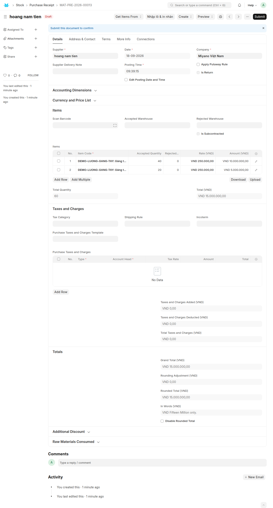
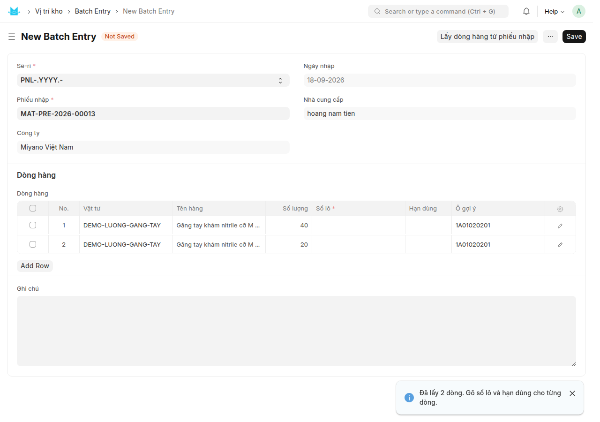
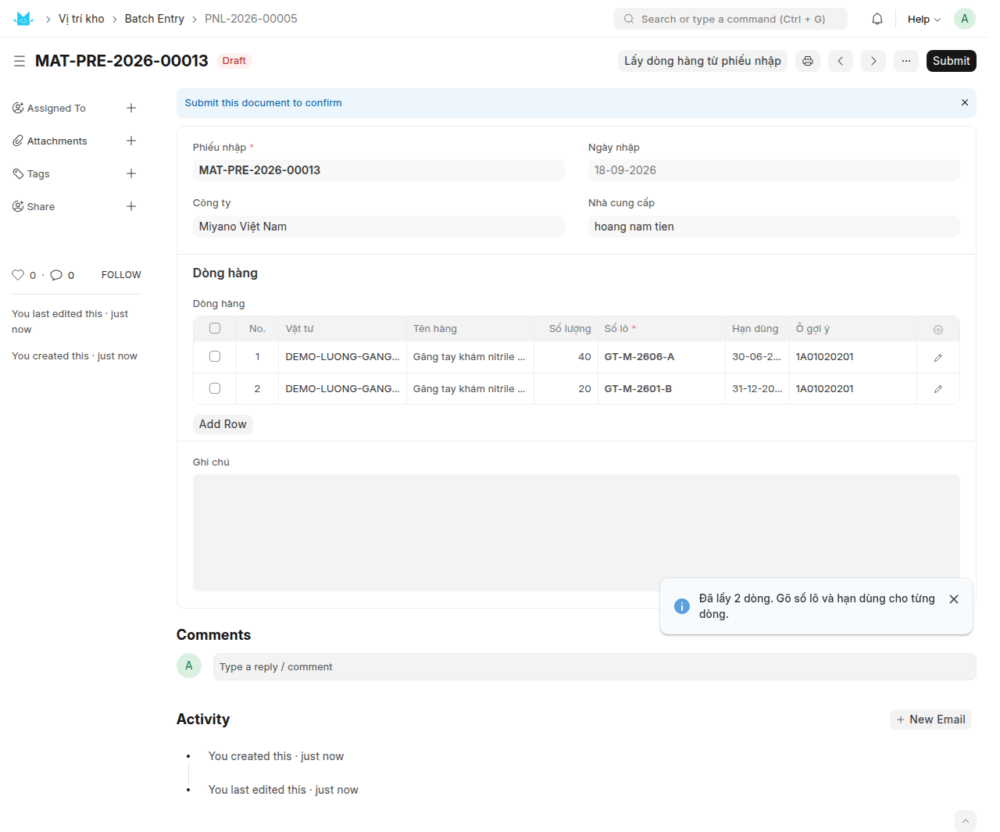
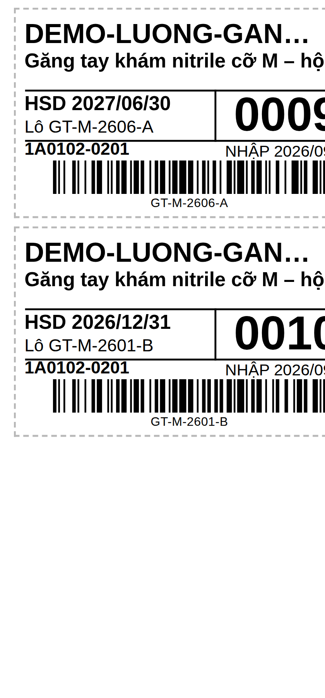
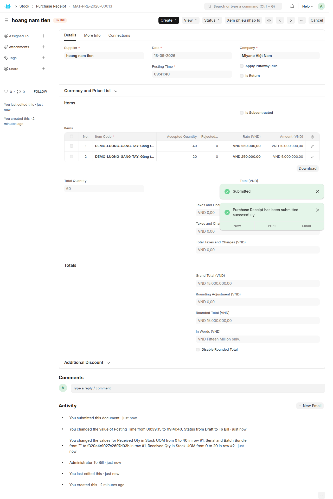
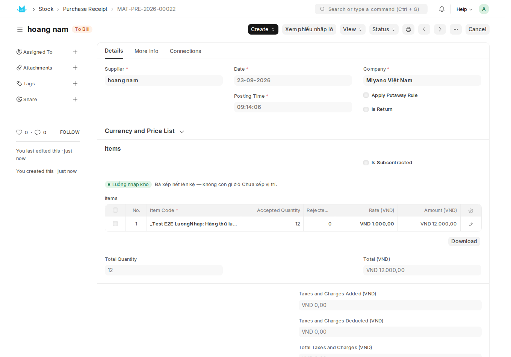
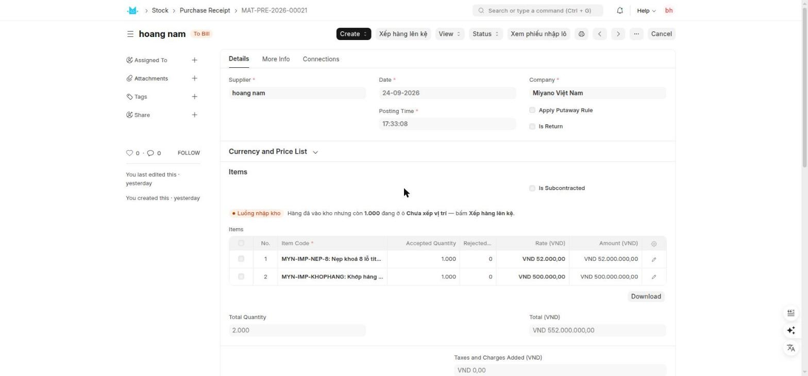
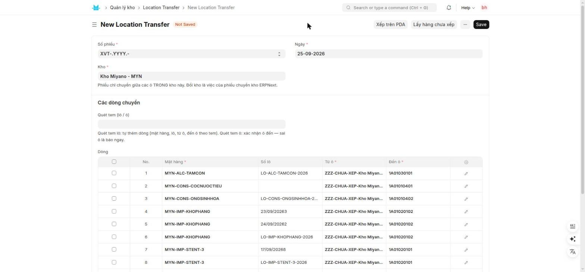
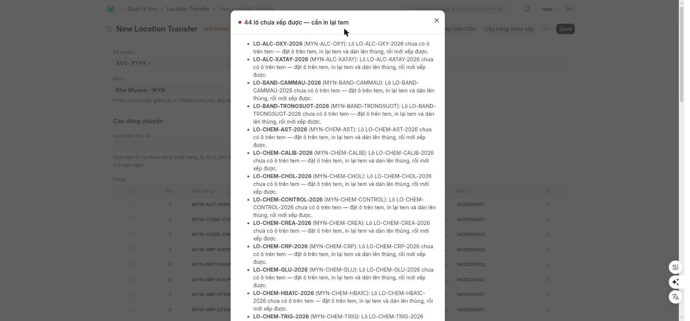
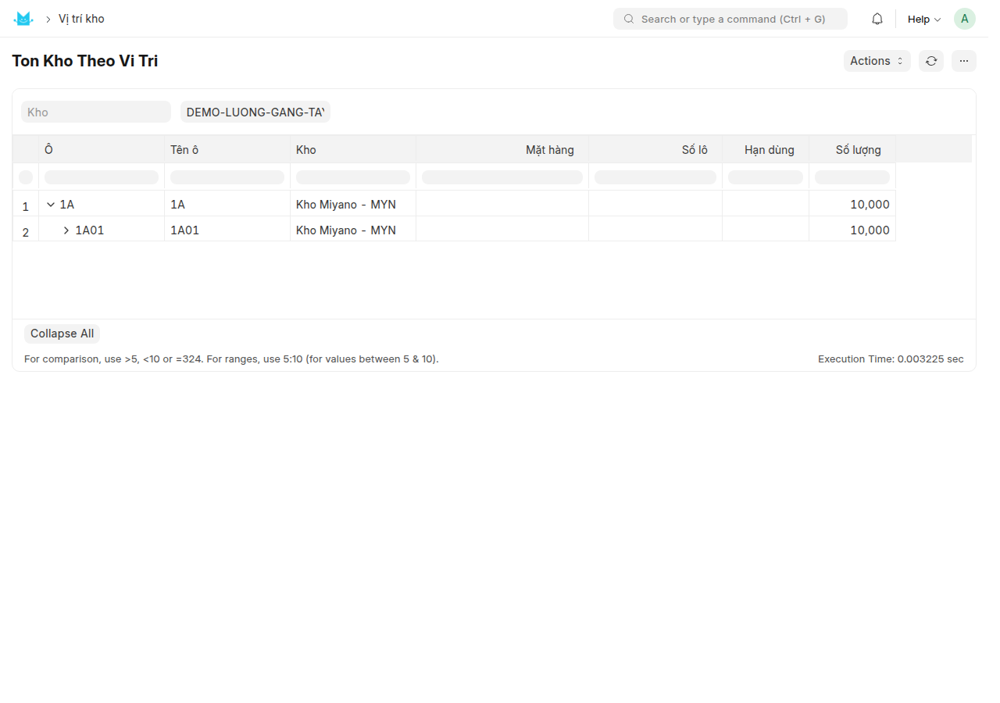

# Hướng dẫn sử dụng — Nhập hàng và xếp lên kệ (thao tác trên máy tính)

Miyano ERP · Module **Quản lý kho** · Cập nhật **25/09/2026** · Dành cho: **thủ kho**

Quyển này hướng dẫn việc hằng ngày của thủ kho trên máy tính: từ đơn mua sang phiếu nhập kho, khai số lô của nhà cung cấp, in nhãn lô, duyệt phiếu nhập, rồi **xếp hàng lên kệ** và kiểm lại bằng báo cáo. Sách dừng đúng ở chỗ hàng đã nằm trên kệ và tồn theo ô đã đúng — không nói về đơn bán, phiếu giao, lấy hàng hay kiểm kê. Việc thiết lập làm một lần (tạo kho, sinh mã ô, in tem ô, bật quản lý vị trí, gán vị trí cố định cho mặt hàng) nằm ở quyển kia: **HDSD-may-tinh-01-cai-dat-kho-vi-tri-mat-hang.md**.

---

## Ai làm bước nào

| Bước | Ai làm | Màn hình |
|---|---|---|
| Thiết lập kho, ô, tem ô, gán vị trí cố định | Người triển khai / trưởng kho | Xem quyển 1 |
| Tạo đơn mua | Mua hàng | Purchase Order |
| Tạo phiếu nhập kho (để nháp) | Thủ kho | Purchase Receipt |
| Khai số lô nhà cung cấp, hạn dùng | Thủ kho | Batch Entry (Nhập lô) |
| In nhãn lô 50×30 mm, dán lên thùng | Thủ kho | Nút **In nhãn cả phiếu** trên Batch Entry |
| Duyệt phiếu nhập kho | Thủ kho | Purchase Receipt, nút **Submit** |
| Xếp hàng lên kệ | Thủ kho | Location Transfer (Xếp / chuyển vị trí) |
| Đặt ô trên tem cho lô còn thiếu | Thủ kho | Trang **Đặt ô trên tem hàng loạt** |
| Đổi ô đã in trên tem | Trưởng kho (Stock Manager) | Form Lô, nút **Đổi ô trên tem** |
| Kiểm lại cuối ngày | Thủ kho | 4 báo cáo ở mục 8 |

---

## 0. Điều kiện cần — kiểm trước khi bắt đầu

Bốn thứ dưới đây phải có SẴN trước khi hàng về. Thiếu bất kỳ thứ nào thì việc không hỏng ngay lúc đó, mà hỏng ở cuối — đúng lúc bạn đang đứng trước kệ với thùng hàng trên tay.

### 0.1. Kho đã bật quản lý vị trí

Kho nhận hàng phải có ô **Quản lý vị trí** đã bật (trường `custom_quan_ly_vi_tri` trên Warehouse, bật qua màn hình **Warehouse Location Setup**).

Thiếu thì hỏng ở đâu:

- Trên phiếu nhập kho, **không có thanh Luồng nhập kho** và **không có nút Xếp hàng lên kệ** — hệ coi phiếu đó nằm ngoài luồng vị trí.
- Phép chặn lô gõ tay lúc duyệt không chạy, nên một số lô gõ thẳng trên dòng phiếu nhập vẫn duyệt được — và lô đó không có tem.
- Nếu bạn cố tạo phiếu xếp cho kho đó, lưu sẽ bị chặn: *"Kho {0} chưa bật quản lý vị trí nên không có sổ vị trí để ghi. Bật ở màn hình Warehouse Location Setup trước."*

Cách làm: **xem quyển 1**, mục bật quản lý vị trí cho kho.

### 0.2. Mặt hàng đã gán vị trí cố định

Đây là điều kiện dễ quên nhất và trả giá đắt nhất. Hãy đọc kỹ một mạch dây chuyền này:

Mặt hàng có **vị trí cố định** → khi in nhãn lô, hệ chốt sẵn một ô và in ô đó lên tem (ô F8) → đến lúc xếp, nút **Xếp hàng lên kệ** tự điền đúng ô ghi trên tem vào cột **Đến ô**.

Bỏ bước gán vị trí thì cả dây đứt ngay từ mắt đầu tiên: hệ không tính được ô nào để in, tem in ra ô vị trí là **`VT —`**, lô đó thành lô "chưa có ô trên tem", và từ 19/09/2026 lô chưa có ô trên tem thì **không xếp vào đâu được cả**. Lúc bấm **Xếp hàng lên kệ**, dòng hàng đó bị bỏ ra khỏi phiếu kèm câu *"{0} lô chưa xếp được — cần in lại tem"*.

Cách kiểm nhanh: mở form mặt hàng. Nếu đã gán, đầu form có dòng xanh *"Vị trí cố định: … "*. Nếu chưa gán, dòng đó ghi *"Mặt hàng này chưa gán vị trí cố định — tem in ra sẽ trống ô vị trí."*

Cách làm: **xem quyển 1**, mục gán vị trí cố định cho mặt hàng. Một mặt hàng nay gán được **nhiều** vị trí.

Còn một lối nữa vào cùng ngõ cụt này, và nó **không** chữa được bằng việc gán vị trí: lô **đã có** ô trên tem nhưng ngăn đó đã hỏng (bị xoá, bị Ngừng dùng, hoặc đã bị mặt hàng khác chiếm). Việc phải làm khi đó là **trưởng kho đổi ô trên tem** rồi in lại tem — xem mục 6.4.

### 0.3. Mặt hàng đã bật "Có lô"

Chỉ mặt hàng bật **Có lô** (`has_batch_no`) mới khai được số lô của nhà cung cấp và mới có tem lô.

Thiếu thì hỏng ở đâu: bấm **Nhập lô & in nhãn** trên phiếu nhập sẽ ra hộp *"Không có dòng nào cần khai lô"* với câu giải thích *"Không mặt hàng nào trên phiếu nhập {0} bật 'Có lô'. Muốn khai lô cho mặt hàng nào thì mở form mặt hàng đó, bật 'Có lô' rồi lưu trước."*

Hàng KHÔNG quản lý lô vẫn nhập và vẫn xếp được — chỉ là không có tem lô, và ô đến khi xếp lấy theo gán vị trí chứ không theo tem.

### 0.4. Đã in tem ô và dán lên kệ

Tem ô (tem dán trên từng ngăn kệ) không phải điều kiện để máy tính cho lưu phiếu — trên máy tính bạn gõ hoặc chọn ô bằng tay được. Nhưng thiếu tem ô thì:

- Không **quét tem ô để xác nhận** được ở ô **Quét tem (lô / ô)** trên phiếu xếp — mà đó là cách duy nhất máy báo cho bạn biết bạn đang đứng nhầm ngăn.
- Người đi lấy hàng sau này không đối chiếu được ô trên tem lô với ngăn thật.

Nói thẳng: đây là điều kiện **nên có**, không phải điều kiện **bắt buộc** của đường máy tính.

Cách làm: **xem quyển 1**, mục in tem ô.

---

## 1. Toàn cảnh một vòng nhập hàng

```
   Mua hàng                      THỦ KHO (máy tính)
   ─────────                     ──────────────────

   Purchase Order
   (đã duyệt)
        │
        │  Create > Purchase Receipt
        ▼
   ┌───────────────────────┐
   │ PHIẾU NHẬP KHO (nháp) │  Kho = kho đang quản lý vị trí
   │  Purchase Receipt     │  KHÔNG gõ số lô ở đây
   └───────────┬───────────┘
               │  nút "Nhập lô & in nhãn"
               ▼
   ┌───────────────────────┐
   │ NHẬP LÔ (nháp)        │  "Lấy dòng hàng từ phiếu nhập"
   │  Batch Entry          │  gõ Số lô + Hạn dùng từng dòng
   └───────────┬───────────┘
               │  Submit
               ▼
   ┌───────────────────────┐
   │ NHẬP LÔ (đã duyệt)    │  nút "In nhãn cả phiếu"
   │  tạo bản ghi Lô       │  -> xấp nhãn 50x30, dán lên thùng
   │  ghi số lô lên phiếu  │     (ô in trên tem được CHỐT lúc này)
   └───────────┬───────────┘
               │  nút "Duyệt phiếu nhập kho"
               ▼
   ┌───────────────────────┐
   │ PHIẾU NHẬP KHO        │  hàng vào kho, nhưng nằm ở ô ảo
   │  đã Submit            │  ZZZ-CHUA-XEP-<kho> ("Chưa xếp vị trí")
   └───────────┬───────────┘
               │  nút "Xếp hàng lên kệ"  (thanh Luồng nhập kho màu cam)
               ▼
   ┌───────────────────────┐
   │ PHIẾU XẾP (nháp)      │  tự đổ dòng từ ô Chưa xếp của CẢ KHO
   │  Location Transfer    │  Đến ô = ô in trên tem lô
   └───────────┬───────────┘
               │  Submit
               ▼
   ┌───────────────────────┐
   │ HÀNG ĐÃ LÊN KỆ        │  tồn theo ô đổi NGAY
   │  Luồng nhập kho xanh  │  kiểm lại bằng 4 báo cáo (mục 8)
   └───────────────────────┘
```

| Bước | Ai làm | Màn hình | Kết quả nhìn thấy |
|---|---|---|---|
| 1 | Mua hàng | Purchase Order | Đơn mua đã duyệt |
| 2 | Thủ kho | Purchase Receipt (nháp) | Phiếu nhập có dòng hàng, đúng kho |
| 3 | Thủ kho | Batch Entry (nháp) | Mỗi dòng có Số lô, Hạn dùng |
| 4 | Thủ kho | Batch Entry (đã duyệt) | Có cột Lô đã tạo, Số gọi |
| 5 | Thủ kho | Cửa sổ in nhãn | Xấp tem 50×30 mm, có ô vị trí và mã vạch |
| 6 | Thủ kho | Purchase Receipt | Trạng thái To Bill, thanh Luồng nhập kho màu cam |
| 7 | Thủ kho | Location Transfer (nháp) | Bảng dòng đã có Từ ô / Đến ô |
| 8 | Thủ kho | Location Transfer (đã duyệt) | Thanh Luồng nhập kho chuyển xanh |
| 9 | Thủ kho | 4 báo cáo | Báo cáo rỗng = sạch |

---

## 2. Đơn mua → Phiếu nhập kho để nháp

### 2.1. Mở phiếu nhập kho từ đơn mua

1. Mở **Purchase Order** đã duyệt của lô hàng đang về.
2. Bấm **Create** rồi chọn **Purchase Receipt**. Hệ chép sẵn nhà cung cấp, dòng hàng, số lượng, đơn giá.
3. Nếu bạn lỡ mở một Purchase Receipt trắng, dùng nút **Get Items From** ở đầu phiếu để kéo dòng từ đơn mua về — đừng gõ tay dòng hàng, vì gõ tay thì đơn mua không bao giờ đóng.



### 2.2. Các trường bắt buộc

| Trường trên màn hình | Phải điền gì |
|---|---|
| **Supplier** | Nhà cung cấp — đơn mua đã điền sẵn |
| **Date** | Ngày nhận hàng thực tế |
| **Company** | Miyano Việt Nam (điền sẵn) |
| **Accepted Warehouse** | **Kho đang quản lý vị trí** — xem 2.3 |
| **Item Code** trên từng dòng | Mã hàng |
| **Accepted Quantity** trên từng dòng | Số lượng nhận thật, đếm tại xe |
| **Rate** trên từng dòng | Đơn giá, lấy từ đơn mua |

### 2.3. Chọn đúng kho đang quản lý vị trí

Ô **Accepted Warehouse** ở đầu phần Items áp cho mọi dòng; mỗi dòng cũng có ô kho riêng (mở dòng ra bằng bút chì bên phải để xem). Cả hai phải là kho **đã bật quản lý vị trí**.

> Vì sao quan trọng: toàn bộ luồng ở quyển này chỉ chạy cho những dòng có kho đã bật quản lý vị trí. Chọn nhầm sang một kho chưa bật thì phiếu vẫn duyệt được nhưng không có thanh Luồng nhập kho, không có nút Xếp hàng lên kệ, và hàng không bao giờ được ghi vào sổ vị trí.

### 2.4. TUYỆT ĐỐI không gõ số lô ở đây

Trên dòng phiếu nhập của ERPNext có ô lô chuẩn (**Batch No**). **Đừng gõ vào đó.**

> Vì sao: ngày 17/09/2026 một phiếu nhập được duyệt với số lô là `17/09/2026` — một ngày tháng gõ thẳng vào ô đó. Số lô của nhà cung cấp mất, và lô ấy không có tem.

Từ đó, khi kho đã bật quản lý vị trí, hệ **chặn duyệt** phiếu nhập có số lô gõ tay. Câu báo lúc bấm Submit:

> **Chưa khai lô qua phiếu nhập lô**
> Kho đã bật quản lý vị trí: số lô phải được khai qua phiếu nhập lô để có tem và giữ đúng số lô của nhà cung cấp.
> Dòng {0} — {1}: chưa có số lô
> Dòng {0} — {1}: số lô '{2}' được gõ tay, không qua phiếu nhập lô
> Xoá số lô gõ tay (nếu có), lưu phiếu, rồi bấm nút **Nhập lô & in nhãn** ở đầu phiếu nhập.

Ba trường hợp cố ý ĐỨNG NGOÀI phép chặn này, bạn vẫn duyệt bình thường: kho chưa bật quản lý vị trí; **phiếu trả hàng** (`Is Return` đã tích); và phần **Rejected Qty** (hàng bị loại).

### 2.5. Lưu phiếu — dừng lại, đừng Submit

Bấm **Save**. Phiếu ở trạng thái **Draft**. Dừng ở đây. Bước tiếp theo là khai lô, và khai lô **bắt buộc** làm trước khi duyệt.

> Vì sao: duyệt trước thì ERPNext tự sinh một số lô máy cho từng dòng, và số lô của nhà cung cấp mất luôn. Lúc đó màn hình Nhập lô sẽ từ chối: *"Phiếu nhập {0} đã duyệt nên không gắn được số lô nữa. Phải nhập lô TRƯỚC rồi mới duyệt phiếu nhập — duyệt trước thì ERPNext đã tự sinh số lô máy và số lô của nhà cung cấp mất luôn."*

---

## 3. Nhập lô nhà cung cấp

Màn hình này là doctype **Batch Entry** (tiêu đề trên màn: *Batch Entry*, tên tắt trong danh mục: **Nhập lô**), bảng con là **Batch Entry Item**. Số phiếu dạng `PNL-2026-00005`.

### 3.1. Vào màn hình

1. Trên phiếu nhập kho còn **Draft**, bấm nút **Nhập lô & in nhãn** ở đầu phiếu.
2. Nếu phiếu nhập chưa lưu hoặc đang sửa dở, hệ **tự lưu** trước rồi mới sang — không cần bạn bấm Save.
3. Hệ mở màn hình Nhập lô mới, ô **Phiếu nhập** đã điền sẵn.

Ba trường hợp bấm nút mà không sang được màn hình mới:

- Phiếu nhập này **đã có một phiếu nhập lô còn nháp** → hệ mở lại đúng phiếu nháp đó, không tạo phiếu thứ hai. (Hai phiếu nháp cùng trỏ một phiếu nhập là hai chỗ gõ số lô cho cùng một dòng hàng.)
- Không còn dòng nào cần khai → hộp **Không có dòng nào cần khai lô**, kèm câu nói rõ vì sao (đã duyệt / có lô gõ tay / mặt hàng chưa bật Có lô / đã khai xong rồi).
- Bạn cũng vào được từ danh mục **Quản lý kho** → **Nhập lô**, rồi tự chọn ô **Phiếu nhập**. Cách này dài hơn, và dễ chọn nhầm phiếu.

### 3.2. Nạp dòng hàng từ phiếu nhập

Nếu bạn vào từ nút trên phiếu nhập, hệ **tự nạp dòng** ngay. Nếu bạn tự chọn phiếu nhập, hệ cũng tự nạp. Muốn nạp lại bằng tay thì bấm **Lấy dòng hàng từ phiếu nhập** ở đầu màn hình.

Nạp xong hiện thông báo xanh: *"Đã lấy {0} dòng. Gõ số lô và hạn dùng cho từng dòng."*



Nút này chỉ nạp những dòng **có quản lý lô** và **chưa có số lô**. Bấm lại sau khi đã khai một phần thì không nạp lại phần đã làm.

Nếu có dòng chưa tính được ô gợi ý, hệ hiện một thông báo cam gộp theo **lý do thật**, ví dụ *"3 dòng chưa có ô gợi ý: 2 dòng (mặt hàng chưa gán vị trí cố định), 1 dòng (vùng 1A01 đã đầy: 12/12 ô đang chứa hàng khác)."* Ba lý do là ba việc khác nhau: đi gán vị trí; đi dọn hoặc mở rộng vùng gán; hoặc báo lỗi dữ liệu.

> Cảnh báo khi đổi phiếu nhập: nếu bảng con đã có dòng thật và bạn đổi ô **Phiếu nhập**, hệ hỏi *"Đổi phiếu nhập sẽ xoá {0} dòng đang có (kèm số lô và hạn dùng đã gõ). Tiếp tục?"*. Chọn Không thì hệ báo đỏ *"Đã giữ nguyên các dòng cũ — chúng vẫn thuộc phiếu nhập TRƯỚC. Lưu sẽ báo lỗi."*

### 3.3. Các cột trên bảng Dòng hàng

| Cột | Ai điền | Ghi chú |
|---|---|---|
| **Vật tư** | Hệ điền, chỉ đọc | Mã hàng |
| **Tên hàng** | Hệ điền, chỉ đọc | |
| **Kho** | Hệ điền, chỉ đọc | Lấy từ dòng phiếu nhập |
| **Số lượng** | Hệ điền, chỉ đọc | Sửa số lượng thì sửa trên phiếu nhập |
| **Số lô** | **Bạn gõ** — bắt buộc | Chép đúng chữ trên vỏ thùng |
| **Ngày sản xuất** | Bạn gõ, không bắt buộc | |
| **Hạn dùng** | Bạn gõ | Gõ khi nhà cung cấp có ghi |
| **Ô gợi ý** | Hệ điền, chỉ đọc | Chỉ để bạn biết hàng sẽ về đâu |
| **Lý do gợi ý** | Hệ điền, chỉ đọc | Vì sao là ô đó, hoặc vì sao trống |
| **Lô đã tạo** | Hệ điền sau khi Submit | Link tới bản ghi Lô |
| **Số gọi** | Hệ điền sau khi Submit | Số 4 chữ số in to trên tem |

**Ô gợi ý là gợi ý, không phải quyết định.** Nó chỉ cho bạn biết trước hàng này sẽ về ngăn nào.

### 3.4. Gõ số lô — giới hạn ký tự

Số lô là thứ được mã hoá thành mã vạch Code 128 trên tem 50×30 mm, nên nó có trần cứng.

| Loại số lô | Tối đa |
|---|---|
| Có chữ cái (dù chỉ một chữ) | **13 ký tự** |
| Toàn chữ số | 23 hoặc 26 ký tự |
| Toàn chữ số, đúng **25** ký tự | **KHÔNG in được** — 24 hoặc 26 thì được |

Ô **Số lô** **chặn gõ** khi bạn chạm trần: ký tự thứ 14 (nếu có chữ) đơn giản không hiện lên, kèm thông báo cam *"Số lô tối đa 13 ký tự nếu có chữ — gõ thêm tem sẽ không in được mã vạch."* Dán một chuỗi quá dài thì hệ **từ chối cả chuỗi**, không cắt bớt.

> Vì sao không cắt: số lô cắt bớt là số lô SAI dán lên hàng.

Trường hợp 25 chữ số lọt qua được lớp chặn gõ; lúc bạn rời ô, hệ báo đỏ *"Số lô dòng {0} chưa dùng được"*.

### 3.5. Ký tự không được phép trong số lô

Mã vạch Code 128 **không mã hoá được** chữ có dấu tiếng Việt và dấu gạch ngang dài `–` (U+2013) — thứ hay dán vào từ phiếu đóng gói của nhà cung cấp. Vừa rời ô Số lô, hệ báo ngay:

> Số lô '{1}' có ký tự '{2}' (U+{3:04X}) ở vị trí {4} — mã vạch Code 128 không mã hoá được ký tự này, nên nhãn sẽ không có mã vạch để quét. Code 128 chỉ nhận chữ cái không dấu, chữ số và dấu câu ASCII. Hai thứ hay lọt vào nhất là DẤU TIẾNG VIỆT và dấu gạch ngang dài '–' (U+2013) dán từ phiếu của nhà cung cấp — hãy gõ lại bằng dấu trừ '-' thường. ĐỪNG xoá bớt ký tự: số lô cắt bớt là số lô sai dán lên hàng.

Cách chữa: gõ lại bằng chữ **không dấu** và dấu trừ `-` thường. Không xoá bớt ký tự.

> Vì sao hệ báo ký tự TRƯỚC, độ dài SAU: một số lô có dấu tiếng Việt thường vừa sai ký tự vừa quá dài. Nếu báo độ dài trước, bạn sẽ đi cắt bớt ký tự — mà việc đúng phải làm là gõ lại không dấu.

### 3.6. Các lỗi báo ngay trên màn hình Nhập lô

Ngoài hai lỗi số lô ở trên, lúc bấm **Save** hoặc **Submit** bạn có thể gặp:

- *"Dòng {0}: chưa có số lô."* — còn dòng bỏ trống.
- *"Dòng {0}: mỗi dòng phiếu nhập chỉ nhận MỘT số lô. Hàng về hai lô thì tách dòng trên phiếu nhập — tách rồi số lượng theo từng lô cũng đúng luôn trên chứng từ."* — Cách chữa: quay lại phiếu nhập, tách dòng đó thành hai dòng với số lượng đúng của từng lô, rồi nạp lại.
- *"Dòng {0}: số lô '{1}' đã thuộc mặt hàng {2}. Số lô là tên bản ghi trong ERPNext nên duy nhất toàn hệ, hai mặt hàng không dùng chung được."*
- *"Dòng {0}: hạn dùng {1} trước ngày sản xuất {2}."*
- *"Dòng {0}: dòng hàng không thuộc phiếu nhập {1}."* — bảng con còn dòng của phiếu nhập cũ; nạp lại.
- *"Dòng {0}: dòng hàng này đã được phiếu nhập lô {1} (đã duyệt) khai số lô rồi. Huỷ {1} trước nếu muốn khai lại."*

### 3.7. Duyệt phiếu nhập lô

Kiểm lại số lô và hạn dùng từng dòng đúng với vỏ thùng, rồi bấm **Submit**.



> Trong hai ảnh trên, đường dẫn phía trên còn ghi tên cũ **Vị trí kho**; nay danh mục tên là **Quản lý kho**.

Sau Submit, hệ:

- tạo bản ghi **Lô** cho từng dòng (hoặc dùng lại lô cũ nếu nhà cung cấp giao làm hai đợt cùng một số lô — chỉ điền chỗ trống, không ghi đè hạn dùng cũ);
- điền **nhà cung cấp** và chứng từ gốc vào bản ghi Lô;
- sinh **Số gọi** 4 chữ số cho lô (số này in to trên tem, dùng để đọc cho nhau qua kho);
- ghi số lô lên đúng dòng của phiếu nhập kho.

Hai nút mới hiện ra: **In nhãn cả phiếu** (mục 4) và **Duyệt phiếu nhập kho** (mục 5).

---

## 4. In nhãn lô 50×30 mm trên máy tính

Nhãn 50×30 mm in trên máy in nhiệt Zebra ZD421 (203 dpi). Mỗi lô một nhãn.

### 4.1. In cả phiếu

1. Mở phiếu **Nhập lô** đã **Submit**.
2. Bấm **In nhãn cả phiếu**.
3. Hệ mở một cửa sổ in mới với cả xấp nhãn, **theo đúng thứ tự dòng trên phiếu** để bạn cầm xấp tem đối chiếu được với phiếu.
4. In, cắt, dán từng tem lên đúng thùng hàng của lô đó.



**Nút In nhãn cả phiếu chỉ tồn tại khi phiếu nhập lô đã Submit.** Đó là chủ ý, không phải thiếu sót.

> Vì sao: hệ suy ra kho của lô qua số lô đã ghi lên dòng phiếu nhập, mà việc ghi đó chỉ xảy ra khi bạn Submit phiếu nhập lô. In sớm hơn thì hệ không biết kho nào, và ô trên tem in ra **`VT —`** — không có lỗi nào báo, mà tem thì đã dán lên thùng.

Nếu có lô chưa tính được ô, trước khi cửa sổ in mở ra hệ báo cam: *"{0} nhãn không có ô (in 'VT —'): {1}."* Hệ **không chặn in** — nhãn thiếu ô vẫn dán lên hàng được — nhưng bạn phải biết để không đi tìm `VT —` trên kệ. Xử lý bằng mục 7.

Nếu trình duyệt chặn cửa sổ mới:

> **Trình duyệt chặn cửa sổ in**
> Nhãn đã dựng xong nhưng trình duyệt không cho mở cửa sổ mới. Cho phép pop-up cho trang này rồi bấm lại — ô in trên tem đã được chốt nên lần in sau ra đúng tờ tem này.

### 4.2. Trên tem có gì

| Ô trên tem | Nội dung |
|---|---|
| F1 | Mã hàng |
| F2 | Tên hàng |
| F3 | Đơn vị tính và quy cách |
| F4 | Thông số thêm của mặt hàng (để trắng nếu không khai) |
| F5 | `HSD YYYY/MM/DD` |
| F6 | `Lô <số lô>` |
| F7 | `NHẬP YYYY/MM/DD` — ngày của phiếu nhập |
| **F8** | **Ô vị trí** — ngăn phải xếp vào, hoặc `VT —` |
| F9 | Số gọi 4 chữ số, in to |
| F10 · F11 | Mã vạch Code 128 của số lô, và số lô in dưới mã vạch |

### 4.3. Ô ghi trên tem đến từ đâu

Ô F8 đi ra thẳng từ **vị trí cố định đã gán cho mặt hàng** (quyển 1). Cụ thể, khi bạn bấm In lần đầu, hệ chọn theo thứ tự:

1. Ô **trống đầu tiên** trong các vị trí đã gán cho mặt hàng ở kho này. Nếu mặt hàng được gán **nhiều** vị trí, hệ xét **hết** mọi vị trí đã gán để tìm ô trống, theo thứ tự các dòng gán — chứ không lấp đầy vị trí thứ nhất rồi mới sang vị trí thứ hai.
2. Không còn ô trống ở bất kỳ vị trí nào thì **dồn vào ô đang có hàng cùng mặt hàng**.
3. Vẫn không được thì không có ô: các vị trí đã gán đều đang chứa hàng khác.

Chọn xong, hệ **chốt** ô đó vào bản ghi Lô và **không bao giờ tính lại**.

### 4.4. In lại tem

Tem rách, bẩn, bong — cứ bấm **In nhãn cả phiếu** lại. Muốn in một lô lẻ thì mở bản ghi **Lô** đó rồi bấm **In nhãn**.

**In lại luôn ra đúng tờ tem như lần đầu**, kể cả khi kho đã đổi trong thời gian đó.

> Vì sao: lần in đầu tiên có thể đã dán lên hàng. Hai tờ tem của cùng một lô ghi hai ô khác nhau là thảm hoạ — người đi lấy hàng đọc tờ nào cũng tưởng đúng.

### 4.5. Lô chưa có ô thì tem ra sao

Ô F8 in ra đúng ba ký tự **`VT —`**. Tem vẫn có đủ mã hàng, tên hàng, HSD, số lô, số gọi và mã vạch — vẫn quét được, vẫn dán lên thùng được.

Nhưng **lô đó chưa xếp lên kệ được**. Đến bước 6, dòng hàng của nó bị bỏ ra khỏi phiếu xếp kèm câu:

> Lô {0} chưa có ô trên tem — đặt ô trên tem, in lại tem và dán lên thùng, rồi mới xếp được.

Hai đường chữa, cả hai đều trên máy tính:

- Nhiều lô cùng lúc: trang **Đặt ô trên tem hàng loạt** — mục 7.
- Một lô lẻ: mở bản ghi **Lô**, bấm **Đặt ô trên tem**, chọn ô, bấm **Lưu và in tem**.

Nếu lô **đã có** ô trên tem mà ô đó hỏng (ngăn bị xoá, bị Ngừng dùng, hoặc đã bị mặt hàng khác chiếm), việc đổi ô là **quyền trưởng kho** (Stock Manager): mở bản ghi Lô, nút lúc này đổi tên thành **Đổi ô trên tem**, bắt buộc ghi **Lý do**. Sau đó in lại tem và **dán thay tem cũ**.

### 4.6. Xem trước không chốt gì

Mở màn hình xem trước nhãn không ghi gì vào dữ liệu. Ô trên tem chỉ được chốt đúng lúc bạn bấm **In**.

---

## 5. Duyệt phiếu nhập kho

### 5.1. Quay về phiếu nhập

Trên phiếu **Nhập lô** đã Submit, bấm **Duyệt phiếu nhập kho**. Nút này chỉ mở phiếu nhập ra cho bạn — nó **không tự bấm Submit**, vì duyệt một chứng từ ghi sổ kho và sổ kế toán là việc bạn nhìn rồi tự quyết.

Nếu phiếu nhập đã duyệt rồi, nhãn nút đổi thành **Xem phiếu nhập kho**.

### 5.2. Bấm Submit

Kiểm lại số lượng, đơn giá, kho một lần cuối rồi bấm **Submit**. Phiếu chuyển sang trạng thái **To Bill**.



> Ảnh trên chụp ngày 18/09/2026, trước khi có thanh **Luồng nhập kho** và nút **Xếp hàng lên kệ** — hai thứ đó nay nằm ngay trên phiếu nhập đã duyệt.

### 5.3. Hàng vào ô "Chưa xếp vị trí"

Hàng đã vào kho, nhưng trong sổ vị trí nó **chưa nằm trên kệ nào cả**. Toàn bộ số lượng được ghi vào một ô hệ thống tên là **`ZZZ-CHUA-XEP-<tên kho>`**, hiển thị là ô **Chưa xếp vị trí**.

Ô này là ô **ảo**, dùng chung cho cả kho. Nó không phải một ngăn thật, không in tem ô, và tiền tố `ZZZ` để nó luôn xếp cuối bảng chữ cái trong mọi danh sách.

> Vì sao phải có nó: nếu hàng nhập mà không ghi vào đâu cả, tổng tồn theo ô sẽ lệch khỏi tồn kho ERPNext ngay từ giây đầu tiên. Ô Chưa xếp giữ cho hai con số luôn khớp, đồng thời biến việc "quên xếp" thành một dòng nhìn thấy được trên báo cáo thay vì một lỗi âm thầm.

### 5.4. Thanh Luồng nhập kho và các nút nối bước

Ngay phía trên bảng dòng hàng của phiếu nhập có một thanh nhỏ mang nhãn **Luồng nhập kho**. Nó trả lời đúng một câu: *phiếu này đang đứng ở đâu, bước tiếp theo là gì.*

| Màu | Câu trên thanh | Nút nối bước |
|---|---|---|
| Cam | Còn {0} dòng chưa khai lô — bấm **Nhập lô & in nhãn** để gõ số lô nhà cung cấp và in tem. | **Nhập lô & in nhãn** |
| Xanh dương | Đã khai lô đủ các dòng ({0}) — bấm **Submit** để ghi kho. | Submit |
| Cam | Hàng đã vào kho nhưng còn **{0}** đang ở ô **Chưa xếp vị trí** — bấm **Xếp hàng lên kệ**. | **Xếp hàng lên kệ** |
| Xanh lá | Đã xếp hết lên kệ — không còn gì ở ô Chưa xếp vị trí. | (xong) |
| Đỏ | Phiếu đã huỷ. | — |

Phiếu không có dòng nào thuộc kho quản lý vị trí thì **không vẽ thanh nào** — luồng này không nói gì về phiếu đó.



Một lưu ý về con số trên thanh cam: ô Chưa xếp là ô **dùng chung của cả kho**, còn sổ vị trí ghi theo (ô, mặt hàng, lô) chứ không theo chứng từ. Nên nếu cùng một lô còn hàng của một phiếu nhập khác đang chờ, con số này tính chung cả hai. Câu chữ trên màn hình vì thế nói "hàng của phiếu này đang chờ xếp", **không hứa** một con số riêng của phiếu.

Trên phiếu nhập đã duyệt còn một nút nữa: **Xem phiếu nhập lô** — để mở lại phiếu nhập lô mà in lại tem.

---

## 6. Xếp hàng lên kệ trên máy tính

Đây là phần quan trọng nhất của quyển này. Đọc hết mục 6 trước khi làm lần đầu.

Màn hình là doctype **Location Transfer** (tên trong danh mục: **Xếp / chuyển vị trí**), bảng con là **Location Transfer Item**. Số phiếu dạng `XVT-2026-00012`.

### 6.1. Luật xếp hàng — đọc trước

Từ 19/09/2026: **một lô chỉ được xếp vào đúng ô in trên tem lô của nó.** Không ai được vượt, kể cả trên máy tính. Máy chủ chặn khi bạn bấm Submit; màn hình chỉ báo sớm.

> Vì sao: tem dán trên thùng là thứ người đi lấy hàng đọc. Nếu sổ nói một ô còn tem nói ô khác, một trong hai đang nói dối — và tổng tồn vẫn khớp nên đối soát không bao giờ bắt được.

Hệ quả thực tế: **ô ghi trên tem thắng mọi gợi ý khác**. Kể cả khi mặt hàng được gán ba vị trí và ô trống đẹp nhất đang ở vị trí thứ ba, nếu tem của lô này ghi ô ở vị trí thứ nhất thì bạn phải xếp vào đó.

Hàng **không quản lý lô** không có tem lô, nên không có luật này áp lên. Ô đến của nó lấy theo gán vị trí cố định, và bạn sửa tay được.

### 6.2. Mở phiếu xếp từ nút Xếp hàng lên kệ

1. Trên phiếu nhập kho đã duyệt, thanh Luồng nhập kho đang **cam** và nút **Xếp hàng lên kệ** đang hiện. Bấm nút đó.
2. Nếu phiếu nhập có hàng chờ ở **nhiều kho**, hệ mở hộp **Xếp hàng lên kệ** với một ô **Kho** để chọn; bấm **Mở phiếu xếp**. Chỉ một kho thì hệ đi thẳng.
3. Hệ mở một **phiếu xếp mới còn nháp**, ô **Kho** đã điền sẵn, và **tự bấm hộ** nút Lấy hàng chưa xếp cho bạn.





### 6.3. Phiếu xếp lấy cả kho, không riêng phiếu nhập vừa duyệt

Đây là điều nhiều người bất ngờ lần đầu: bấm **Xếp hàng lên kệ** từ một phiếu nhập, nhưng phiếu xếp mở ra chứa **mọi thứ đang chờ ở ô Chưa xếp của cả kho** — kể cả hàng của những phiếu nhập trước đó chưa ai xếp.

> Vì sao: hàng chờ ở ô Chưa xếp là hàng chờ, bất kể phiếu nào đưa nó vào. Sổ vị trí ghi theo (ô, mặt hàng, lô) chứ không theo chứng từ, nên không có cách nào tách riêng hàng của một phiếu ra.

Nghĩa là: nếu bạn chỉ muốn xếp đúng lô vừa nhập, hãy **xoá tay** các dòng không liên quan khỏi bảng trước khi Submit. Còn nếu bạn đang đi một vòng xếp cuối ca thì để nguyên — đó chính là cách dùng đúng.

### 6.4. Dòng bị BỎ QUA — hai loại, hai cách chữa

Khi hệ đổ dòng vào phiếu, có những dòng **không** xuống bảng. Có **hai** loại hoàn toàn khác nhau; đừng gộp làm một.

**Loại 1 — lô bị luật tem chặn.** Dòng có số lô nhưng chưa có ô đến hợp lệ. Hệ **không bao giờ** đưa loại này vào phiếu, dù bạn vào bằng đường tự động hay bấm tay, vì lưu chắc chắn bị chặn. Hệ mở một hộp **đỏ**:

> **{0} lô chưa xếp được — cần in lại tem**
> (danh sách từng lô, kèm lý do)



Hai lý do có thể gặp, chép nguyên văn:

- *"Lô {0} chưa có ô trên tem — đặt ô trên tem, in lại tem và dán lên thùng, rồi mới xếp được."*
- *"Ô trên tem lô {0} không dùng được nữa: {1}. Trưởng kho mở lô, bấm "Đổi ô trên tem" rồi in lại tem."* — phần `{1}` nói rõ hỏng ở đâu: *ô {0} không còn tồn tại* / *ô {0} thuộc kho {1}, không phải kho {2}* / *{0} là nút nhóm, không chứa hàng được* / *{0} là ô Chưa xếp, không phải chỗ để hàng* / *ô {0} đang Ngừng dùng (vì {1})* / *ô {0} đang chứa mặt hàng khác ({1})*.

Cách chữa: lô **chưa có ô** thì dùng trang **Đặt ô trên tem hàng loạt** (mục 7), hoặc mở từng bản ghi Lô bấm **Đặt ô trên tem**. Lô có **ô hỏng** thì phải nhờ **trưởng kho** bấm **Đổi ô trên tem**. Cả hai trường hợp: **in lại tem, dán thay tem cũ**, rồi quay lại bấm **Lấy hàng chưa xếp**.

**Loại 2 — dòng chưa có ô đến, bị đường tự động bỏ qua.** Đây là hàng **không quản lý lô** mà mặt hàng chưa gán vị trí cố định (hoặc vùng gán đã đầy). Khi bạn vào bằng nút **Xếp hàng lên kệ**, hệ chỉ đổ những dòng **đã có ô đến** và bỏ qua phần còn lại, kèm thông báo cam:

> Bỏ qua {0} dòng chưa có ô đến: {1}. Thêm tay nếu cần xếp luôn.

> Vì sao đường tự động bỏ qua: bạn vừa bấm một nút tên là "Xếp hàng lên kệ". Nếu hệ đổ cả những dòng trống ô, phiếu mở ra đã không Submit được — nó sẽ báo `Đến ô is required in rows 4-8, 10-15, …` ngay lập tức.

> Câu này do khung phần mềm sinh ra nên hiện **bằng tiếng Anh**, không phải lỗi của bạn.


Cách chữa: gán vị trí cố định cho mặt hàng (**xem quyển 1**), hoặc bấm tay nút **Lấy hàng chưa xếp** rồi tự điền ô — xem 6.5.

Nếu đường tự động không đổ được **dòng nào**, hệ hiện:

> **Chưa xếp tự động được dòng nào**
> Kho {0} còn {1} dòng chờ xếp, nhưng chưa dòng nào có ô đến (mặt hàng chưa gán vị trí, hoặc lô chưa có ô trên tem). Gán vị trí cho mặt hàng, hoặc bấm 'Lấy hàng chưa xếp' rồi điền ô bằng tay.

### 6.5. Nút Lấy hàng chưa xếp — bấm tay

Nút **Lấy hàng chưa xếp** nằm ở đầu phiếu xếp còn nháp, hiện ngay khi ô **Kho** đã có giá trị. Nó khác đường tự động ở đúng một điểm:

| | Đường tự động (từ nút Xếp hàng lên kệ) | Bấm tay nút Lấy hàng chưa xếp |
|---|---|---|
| Lô bị luật tem chặn | Không đưa vào phiếu, báo đỏ | Không đưa vào phiếu, báo đỏ |
| Dòng không lô, chưa có ô đến | **Bỏ qua**, báo cam | **Giữ lại**, để trống ô Đến ô |

Nghĩa là: muốn tự điền ô cho những dòng hệ không đoán được, hãy **bấm tay** nút này.

> Lưu ý: nút này **xoá sạch bảng** rồi đổ lại. Bấm lại sau khi đã sửa tay vài dòng là mất phần sửa đó.

Đổ xong hiện thông báo *"Đã lấy {0} dòng — ô đến theo tem lô."* Nếu kho không còn gì chờ, hệ báo xanh: *"Kho {0} không còn hàng nào ở ô 'Chưa xếp vị trí'."*

### 6.6. Các cột trên bảng Dòng

| Cột | Ai điền | Sửa được không |
|---|---|---|
| **Mặt hàng** | Hệ đổ xuống, bắt buộc | Có |
| **Số lô** | Hệ đổ xuống | Có. Bắt buộc nếu mặt hàng có quản lý lô; phải bỏ trống nếu không |
| **Từ ô** | Hệ đổ xuống — là ô Chưa xếp, bắt buộc | Có |
| **Đến ô** | Hệ đổ theo tem lô, bắt buộc | Có, nhưng lô thì phải đúng ô trên tem |
| **Số lượng** | Hệ đổ xuống | Có. Phải lớn hơn 0 |

Cả phiếu chỉ chuyển **giữa các ô TRONG một kho**. Đổi kho là việc của phiếu chuyển kho ERPNext, không phải phiếu này.

> Nếu bạn đổi ô **Kho** ở đầu phiếu, hệ **xoá sạch bảng dòng** và báo cam *"Đã xoá các dòng vì đổi kho."* — ô của kho cũ không dùng được cho kho mới.

### 6.7. Điền ô bằng tay

Với dòng còn trống **Đến ô** (hàng không lô):

1. Bấm vào ô **Đến ô** của dòng đó.
2. Gõ vài ký tự đầu của mã ngăn, chọn từ danh sách gợi ý. Mã ngăn đọc được trên **tem ô** dán ở kệ.
3. Kiểm lại **Số lượng** đúng với số bạn thật sự mang ra kệ.

Ô đến phải là **ô lá thật**: không phải nút nhóm cấp Khu/Dãy/Khoang/Tầng, không phải ô Chưa xếp, không nằm dưới nhánh đang Ngừng dùng, và thuộc đúng kho của phiếu.

Với dòng có **số lô**, bạn không tự chọn ô khác được — xem 6.8.

### 6.8. Ràng buộc phải xếp đúng ô ghi trên tem

Nếu bạn sửa ô **Đến ô** của một dòng có lô sang một ngăn khác ngăn in trên tem, lúc bấm **Submit** máy chủ chặn:

> **Sai ô**
> Dòng {0}: Ô {1} không phải ô in trên tem lô {2}. Tem ghi ô {3} — xếp đúng ô đó.

Không có cách nào vượt trên máy tính. Muốn lô đó nằm ở ngăn khác thì phải **đổi ô trên tem trước** (quyền trưởng kho), in lại tem, dán thay tem cũ — rồi mới xếp.

### 6.9. Ô Quét tem (lô / ô) — làm nhanh bằng máy quét

Trên phiếu xếp có một ô nhập tên **Quét tem (lô / ô)**, dùng được với máy quét cắm vào máy tính:

1. Chọn **Kho** trước. Chưa chọn kho mà quét thì hệ báo cam *"Chọn kho trước khi quét."*
2. **Quét tem lô** → hệ tự thêm một dòng: mặt hàng, số lô, từ ô, số lượng và **Đến ô lấy theo tem**. Thông báo: *"Đã thêm {0} · lô {1}. Quét tem ô {2} để xác nhận."*
3. **Quét tem ô** của ngăn bạn đang đứng → nếu đúng, báo xanh *"Đúng ô {0}."*; nếu sai, hộp đỏ **Sai ô** với câu *"Ô {0} không phải ô in trên tem lô {1}. Tem ghi ô {2} — xếp đúng ô đó."*

Vài câu báo khác khi quét:

- *"Không nhận ra mã {0}."* — mã không phải tem lô, tem ô, hay mã hàng nào.
- *"{0} có quản lý lô — quét tem LÔ, không phải mã hàng."* — bạn quét nhầm mã vạch mặt hàng.
- *"Quét tem LÔ trước, rồi mới quét tem ô."*
- *"Không xếp được lô {0}"* — lô này đang vướng luật tem, xem 6.4.
- *"{0}{1}: không còn hàng nào để xếp ở kho này…"*
- *"{0} — lô đang ở nhiều ô, chọn 'Từ ô' và số lượng trên dòng."*

### 6.10. Duyệt phiếu xếp

1. Rà lại bảng: đúng lô, đúng ngăn, đúng số lượng, không còn dòng thừa của hàng bạn chưa mang ra kệ.
2. Bấm **Save**, rồi **Submit**.
3. **Tồn theo ô đổi ngay lập tức**: mỗi dòng ghi một bút toán trừ ở ô Chưa xếp và một bút toán cộng ở ngăn đích. Không cần chạy gì thêm, không cần đợi cuối ngày.
4. Quay lại phiếu nhập kho: thanh **Luồng nhập kho** đã chuyển **xanh lá** — *"Đã xếp hết lên kệ — không còn gì ở ô Chưa xếp vị trí."*

Các câu chặn có thể gặp lúc Submit:

- *"Dòng {0}: Số lượng phải lớn hơn 0."*
- *"Dòng {0}: Từ ô và Đến ô đang trùng nhau."*
- *"Dòng {0}: {1} là nút nhóm (cấp Khu/Dãy/Khoang/Tầng), không chứa hàng được."*
- *"Dòng {0}: không xếp hàng vào {1} được vì {2} đang Ngừng dùng. Bật lại {2}, hoặc chọn ô khác. (Lấy hàng RA khỏi ô đang Ngừng dùng thì vẫn được.)"*
- *"Dòng {0}: Mặt hàng {1} có quản lý lô nên bắt buộc chọn số lô…"*
- *"Ô {0} không đủ hàng: mặt hàng {1}{2} sẽ còn {3} sau phiếu này. Kiểm lại số lượng trên các dòng lấy hàng từ ô đó."*

Phiếu bị chặn thì **không dòng sổ nào được ghi** — sửa rồi Submit lại là xong, không phải dọn gì.

Nếu Submit nhầm: bấm **Cancel** trên phiếu xếp. Hệ ghi bút toán **đảo** (hàng quay về ô cũ) chứ không xoá dòng sổ gốc, nên vẫn tra được là phiếu này từng chuyển hàng đi đâu. Lưu ý phép chặn tồn âm cũng chạy ở chiều huỷ: nếu hàng đã xếp lên kệ rồi bị xuất đi mất, huỷ sẽ bị từ chối.

---

## 7. Đặt ô trên tem hàng loạt

Dùng khi bước 6 báo **nhiều lô chưa có ô trên tem** cùng lúc — mở từng bản ghi Lô ra đặt tay là quá lâu.

### 7.1. Vào trang

Mở danh mục **Quản lý kho**, bấm lối tắt **Đặt ô trên tem hàng loạt**. (Hoặc gõ tên đó vào thanh tìm kiếm ở đầu màn hình.)

### 7.2. Làm gì trên trang

1. Chọn **Kho** ở đầu trang. Danh sách chỉ hiện kho đã bật quản lý vị trí. Nếu chỉ có một kho như vậy, hệ chọn sẵn.
2. Trang liệt kê **các lô đang có tồn trong kho mà chưa có ô trên tem**, mỗi lô một dòng, với các cột: **Số lô** · **Mặt hàng** · **Tồn** · **Đang ở ô** · **Ô trên tem**.
3. Cột **Ô trên tem** đã **đề xuất sẵn** một ngăn — lấy từ đúng cách tính mà lúc in tem dùng, nên trang này và con tem không bao giờ nói hai ô khác nhau. Mặt hàng chưa gán vị trí thì ô này để trống, chỗ nhập ghi lý do (ví dụ *"mặt hàng chưa gán vị trí cố định"*); bạn tự chọn ngăn.
4. Tích chọn những dòng muốn đặt (có hộp chọn hết).
5. Bấm **Đặt ô cho dòng đã chọn**.
6. Đặt xong, hệ mời in ngay: nút **In tem {n} lô**, hoặc **Để sau**.
7. **In tem và dán thay tem cũ lên thùng** — nếu không, ô trong hệ và ô trên giấy nói khác nhau.

### 7.3. Những điều trang này KHÔNG làm

- **Chỉ đặt ô cho lô CHƯA có ô.** Không đổi ô đã có. Đổi ô đã in trên tem là quyền trưởng kho, làm từng lô một và phải ghi lý do — một màn hình đổi hàng loạt chính là cửa sau mà luật tem sinh ra để đóng.
- Nếu trong lúc bạn đang mở trang mà người khác vừa đặt ô cho một lô trong danh sách, dòng đó **không bị ghi đè**; kết quả trả về ghi *"lô đã có ô trên tem (người khác vừa đặt) — nạp lại danh sách"*.
- Một dòng hỏng **không kéo theo** các dòng đã đặt xong — mỗi lô chạy riêng, hệ báo rõ dòng nào xong và dòng nào lỗi.

Đặt xong, quay lại phiếu xếp và bấm **Lấy hàng chưa xếp** — các lô vừa đặt ô giờ đã xuống bảng được.

---

## 8. Kiểm sau khi xếp

Bốn báo cáo, mở từ danh mục **Quản lý kho** → nhóm **Báo cáo**. Nếu tìm bằng thanh tìm kiếm thì gõ tên ASCII trong ngoặc.

### 8.1. Hàng chưa xếp vị trí (`Hang Chua Xep Vi Tri`)

Đây là **danh sách việc của bạn**: mọi thứ còn nằm ở ô Chưa xếp.

| Cột | Đọc thế nào |
|---|---|
| **Ô** | Luôn là `ZZZ-CHUA-XEP-<kho>` |
| **Kho** | Kho nào đang có hàng chờ |
| **Mặt hàng** | Mã hàng |
| **Số lô** | Số lô, trống nếu hàng không quản lý lô |
| **Hạn dùng** | HSD của lô — dòng gần hết hạn thì xếp trước |
| **Số lượng** | Đang chờ bao nhiêu |

Bộ lọc: **Kho** (không bắt buộc).

**Thế nào là sạch:** báo cáo **rỗng**. Còn dòng nghĩa là còn hàng chưa lên kệ.

**Có dòng thì làm gì:** mở một phiếu xếp (mục 6) và bấm **Lấy hàng chưa xếp**. Nếu bấm rồi mà dòng vẫn ở lại, gần như chắc chắn lô đó chưa có ô trên tem — sang mục 7.

### 8.2. Tồn kho theo vị trí (`Ton Kho Theo Vi Tri`)

Xem hàng đang nằm ở những ngăn nào, dạng cây gấp mở được theo Khu → Dãy → Khoang → Tầng → Ô, cộng dồn lên từng cấp cha.

| Cột | Đọc thế nào |
|---|---|
| **Ô** | Mã ngăn, hoặc mã nút cha khi đang gấp |
| **Tên ô** | Tên đặt cho ngăn |
| **Kho** | |
| **Mặt hàng** | Trống ở dòng cha (dòng cha chỉ cộng tổng) |
| **Số lô** | Trống ở dòng cha |
| **Hạn dùng** | HSD của lô |
| **Số lượng** | Tồn của dòng đó; ở dòng cha là tổng của cả nhánh |

Bộ lọc: **Kho** và **Mặt hàng** (đều không bắt buộc).



**Đọc như thế nào:** ô `ZZZ-CHUA-XEP-<kho>` **cố ý luôn hiện** trong báo cáo này, đứng **ở gốc** cây (nó không nằm trong cây vị trí nên không có ô cha). Đó là cách bạn nhìn thấy hàng chưa xếp ngay trên bức tranh tồn kho, thay vì nó biến mất và bạn tưởng đã xếp hết.

**Thế nào là sạch:** không có dòng nào nằm dưới `ZZZ-CHUA-XEP-<kho>`.

### 8.3. Hàng nằm sai vị trí (`Hang Nam Sai Vi Tri`)

Ngăn đang chứa **mặt hàng khác** với mặt hàng đã gán cho nhánh của ngăn đó.

| Cột | Đọc thế nào |
|---|---|
| **Ô** | Ngăn đang có vấn đề |
| **Mã trên nhãn** | Mã in trên tem ô — để bạn đi tìm đúng ngăn ngoài kho |
| **Mặt hàng đang nằm** | Thứ đang thật sự nằm trong ngăn |
| **Số lô** | |
| **Số lượng** | |
| **Đã gán cho** | Mặt hàng lẽ ra mới được nằm ở nhánh này |
| **Nút gán** | Nút trên cây mà bản gán trỏ tới |

Bộ lọc: **Kho** (không bắt buộc).

**Thế nào là sạch:** báo cáo **rỗng**.

**Có dòng thì làm gì:** ra ngăn đó xem thật. Hoặc hàng nằm nhầm chỗ (báo trưởng kho để lập phiếu chuyển ô), hoặc bản gán vị trí đã lỗi thời (báo trưởng kho sửa gán). Đừng tự sửa gán vị trí — đó là việc của quyển 1.

> Vì sao cần báo cáo này dù đã có đối soát: đối soát chỉ so **tổng** tồn vị trí với tồn kho ERPNext, nên một ngăn chứa nhầm mặt hàng vẫn khớp tuyệt đối. Chỉ báo cáo này bắt được.

### 8.4. Đối soát tồn vị trí (`Doi Soat Ton Vi Tri`)

Lưới an toàn của cả hệ: so sổ vị trí với sổ kho ERPNext.

Bộ lọc **Kho** là **bắt buộc**. Không chọn kho thì báo cáo từ chối chạy: *"Chọn kho để đối soát."*

> Vì sao bắt buộc: một báo cáo rỗng vì "chưa chọn kho" và một báo cáo rỗng vì "đã đối soát và khớp" là hai chuyện hoàn toàn khác nhau. Bắt chọn kho để bạn không đọc nhầm cái thứ nhất thành cái thứ hai.

Báo cáo gộp **ba loại lệch** vào một bảng, phân biệt bằng cột **Loại lệch**. Hai cột số đổi nghĩa theo loại — đây là chỗ dễ đọc nhầm nhất:

| Loại lệch | Cột **Ô** | Cột **Tồn vị trí / Số lượng / Bộ đệm** | Cột **Tồn kho ERPNext / Sổ** | Cột **Lệch** |
|---|---|---|---|---|
| **Lệch tồn** | trống | Tổng tồn theo vị trí | Tồn kho ERPNext | Chênh lệch |
| **Ô âm** | Ngăn bị âm | Số lượng đang âm | trống | trống |
| **Lệch bộ đệm** | Ngăn | Số trong bộ đệm | Số tính lại từ sổ | Chênh lệch |

**Thế nào là sạch:** báo cáo **rỗng** với kho đã chọn.

**Có dòng thì làm gì:** đừng tin bất kỳ con số tồn nào khác cho tới khi xử lý xong. **Ô âm** là hỏng nặng — báo trưởng kho ngay, đừng tự chạy đồng bộ. **Lệch tồn** và **Lệch bộ đệm** cũng báo trưởng kho; việc chữa nằm ngoài phạm vi quyển này.

---

## 9. Đường PDA

Các bước ở quyển này còn có đường làm trên điện thoại PDA (quét mã, xếp hàng vào ô) — xem tài liệu riêng `HDSD-app-pda.md`. Quyển này không mô tả màn hình PDA.

---

## Bảng lỗi thường gặp

Câu báo chép đúng chữ hiện trên màn hình. Phần `{0}`, `{1}`… là chỗ hệ điền tên chứng từ, mã hàng, số lô của bạn.

| Thông báo | Khi nào gặp | Cách xử lý |
|---|---|---|
| Kho đã bật quản lý vị trí: số lô phải được khai qua phiếu nhập lô để có tem và giữ đúng số lô của nhà cung cấp. | Bấm Submit trên phiếu nhập kho mà còn dòng chưa khai lô, hoặc số lô gõ tay | Xoá số lô gõ tay trên dòng, Save, rồi bấm **Nhập lô & in nhãn** |
| Phiếu nhập {0} đã duyệt nên không gắn được số lô nữa. Phải nhập lô TRƯỚC rồi mới duyệt phiếu nhập — duyệt trước thì ERPNext đã tự sinh số lô máy và số lô của nhà cung cấp mất luôn. | Mở/lưu phiếu Nhập lô cho một phiếu nhập đã Submit | Huỷ phiếu nhập, làm lại theo đúng thứ tự: khai lô trước, duyệt sau |
| Phiếu nhập {0} đã duyệt nên không huỷ phiếu nhập lô được. Tồn đã ghi theo lô rồi — muốn gỡ thì huỷ chính phiếu nhập. | Bấm Cancel trên phiếu Nhập lô | Huỷ phiếu nhập kho trước, rồi mới huỷ phiếu nhập lô |
| Không mặt hàng nào trên phiếu nhập {0} bật 'Có lô'. Muốn khai lô cho mặt hàng nào thì mở form mặt hàng đó, bật 'Có lô' rồi lưu trước. | Bấm **Nhập lô & in nhãn** | Bật **Có lô** trên form mặt hàng (xem quyển 1) |
| Số {0} '{1}' có ký tự '{2}' (U+{3:04X}) ở vị trí {4} — mã vạch Code 128 không mã hoá được ký tự này… | Gõ xong số lô có dấu tiếng Việt hoặc dấu `–` | Gõ lại không dấu, dùng dấu trừ `-` thường. Không xoá bớt ký tự |
| Số {0} '{1}' quá dài ({2} ký tự) nên không in được mã vạch trên tem. Tối đa 13 ký tự nếu có chữ. | Số lô vượt trần mã vạch | Đối chiếu lại phiếu nhà cung cấp. Câu báo chỉ nói con số 13 (ca có chữ); nếu số lô TOÀN CHỮ SỐ thì 24 và 26 in được, riêng 25 thì không. Đừng cắt bớt ký tự — báo trưởng kho |
| Số lô tối đa 13 ký tự nếu có chữ — gõ thêm tem sẽ không in được mã vạch. | Đang gõ, chạm trần — ký tự không hiện lên | Dừng lại, kiểm lại số lô |
| Dòng {0}: chưa có số lô. | Save phiếu Nhập lô còn dòng trống | Gõ số lô, hoặc xoá dòng đó |
| Dòng {0}: mỗi dòng phiếu nhập chỉ nhận MỘT số lô. Hàng về hai lô thì tách dòng trên phiếu nhập… | Hai dòng nhập lô cùng trỏ một dòng phiếu nhập | Tách dòng trên phiếu nhập kho theo số lượng từng lô, rồi nạp lại |
| Dòng {0}: số lô '{1}' đã thuộc mặt hàng {2}… | Số lô trùng với lô của mặt hàng khác | Hỏi lại nhà cung cấp; nếu đúng là trùng, thêm hậu tố phân biệt |
| Dòng {0}: hạn dùng {1} trước ngày sản xuất {2}. | Gõ nhầm ngày | Sửa lại ngày |
| Dòng {0}: dòng hàng này đã được phiếu nhập lô {1} (đã duyệt) khai số lô rồi. Huỷ {1} trước nếu muốn khai lại. | Khai lô lần hai cho cùng một dòng | Mở phiếu {1}, huỷ, rồi khai lại |
| {0} nhãn không có ô (in 'VT —'): {1}. | Bấm **In nhãn cả phiếu** | In vẫn ra; sau đó đặt ô cho các lô đó (mục 7) và in lại tem |
| Trình duyệt chặn cửa sổ in — Nhãn đã dựng xong nhưng trình duyệt không cho mở cửa sổ mới… | Bấm In, không thấy gì | Cho phép pop-up cho trang này rồi bấm lại |
| Lô {0} chưa có ô trên tem — đặt ô trên tem, in lại tem và dán lên thùng, rồi mới xếp được. | Bấm **Xếp hàng lên kệ** hoặc **Lấy hàng chưa xếp** | Trang **Đặt ô trên tem hàng loạt** (mục 7), in lại tem, dán thay |
| Ô trên tem lô {0} không dùng được nữa: {1}. Trưởng kho mở lô, bấm "Đổi ô trên tem" rồi in lại tem. | Ngăn ghi trên tem đã bị xoá / Ngừng dùng / bị hàng khác chiếm | Báo trưởng kho đổi ô trên tem, in lại tem, dán thay |
| {0}Ô {1} không phải ô in trên tem lô {2}. Tem ghi ô {3} — xếp đúng ô đó. | Submit phiếu xếp với ô đến khác tem | Xếp đúng ngăn ghi trên tem; muốn đổi thì nhờ trưởng kho đổi ô trên tem trước |
| Bỏ qua {0} dòng chưa có ô đến: {1}. Thêm tay nếu cần xếp luôn. | Vào phiếu xếp từ nút **Xếp hàng lên kệ** | Gán vị trí cho mặt hàng (quyển 1), hoặc bấm tay **Lấy hàng chưa xếp** rồi điền ô |
| Chưa xếp tự động được dòng nào — Kho {0} còn {1} dòng chờ xếp, nhưng chưa dòng nào có ô đến… | Cả kho chưa mặt hàng nào gán vị trí / chưa lô nào có ô tem | Gán vị trí, hoặc đặt ô trên tem hàng loạt |
| Kho {0} không còn hàng nào ở ô 'Chưa xếp vị trí'. | Bấm **Lấy hàng chưa xếp** | Không có gì để xếp — đúng trạng thái mong muốn |
| Kho {0} chưa bật quản lý vị trí nên không có sổ vị trí để ghi. Bật ở màn hình Warehouse Location Setup trước. | Lưu phiếu xếp cho kho chưa bật | Chọn đúng kho, hoặc nhờ trưởng kho bật quản lý vị trí (quyển 1) |
| Dòng {0}: Số lượng phải lớn hơn 0. | Dòng phiếu xếp có số lượng 0 | Điền số lượng, hoặc xoá dòng |
| Dòng {0}: Từ ô và Đến ô đang trùng nhau. | Sửa tay nhầm | Sửa lại Đến ô |
| Dòng {0}: {1} là nút nhóm (cấp Khu/Dãy/Khoang/Tầng), không chứa hàng được. | Chọn nhầm nút cha làm ô đến | Chọn ô lá — mã đầy đủ đọc trên tem ô |
| Dòng {0}: không xếp hàng vào {1} được vì {2} đang Ngừng dùng. Bật lại {2}, hoặc chọn ô khác. (Lấy hàng RA khỏi ô đang Ngừng dùng thì vẫn được.) | Ngăn đích nằm dưới một nhánh đã tắt | Chọn ngăn khác, hoặc báo trưởng kho bật lại nhánh |
| Dòng {0}: Mặt hàng {1} có quản lý lô nên bắt buộc chọn số lô. Bỏ trống sẽ ghi một dòng sổ không khớp lô nào… | Thêm dòng tay mà quên số lô | Chọn số lô |
| Dòng {0}: Mặt hàng {1} không quản lý lô, phải bỏ trống Số lô. | Điền lô cho hàng không quản lý lô | Xoá ô Số lô của dòng đó |
| Dòng {0}: Lô {1} là lô của mặt hàng {2}, không phải {3}. | Chọn nhầm lô | Chọn đúng lô của mặt hàng đó |
| Ô {0} không đủ hàng: mặt hàng {1}{2} sẽ còn {3} sau phiếu này. Kiểm lại số lượng trên các dòng lấy hàng từ ô đó. | Số lượng trên phiếu xếp lớn hơn số đang có | Sửa số lượng cho đúng số thật |
| Ô {0} chỉ còn {1} của {2}{3} chưa lên phiếu — không xếp {4} được. Sửa số lượng rồi quét lại tem ô. | Quét trùng một lô hai lần | Sửa số lượng dòng đã có, không thêm dòng mới |
| Đến ô is required in rows … | Submit phiếu xếp còn dòng trống ô đến | Điền ô cho các dòng đó, hoặc xoá chúng khỏi phiếu |
| Chọn kho để đối soát. | Mở báo cáo **Đối soát tồn vị trí** chưa chọn kho | Chọn kho ở bộ lọc |
| Bạn không có quyền xem hàng chưa xếp vị trí. | Bấm **Lấy hàng chưa xếp** hoặc **Xếp hàng lên kệ** | Báo quản trị cấp vai trò Stock User |
| Bạn không có quyền dùng chức năng nhập lô / in nhãn. · Bạn không có quyền đặt ô trên tem lô. · Bạn không có quyền in tem vị trí. | Mở màn hình Nhập lô, bấm In nhãn, hoặc mở trang Đặt ô trên tem hàng loạt | Báo quản trị cấp vai trò Stock User |
| Chỉ trưởng kho (Stock Manager) được đổi ô đã in trên tem lô. | Thủ kho bấm **Đổi ô trên tem** | Nhờ trưởng kho làm |
| lô đã có ô trên tem (người khác vừa đặt) — nạp lại danh sách | Đặt ô hàng loạt, người khác vừa đặt trước | Nạp lại trang, làm tiếp phần còn lại |

---

## Checklist cuối ngày của thủ kho

Làm theo đúng thứ tự này, mỗi ngày trước khi về.

1. Mở báo cáo **Hàng chưa xếp vị trí**, lọc theo kho của bạn — đây là **danh sách việc** phải làm nốt. **Phải rỗng.** Còn dòng thì mở phiếu xếp, bấm **Lấy hàng chưa xếp**, xếp nốt.
2. Nếu bước 1 báo có lô chưa xếp được vì tem: mở trang **Đặt ô trên tem hàng loạt**, đặt ô, **in tem và dán thay tem cũ**, rồi quay lại bước 1.
3. Mọi phiếu nhập kho nhận hàng hôm nay: mở ra xem thanh **Luồng nhập kho**. **Phải xanh lá** — *"Đã xếp hết lên kệ"*.
4. Không còn phiếu **Nhập lô** nào đang **Draft** của hàng đã về (chưa Submit thì chưa có tem, và phiếu nhập kho chưa duyệt được).
5. Không còn phiếu **Xếp / chuyển vị trí** nào đang **Draft** (dòng đã gõ mà chưa Submit thì hàng thật đã lên kệ mà sổ chưa biết).
6. Mọi tem lô in hôm nay đã **dán lên đúng thùng**. Tem in lại thay tem cũ thì tem cũ phải **bóc bỏ**, không để hai tem trên một thùng.
7. Mở báo cáo **Hàng nằm sai vị trí**, lọc theo kho. **Phải rỗng.** Có dòng thì ra ngăn đó xem thật và báo trưởng kho.
8. Mở báo cáo **Đối soát tồn vị trí**, chọn kho. **Phải rỗng.** Có dòng thì báo trưởng kho ngay, đừng tự xử lý.
9. Liếc qua **Tồn kho theo vị trí** lọc theo kho: dòng `ZZZ-CHUA-XEP-<kho>` không được có số lượng nào. Bước này lặp lại bước 1 bằng một báo cáo KHÁC, cố ý — nó bắt được ca bạn lọc nhầm kho ở bước 1 và tưởng đã sạch.
