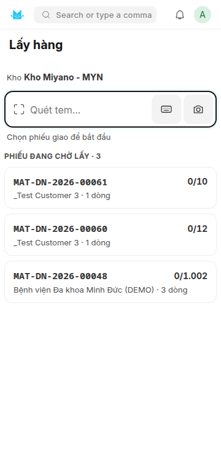
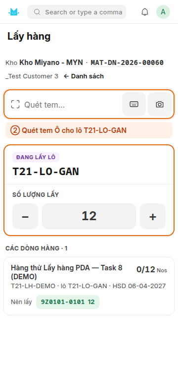
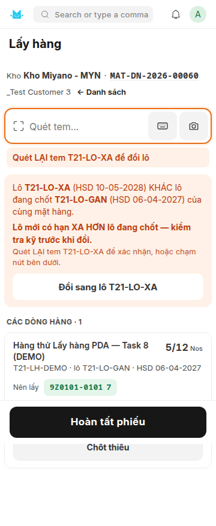
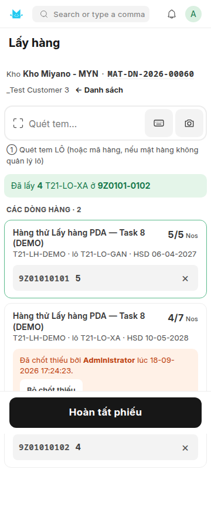
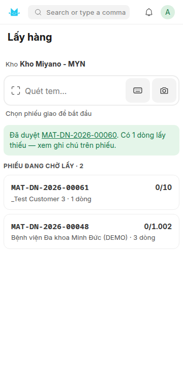
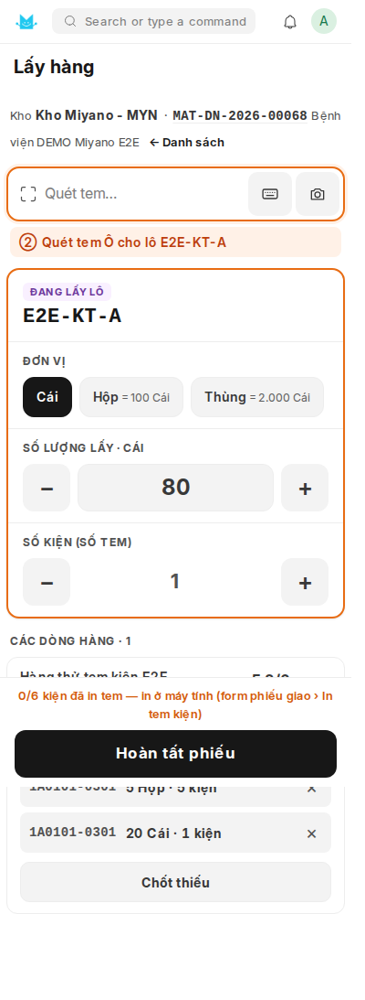
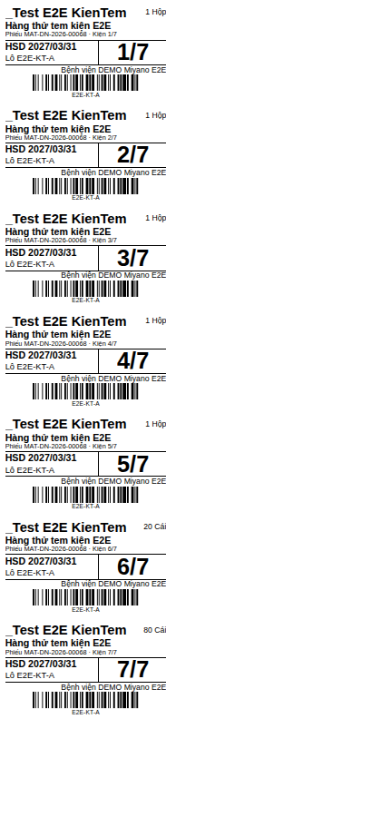
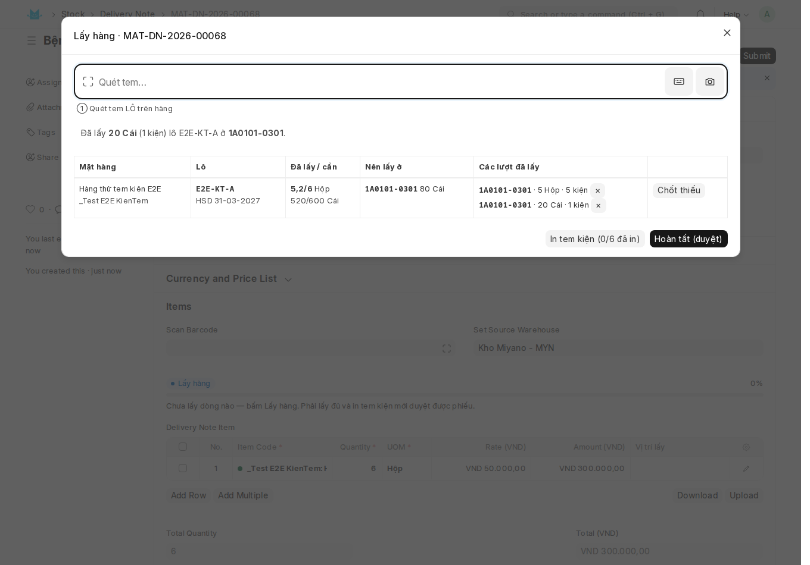

# Hướng dẫn sử dụng kho

Miyano ERP · quản lý kho và vị trí (giá kệ / ô kệ) · dành cho thủ kho và quản lý kho.

> **Tài liệu này mô tả hệ đang chạy trên site thử `erptest.local` (`http://192.168.61.129:8003`).**
> Đây **không phải** site chạy thật. Site thật là `miyano`, nằm trên máy khác và **chưa cài**
> phần quản lý vị trí. Làm quen trên site thử thoải mái — hỏng gì cũng không ảnh hưởng số liệu
> công ty. Khi đưa lên site thật, làm lại toàn bộ mục 5 từ đầu.

---

## 1. Kho nào đang quản lý vị trí

Công ty **Miyano Việt Nam** có các kho sau:

| Kho | Vai trò | Quản lý vị trí |
|---|---|---|
| `Kho Miyano - MYN` | kho vật tư chính | **CÓ** |
| `Hàng trả về - MYN` | hàng khách trả | không |
| `Stores - MYN`, `Work In Progress - MYN`, `Finished Goods - MYN`, `Goods In Transit - MYN` | kho mặc định ERPNext, chưa dùng | không |

Chỉ **`Kho Miyano - MYN`** được chia ô. Các kho khác vẫn chạy bình thường như ERPNext gốc —
có tồn kho, có nhập xuất, chỉ là không biết hàng nằm ở ô nào.

> ### ⚠ Cái bẫy phải sửa trước khi dùng thật
>
> Trong **Stock Settings**, ô **Default Warehouse** đang là **`Stores - M`** — kho của một
> công ty **khác** (`Miyano`, mã `M`), không phải `Miyano Việt Nam` (mã `MYN`). Nghĩa là một
> chứng từ mới mở ra sẽ **tự điền sẵn một kho không quản lý vị trí**. Người lập phiếu không
> để ý, bấm Lưu — hàng vào kho đó, **sổ vị trí không ghi một dòng nào**, và **đối soát vẫn
> báo khớp** (nó chỉ kiểm những kho có bật quản lý vị trí).
>
> Việc cần làm: đổi Default Warehouse sang `Kho Miyano - MYN`, hoặc xoá trống ô đó để người
> lập phiếu buộc phải tự chọn kho. Đây là việc của quản trị hệ thống, làm **một lần**.

### Ai vào được gì

| Việc | Vai trò cần có |
|---|---|
| Sinh ô, bật/tắt quản lý vị trí, đồng bộ lại | `System Manager` **hoặc** `Stock Manager` |
| **Gán vị trí cố định cho mặt hàng** (tạo / sửa / xoá) | `System Manager` **hoặc** `Stock Manager` |
| Xem bốn báo cáo, xem danh mục ô, **xem các gán vị trí**, **quét mã tra cứu** | thêm `Stock User` |
| Nhập/xuất kho như thường lệ | như ERPNext gốc, không đổi |

Sinh ô, bật/tắt kho và **gán vị trí cố định** đều là **thao tác thiết lập**, cố ý không mở cho
`Stock User` — không phải việc hằng ngày. Thủ kho **xem** được mặt hàng nào thuộc ô nào (và phiếu
xếp vẫn tự điền ô đích cho họ), chỉ không tự đổi được chỗ của một mặt hàng.

Khách hàng đăng nhập cổng (`Website User`) **không vào được gì** của phần này.

### Vào ở đâu

Gõ tên màn hình vào ô tìm kiếm (kính lúp trên thanh trên cùng), hoặc vào thẳng đường dẫn:

| Màn hình | Đường dẫn |
|---|---|
| **Vị trí kho** (trang tổng hợp, vào đây trước) | `/app/vị-trí-kho` |
| **Quét mã tra cứu** — dùng trên PDA, xem mục 12 | `/app/quet-ma-tra-cuu` |
| **Xếp hàng vào ô** — dùng trên PDA, xem mục 13 | `/app/xep-hang-pda` |
| Storage Location — danh mục ô | `/app/storage-location` |
| Location Generator — sinh mã ô hàng loạt | `/app/location-generator` |
| Warehouse Location Setup — bật/tắt/đồng bộ | `/app/warehouse-location-setup` |
| Báo cáo **Tồn kho theo vị trí** | `/app/query-report/Ton Kho Theo Vi Tri` |
| Báo cáo **Hàng chưa xếp vị trí** | `/app/query-report/Hang Chua Xep Vi Tri` |
| Báo cáo **Đối soát tồn vị trí** | `/app/query-report/Doi Soat Ton Vi Tri` |
| **Item Location Preference** — gán vị trí cố định | `/app/item-location-preference` |
| Báo cáo **Hàng nằm sai vị trí** | `/app/query-report/Hang Nam Sai Vi Tri` |

*(Đường dẫn **có dấu**, giống `/app/bán-hàng` và `/app/kho-khách-hàng`. Trước 14/09/2026 trang
này nằm ở `/app/vi-tri-kho` không dấu — lệch với mọi trang khác của site và gây lỗi "Not found"
cho người gõ theo tiêu đề; đã đổi cho khớp, đường dẫn không dấu nay **không còn dùng được**.)*

---

## 2. Mã ô đọc thế nào

Mã ô **10 ký tự**, nhìn mã biết ngay chỗ đứng, không phải tra bảng:

```
1B   01   04      03    02        →   1B01040302
khu  dãy  khoang  tầng  ô
```

| Phần | Dài | Miền giá trị | Cách đánh số |
|---|---|---|---|
| Khu | 2 | 1 số + 1 chữ, ví dụ `1B` | theo sơ đồ mặt bằng |
| Dãy | 2 | `01`–`99` | |
| Khoang | 2 | `01`–`99` | trái sang phải |
| Tầng | 2 | `01`–`09` | **đếm từ dưới lên** |
| Ô | 2 | `01`–`99` | trái sang phải |

Hệ lưu và hiển thị **đúng 10 ký tự liền** ở ô **Mã ô**. Ô **Mã in trên nhãn** giữ dạng có gạch
nối `1B0104-0302` cho dễ đọc bằng mắt khi in tem.

Mã sai chuẩn bị **chặn cứng** — sai một ký tự là không lưu được, kèm thông báo chỉ rõ dạng
đúng. `00` cũng bị chặn: không có dãy 0 hay tầng 0 nào cả.

> **Mã ô không bao giờ dùng lại.** Dỡ kệ đi thì mã đó chết theo, không cấp cho ô khác — nếu
> không, tem cũ còn sót lại sẽ chỉ vào chỗ sai.

> **Mã ô cũng KHÔNG sửa được sau khi tạo.** Muốn đổi phải xoá ô và tạo lại, mà mã đã dùng thì
> không cấp lại. Đối chiếu sơ đồ kho cho xong **trước khi** bấm sinh ô.

> ### Ký hiệu Khu phải cấp phát TOÀN HỆ, không phải theo từng kho
>
> Mã ô không chứa mã kho, nên `Mã ô` là khoá chính trên **toàn bộ** danh mục — không riêng
> một kho. Hai kho khác nhau **không được** cùng dùng ký hiệu `1B`. Hệ có chặn (báo "nút nhóm
> đã thuộc kho khác"), nhưng phải thống nhất bảng phân bổ **Khu ↔ Kho** *trước khi* sinh ô,
> đừng để phát hiện sau khi tem đã in.

> ### Cách ly là một KHO RIÊNG, không phải một loại vị trí
>
> Trường **Loại vị trí** chỉ có hai lựa chọn: "Lưu trữ" và "Soạn hàng". **Không có "Cách ly"** —
> và đó là cố ý. Trước đây có, nhưng nó chỉ là một cái nhãn: không chỗ nào trong hệ đọc tới,
> nên hàng để ở ô "Cách ly" **vẫn bị chọn ra xuất bán bình thường**. Một nhãn an toàn giả còn
> nguy hơn không có nhãn.
>
> Muốn cách ly hàng thật (chờ QC, hàng lỗi, hàng thu hồi, hàng hết hạn): tạo một **Kho riêng**
> và chuyển hàng sang đó bằng phiếu chuyển kho. Đó mới là ranh giới tồn kho thật.

---

## 3. Tem vị trí

Mở một ô bất kỳ trong **Storage Location**, mục **Tem vị trí** nằm ngay dưới mục đầu — đó là
**đúng con tem sẽ in ra**, không phải một bản xem trước gần giống.

Tem dựng theo mẫu đang dán trong kho: mã 10 ký tự tách làm **ba nhóm**, theo đúng cách người
đứng trước kệ tìm hàng — tới Khu+Dãy, đếm Khoang, rồi nhìn Tầng+Ô.

```
┌──────┬──────┬─────────────────┐
│  ⬇   │      │  TẦNG        Ô  │
├──────┴──────┤  ┌───────────┐  │
│ KHU DÃY│KHOANG│ │   0302    │  │   ← nhóm cuối to nhất: khi đã đứng
│  1B01  │  04  │ └───────────┘  │      đúng khoang thì chỉ còn nó đáng đọc
├─────────────────────────────────┤
│  ▌│▌▌│▌ ▌│▌▌▌ │▌ ▌│▌▌ ▌│▌      │
│  Kho Miyano - MYN · Kệ inox T3  │
└─────────────────────────────────┘
```

Đọc liền ba nhóm ra `1B` `01` `04` `03` `02` = `1B01040302` — **đúng chuỗi máy quét trả về**,
tức đúng khoá chính của bản ghi. Quét tem là ra thẳng ô, không qua bảng tra nào. Ký hiệu dùng
là **Code 128**, mọi máy quét công nghiệp đều đọc được.

> **Tem KHÔNG in chữ dưới mã vạch** — khác thói quen thường thấy, và là chủ ý. Ba nhóm số ở
> khối trên đã làm đúng việc đó và làm tốt hơn: `1B01 · 04 · 0302` dễ đọc bằng mắt hơn một
> chuỗi mười ký tự liền. Nếu in thử mà thấy khó đọc, đây là chỗ xem lại đầu tiên.

> **Mũi tên ⬇ in cố định trên mọi tem**, nghĩa là "ô của tem này nằm ngay **dưới** chỗ dán" —
> tem dán lên thanh xà hoặc mép tầng trên. Nó không đổi chiều theo dữ liệu được.

Vài điều nên biết:

- Tem **không phải dữ liệu mới** — nó vẽ lại từ Mã ô mỗi lần mở form, không lưu vào cơ sở dữ
  liệu. Sửa được Mã vạch ở mục *Lấy hàng* nếu kho cần một chuỗi khác với Mã ô (hiếm); để trống
  thì hệ lấy bằng Mã ô.
- **Nút nhóm cũng có mã vạch** (`1A`, `1A01`, `1A0104`…) để dán tem đầu dãy, đầu khoang.
- **Ô "Chưa xếp vị trí" không có** — nó là ô ảo, không có kệ thật để dán.

### In tem hàng loạt

Mở **Storage Location** ở dạng cây, mỗi nốt có nút **"In tem"**. Bấm ở nốt nào thì in tem cho
**mọi ô lá thuộc nhánh dưới nốt đó** — bấm ở Khu `1A` ra 128 tem, bấm ở một khoang ra 8 tem,
bấm ở đúng một ô ra một tem.

Hộp thoại cho biết **sẽ in bao nhiêu tem** và vài mã ví dụ trước khi in, kèm ô **Số bản in mỗi
ô** (dán hai mặt kệ thì để 2). Kiểm rồi mới bấm In.

Tem có **hai khổ: 45×25mm (mặc định) và 50×30mm** — chọn trong hộp thoại. Mỗi tem một trang,
đúng cuộn tem của máy in nhiệt, không phải khổ A4. Đã đo trên bản in thật: 45,13 × 25,06mm và
50,12 × 29,97mm, không có tem trắng thừa ở cuối xấp.

> **Khi in phải đặt tỉ lệ 100%, KHÔNG dùng "Fit to page".** Lệch 10% trên con tem 45mm là mã
> vạch chạy ra khỏi mép và máy quét đọc chập chờn ngay trên kệ.

| Không in tem cho | Vì sao |
|---|---|
| Nút nhóm (Khu, Dãy, Khoang, Tầng) | không có kệ riêng để dán |
| Ô "Chưa xếp vị trí" | ô ảo, không tồn tại ngoài kho |

**Trần 500 tem một lần in.** Vượt thì hệ **từ chối hẳn** kèm thông báo, không in 500 tem đầu
rồi lặng lẽ dừng — nếu cắt bớt im lặng, người in tưởng đã in đủ cả nhánh. Chọn nhánh nhỏ hơn
rồi in làm nhiều đợt.

**Thủ kho (`Stock User`) tự in lại được** khi tem rách, bẩn, bong — không phải nhờ quản lý. In
tem không ghi gì vào dữ liệu nên không có rủi ro hỏng số liệu.

> **Nếu không thấy cửa sổ in hiện ra:** trình duyệt đang chặn cửa sổ bật lên. Cho phép pop-up
> cho địa chỉ này rồi bấm In lại.

> **Vẫn nên in thử vài con và dán lên kệ trước khi in cả loạt** — rồi quét thử bằng đúng máy
> quét của kho. Khổ giấy và bố cục đã đo trên bản in ra PDF, nhưng chưa ai quét thử một con
> tem in ra từ máy in nhiệt thật.

---

## 4. Cây vị trí: gấp/mở, và ngừng dùng cả một dãy

Ô kệ là một **cây 5 cấp** (Khu → Dãy → Khoang → Tầng → Ô), suy thẳng từ mã: mỗi cấp là **tiền
tố** của cấp sau.

```
1B                  Khu
└─ 1B01             Dãy
   └─ 1B0104        Khoang
      └─ 1B010403   Tầng
         └─ 1B01040302   Ô  ← chỉ cấp này mới thật sự chứa hàng
```

Cây này **không khai tay** — hệ tự tính lại từ mã mỗi lần lưu, nên không bao giờ có chuyện cây
lệch khỏi mã.

**Xem cây:** mở **Storage Location** ở dạng cây (Tree View) thay vì bảng. Mỗi Khu/Dãy/Khoang/
Tầng là một nút gấp được; nút không gấp được là ô lá — nơi chứa hàng.

**Ngừng dùng cả một dãy trong một thao tác:** tích **"Ngừng dùng"** trên **một nút cha bất kỳ**
— Khu, Dãy, Khoang hay Tầng — là ngừng dùng **toàn bộ ô lá bên dưới nó**. Ví dụ tắt cả khoang
`1B0104` (mấy chục ô bên dưới) chỉ cần tích đúng một bản ghi `1B0104`. Bỏ tích để dùng lại.

Hàng nằm trong nhánh đã tắt: vẫn **cộng vào tồn kho** như thường (đối soát vẫn khớp), chỉ là
**không được chọn để xuất**. Nếu hàng chỉ còn ở nhánh đã tắt, phiếu xuất bị chặn kèm thông báo
**nói rõ ô nào đang giữ hàng** — không phải câu "thiếu hàng" chung chung.

---

## 5. Trình tự làm lần đầu

Làm đúng thứ tự này. Trên `erptest.local` các bước này **đã làm xong rồi** (214 bản ghi: 85 nút
nhóm + 128 ô thật + 1 ô hệ thống); mục này để làm lại khi đưa lên site thật.

### Bước 0 — Thống nhất ký hiệu Khu (một lần, cho TẤT CẢ các kho)

Làm **ngoài phần mềm**: lập một bảng "Khu nào thuộc kho nào" (`1A`, `1B`, `2A`…), mỗi ký hiệu
chỉ dùng cho **đúng một kho**. Lý do ở mục 2.

### Bước 1 — Sinh mã ô

**Location Generator** → **New**:

| Ô nhập | Ví dụ |
|---|---|
| Kho | `Kho Miyano - MYN` |
| Khu (2 ký tự) | `1B` |
| Số dãy (tối đa 99) | `4` |
| Số khoang mỗi dãy (tối đa 99) | `4` |
| Số tầng mỗi khoang (tối đa **9**) | `4` |
| Số ô mỗi tầng (tối đa 99) | `2` |

Lưu, rồi bấm **"Xem trước rồi sinh ô"**. Hộp thoại cho biết **sẽ tạo bao nhiêu ô** và **vài mã
ví dụ** — ví dụ trên là `4 × 4 × 4 × 2` = **128 ô**. Kiểm kỹ rồi mới xác nhận.

Nếu có mã trùng, hệ **không tạo ô nào cả** và báo rõ mã nào trùng. Không có chuyện tạo được
một nửa.

**Thứ tự lấy hàng:** bộ sinh tự đánh số 1, 2, 3… theo thứ tự mã. Nếu đường đi thật trong kho
khác thế, mở từng ô trong **Storage Location** và sửa lại — ô gần cửa để số nhỏ.

### Bước 2 — Bật quản lý vị trí cho kho

**Warehouse Location Setup** → **New** → chọn Kho → **Lưu** → bấm **"Xem trước chuyển đổi"**.

Hộp thoại cho biết sẽ ghi bao nhiêu dòng sổ, cho bao nhiêu mặt hàng và lô, kèm **cảnh báo** nếu
có hàng không quản lý lô hoặc có tồn âm. **Bước xem trước không ghi gì cả** — bấm thoải mái.

Xác nhận trên hộp thoại đó chính là **bật**. *(Không có nút "Bật" riêng — cố ý, để không ai bật
mà chưa xem trước.)*

Toàn bộ tồn hiện có chuyển vào ô **"Chưa xếp vị trí"**, tách theo từng lô. Nếu bước kiểm cuối
phát hiện lệch, hệ **huỷ sạch** và kho quay về đúng như trước — không có trạng thái bật nửa vời.

### Bước 3 — Kiểm ngay sau khi bật

1. Mở **Đối soát tồn vị trí**, chọn kho. **Rỗng nghĩa là khớp.**
2. Mở **Hàng chưa xếp vị trí** — lúc này nó liệt kê **toàn bộ tồn**, vì mọi thứ vừa dồn vào ô
   "Chưa xếp vị trí". Đó là danh sách việc: ra kho xếp hàng vào ô thật.

---

## 6. Vận hành hằng ngày

**Không phải thao tác gì thêm.** Cứ nhập/xuất bằng chứng từ ERPNext như cũ — hệ tự ghi sổ vị
trí ở phía sau.

| Việc | Hệ làm gì |
|---|---|
| Nhập kho (Purchase Receipt, Stock Entry) | Hàng vào ô **"Chưa xếp vị trí"** |
| Xuất kho / giao hàng (Delivery Note, Stock Entry) | Hệ **tự chọn ô** — xem mục 6.2 |
| Huỷ phiếu | Hàng về **đúng ô đã lấy**, không phải ô khác |
| Kiểm kê (Stock Reconciliation) | Sổ vị trí điều chỉnh theo |

**Việc hằng ngày của thủ kho:** mở **Hàng chưa xếp vị trí**, ra kho xếp hàng vào ô thật.
**Việc hằng tuần của quản lý:** mở **Đối soát tồn vị trí**. Rỗng là tốt.

### 6.1 Nhập hàng: số lô phải gõ tay

Cả **80 mặt hàng có quản lý lô** của Miyano đều đặt "không tự sinh lô". Nghĩa là khi nhập hàng,
**người lập phiếu phải gõ số lô theo nhãn của nhà sản xuất** — hệ không tự đẻ ra số lô, và
không cho lưu nếu bỏ trống.

Gõ **kèm hạn dùng**. Hạn dùng là thứ hệ dựa vào để chọn hàng xuất trước; bỏ trống là mất tác
dụng đó. Hiện 55/55 lô trên hệ đều đã có hạn dùng — giữ nguyên kỷ luật này.

> **Từ 16/09/2026 có màn hình riêng để khai số lô: *Phiếu nhập lô* — xem mục 11.** Nó thay cho
> việc gõ số lô vào hộp thoại lô trên dòng phiếu nhập, và nó là đường duy nhất in được nhãn lô.
>
> **Từ 17/09/2026:** trên phiếu nhập nháp có nút **"Nhập lô & in nhãn"** — bấm là vào thẳng phiếu
> nhập lô với dòng hàng đã nạp sẵn. Và ở **kho đã bật quản lý vị trí**, phiếu nhập **không duyệt
> được** nếu số lô gõ tay thay vì khai qua nút đó (mục 11.1).

Hàng nhập về **dồn hết vào ô "Chưa xếp vị trí"** — chưa có ô khai vị trí ngay trên phiếu nhập.
Việc xếp làm sau, bằng **Phiếu xếp / chuyển vị trí** (mục 6.3).

### 6.2 Xuất hàng: hệ chọn LÔ và chọn Ô theo hai quy tắc KHÁC NHAU

Đây là chỗ dễ hiểu nhầm nhất, đọc kỹ:

| Bước | Ai quyết | Theo quy tắc nào |
|---|---|---|
| 1. Chọn **lô** nào để xuất | ERPNext gốc | **thứ tự nhập** (lô tạo trước xuất trước) |
| 2. Trong lô đó, lấy ở **ô** nào | phần vị trí của Miyano | **hạn dùng gần nhất trước**, cùng hạn thì theo thứ tự lấy hàng |

Lô **đã quá hạn** thì ERPNext tự loại, không chọn. Nhưng giữa hai lô **còn hạn**, nó chọn theo
thứ tự nhập chứ **không** theo hạn dùng.

**Điều này đã được chạy thử trên site và đo, không phải suy đoán.** Ngày 13/09/2026, mặt hàng
`MYN-IMP-NEP-8` có ba lô còn hạn trong kho:

| Lô | Hạn dùng | Tạo lúc |
|---|---|---|
| `E2E-LO-GAN-2026` | **28/10/2026** — còn 45 ngày | 13/09, tạo sau |
| `LO-IMP-NEP-8-2026` | 16/07/2028 | 16/08, tạo trước |
| `E2E-LO-XA-2028` | 12/09/2028 | 13/09 |

Lập phiếu giao **`MAT-DN-2026-00053`** xuất 30 Cái, để hệ tự chọn. Kết quả: hệ lấy
`LO-IMP-NEP-8-2026` (20) rồi `E2E-LO-XA-2028` (10) — **cả hai đều hạn 2028**, còn lô sắp hết
hạn sau 45 ngày **không được đụng tới**.

Đây không phải lỗi, đó là FIFO đúng như cấu hình. Nhưng với vật tư y tế thì hệ quả rất thật:
**hàng sắp hết hạn nằm lại trong kho cho tới lúc hỏng**, trong khi hàng còn hai năm được bán đi.

> **Việc cần quyết.** Trong **Stock Settings**, ô **"Pick Serial / Batch Based On"** đang để
> `FIFO`; đổi sang **`Expiry`** thì cả hai bước đều theo hạn dùng gần nhất trước. Đây là
> **quyết định của công ty**, không phải việc kỹ thuật — nó ảnh hưởng mọi kho, mọi chứng từ,
> nên cần người có thẩm quyền chốt.

Ngược lại, **bước 2 chạy đúng như thiết kế.** Phiếu **`MAT-DN-2026-00054`** xuất 40 Cái, chỉ
định thẳng lô `E2E-LO-GAN-2026` đang nằm ở hai ô. Hệ lấy hết ô gần cửa trước rồi mới đi tới ô
cuối kho:

```
1A01010101   -25   (thứ tự lấy hàng 1)     ← lấy cạn ô này trước
1A04040402   -15   (thứ tự lấy hàng 128)   ← rồi mới tới ô xa
```

### 6.3 Xếp hàng vào ô

Đây là bước biến "hàng đã về kho" thành "hàng nằm ở ô nào". Không có nó thì mọi thứ dồn ở ô
"Chưa xếp vị trí" và cả phần vị trí chỉ chạy được một nửa.

> **Có PDA thì dùng trang "Xếp hàng vào ô" (mục 13)** — quét tem lô rồi quét tem ô, không phải
> gõ gì. Cách trên máy tính dưới đây vẫn dùng được, hợp khi xếp cả loạt theo danh sách.

**Cách làm trên máy tính:**

1. Mở **Phiếu xếp / chuyển vị trí** (`/app/location-transfer/new`), chọn **Kho**.
2. Hai cách đưa dòng vào phiếu:
   - **Quét tem** vào ô *"Quét tem (lô / ô)"* trên đầu bảng: quét tem **lô** là tự thêm một dòng
     đủ mặt hàng, lô, *Từ ô* (Chưa xếp), *Đến ô* (ô in trên tem) và số lượng — không phải chọn
     mặt hàng rồi chọn lô. Quét tiếp tem **ô** để xác nhận: sai ô là báo đỏ ngay.
   - Bấm **"Lấy hàng chưa xếp"** — hệ đổ toàn bộ hàng đang ở ô "Chưa xếp vị trí" thành các dòng,
     *Đến ô* lấy đúng **ô in trên tem lô**. Lô chưa có ô trên tem (hoặc ô trên tem hỏng) thì
     **không** được đưa vào phiếu — hệ liệt kê riêng để đi in lại tem.
3. **Lô bắt buộc xếp đúng ô in trên tem** (luật từ 19/09/2026 — xem "Ô trên tem" ngay dưới). Sửa
   *Đến ô* sang ô khác thì **không lưu được**. Hàng **không quản lý lô** không có tem lô nên chọn
   ô tự do, như trước.

   Với hàng không lô, nếu có dòng chưa được điền ô thì hệ hiện một dòng nhắc màu cam
   nói **có bao nhiêu dòng và vì sao**, gộp theo từng lý do. Ba lý do có thể gặp:

   | Lý do hiện ra | Nghĩa là | Việc cần làm |
   |---|---|---|
   | *mặt hàng chưa gán vị trí cố định* | chưa ai gán chỗ cho mặt hàng này | gán một lần ở mục 10, lần sau khỏi phải điền |
   | *vùng `<nút>` đã đầy: N/N ô đang chứa hàng khác* | đã gán rồi, nhưng vùng đó hết chỗ trống và cũng không ô nào đang chứa chính mặt hàng này | dọn bớt vùng đó, hoặc gán mặt hàng sang nút rộng hơn |
   | *không gợi ý được cho `<mã>` — xem Error Log* | có trục trặc dữ liệu ở nút đã gán | báo quản trị; **đừng** đi gán lại, gán lại không chữa được |

   > Ba lý do là ba việc khác nhau. Đọc nhầm "đã đầy" thành "chưa gán" rồi đi gán lại một thứ đã
   > gán là mất công mà vùng kho vẫn hết chỗ.
4. **Lưu** rồi **Duyệt**. Duyệt xong sổ vị trí mới ghi.

Phiếu này cũng dùng để **dồn hàng, đổi kệ**: chọn *Từ ô* là một ô thật thay vì ô "Chưa xếp".

**Xếp nhầm thì Huỷ phiếu** — hàng quay về đúng ô cũ. Sổ giữ nguyên dấu vết cả hai chiều, không
ai sửa được lịch sử. Nếu hàng ở ô đích đã bị xuất đi mất thì **không huỷ được**, kèm thông báo
nói rõ vì sao.

| Hệ chặn | Vì sao |
|---|---|
| Chuyển sang **kho khác** | đổi kho là đổi tồn kho thật — việc của phiếu chuyển kho ERPNext |
| Xếp vào **nút nhóm** (Khu/Dãy/Khoang/Tầng) | không phải kệ thật, không chứa hàng |
| Xếp vào ô **đang Ngừng dùng**, hoặc dưới nhánh đã tắt | hàng vào được mà không xuất ra được |
| Rút quá tồn ô nguồn | sinh ô âm, mà "Đồng bộ lại" cố ý từ chối chữa ô âm |
| Bỏ trống số lô cho hàng có lô, hoặc điền lô cho hàng không lô | lệch tồn theo ô mà tổng vẫn đúng — đối soát không bắt được |
| **Xếp lô vào ô KHÁC ô in trên tem** (kể cả chuyển giữa hai ô thật) | tem trên thùng là thứ người lấy hàng đọc — sổ nói một ô, tem nói ô khác là mất hàng |
| Lô **chưa có ô trên tem**, hoặc ô trên tem đã Ngừng dùng / đang chứa mặt hàng khác | phải đặt/đổi ô trên tem và in lại tem trước |

#### Ô trên tem — đặt, đổi, và chuyển hàng sang chỗ khác

Mỗi lô có **một** ô in trên tem, và lô **chỉ** được xếp vào ô đó. Không ai vượt được, kể cả
trưởng kho, kể cả trên máy tính. Muốn hàng nằm chỗ khác thì đổi ô trên tem trước:

**Ba lối đặt / đổi ô trên tem:**

| Việc | Làm ở đâu | Ai |
|---|---|---|
| **Đặt** ô cho **một** lô, ngay tại kệ | Trang **Xếp hàng vào ô** (PDA): quét tem lô, bấm **Đặt ô trên tem**, rồi quét tem ô định để hàng | Thủ kho |
| **Đặt** ô cho **nhiều** lô một lượt | Trang **Đặt ô trên tem hàng loạt** (máy tính, mục 15) | Thủ kho |
| **Đổi** ô của lô đã có ô | Form **Lô** (`/app/batch/<số lô>`) | Trưởng kho |

Cách làm trên form Lô:

1. Mở lô (`/app/batch/<số lô>`) → bấm **Đặt ô trên tem** (lô chưa có ô) hoặc **Đổi ô trên tem**
   (lô đã có ô).
2. Chọn ô mới, ghi lý do (bắt buộc khi đổi) → **Lưu và in tem**. Hệ in ngay tem mới.
3. **Dán tem mới đè lên tem cũ** trên mọi thùng của lô.
4. Xếp / chuyển hàng vào ô mới như thường.

| Ai | Được làm |
|---|---|
| Thủ kho (`Stock User`) | **Đặt** ô cho lô chưa có ô |
| Trưởng kho (`Stock Manager`) | Đặt, và **đổi** ô đã có |

Mỗi lần đặt/đổi ghi một dòng vào lịch sử của lô: ai, lúc nào, từ ô nào sang ô nào, vì sao.

> **Một lô — một ô.** Lô lớn phải chia ra hai ô thì phần nằm ở ô không khớp tem sẽ không chuyển
> tiếp được cho tới khi đổi ô trên tem. Lấy hàng (xuất bán) từ bất kỳ ô nào vẫn bình thường.
>
> **Quyền mở form Lô:** theo phân quyền gốc, form **Lô** chỉ vai trò `Item Manager` mở được.
> Thủ kho / trưởng kho cần được cấp quyền đọc Lô (Role Permission Manager) thì mới thấy nút.

> **Lấy hàng RA khỏi ô đang Ngừng dùng thì VẪN ĐƯỢC** — cố ý. Đó là đường duy nhất gỡ hàng khỏi
> một dãy đang tháo kệ. Chỉ chiều xếp *vào* mới bị chặn.

**Phiếu xếp không đụng tới tồn kho ERPNext.** Chuyển giữa hai ô trong cùng kho không làm đổi
`Bin.actual_qty`, nên nó chỉ ghi sổ vị trí. Vì vậy nó không sinh phiếu kho, không đổi giá vốn,
không ảnh hưởng kế toán.

**Thủ kho (`Stock User`) lập, duyệt và huỷ được** — xếp hàng là việc hằng ngày.

---

## 7. Bốn báo cáo

| Báo cáo | Trả lời câu hỏi | Rỗng nghĩa là |
|---|---|---|
| **Tồn kho theo vị trí** | hàng nào đang ở ô nào (hiển thị dạng cây, gộp theo từng cấp) | kho trống |
| **Hàng chưa xếp vị trí** | việc cần dọn của thủ kho | đã xếp hết, tốt |
| **Đối soát tồn vị trí** | hệ có lệch không | **khớp, tốt** |
| **Hàng nằm sai vị trí** | ô nào đang chứa hàng khác với mặt hàng đã gán cho nó | **đúng chỗ hết, tốt** |

**Hai báo cáo cuối là báo cáo *sai lệch*, không phải báo cáo tồn kho.** Rỗng mới là tốt. Muốn
xem tồn thì mở *Tồn kho theo vị trí*.

> ### Vì sao cần *Hàng nằm sai vị trí* khi đã có *Đối soát*
>
> Hai cái soi hai thứ khác hẳn nhau, và cái này **không** thay được cái kia.
>
> *Đối soát* so **tổng** tồn theo ô với tồn kho ERPNext. Một ô chứa nhầm mặt hàng thì tổng vẫn
> đúng y nguyên — **đối soát không bao giờ thấy**. Nó khớp tuyệt đối trong khi kệ đã sai.
>
> Lúc **gán** vị trí, hệ đã chặn nếu vùng đó đang có hàng của mặt hàng khác. Nhưng đó là chặn
> **một lần**, lúc gán. Sau đó hàng vẫn vào sai ô được — qua phiếu xếp khai tay, qua huỷ chứng
> từ, qua kiểm kê. *Hàng nằm sai vị trí* là thứ duy nhất soi việc đó, và nên xem **hằng tuần**.

### Xem tồn theo Khu, theo Dãy

*Tồn kho theo vị trí* hiện **dạng cây và tự cộng dồn lên từng cấp**: mỗi nút Khu/Dãy/Khoang/
Tầng mang tổng của mọi ô lá bên dưới nó. Gấp nhánh lại là thấy số của cả khu.

```
1A                    50        ← cả Khu
   1A02               30           ← Dãy 02
      1A0201          30
         1A020101     30
            1A02010101  30        ← ô thật
   1A04               20           ← Dãy 04
      ...
```

> **Luôn lọc một mặt hàng trước khi đọc số ở cấp Khu.** Kho đang dùng **10 đơn vị tính** khác
> nhau (Hộp, Cái, Gói, Chai, Bộ, Cuộn, Đôi, Miếng, Túi, Lọ). Không lọc thì con số ở nút Khu là
> tổng của hộp cộng chai cộng đôi — **không trả lời được câu hỏi nào**. Lọc một mặt hàng rồi
> thì cùng đơn vị, con số mới có nghĩa.

Ba câu hỏi khác về cấp Khu — *khu nào còn chỗ trống*, *khu nào đang giữ bao nhiêu tiền hàng*,
*khu nào có hàng sắp hết hạn* — **chưa có báo cáo**, đang chờ làm.

### Khi đối soát có dòng

Đọc cột `loai`:

| Loại | Nghĩa | Làm gì |
|---|---|---|
| Lệch tồn | Tổng tồn các ô ≠ tồn kho ERPNext | Warehouse Location Setup → **"Đồng bộ lại"** |
| Ô âm | Có ô mang số lượng âm | **Không** bấm Đồng bộ lại — xem dưới |
| Lệch bộ đệm | Bộ nhớ đệm trôi khỏi sổ | xem dưới |

**"Đồng bộ lại" chỉ chữa được loại thứ nhất.** Với hai loại kia nó **cố ý ném lỗi** thay vì âm
thầm ghi đè — đó là dấu hiệu dữ liệu hỏng, không phải lệch thường. Khi đó gọi kỹ thuật chạy:

```
bench --site erptest.local execute erpnext.warehouse_operations.vitri.so.dung_lai_ton_vi_tri \
  --kwargs "{'kho': 'Kho Miyano - MYN'}"
```

Hàm này xoá bộ đệm và cộng lại từ đầu từ sổ. Sổ không bao giờ bị sửa hay xoá — nó chỉ ghi thêm
— nên thao tác này an toàn, chạy lại bao nhiêu lần cũng được.

> **Đối soát khớp KHÔNG chứng minh cây vị trí đúng.** Nó chỉ so tổng số lượng với tồn kho; nó
> **không đọc cấu trúc cây**. Một ô gắn nhầm vào nhánh khác vẫn cho đối soát khớp. Muốn kiểm
> cấu trúc thì phải nhờ kỹ thuật kiểm thẳng, không nhìn báo cáo này mà kết luận.

---

## 8. Tắt và bật lại quản lý vị trí

**Tắt** (Warehouse Location Setup → "Tắt quản lý vị trí"): hệ ngừng ghi sổ cho kho đó. **Sổ cũ
giữ nguyên**, không xoá gì.

**Không bật thẳng lại được.** Trong lúc tắt, kho vẫn xuất nhập — nên tồn vị trí đứng yên trong
khi tồn kho đi tiếp. Phải bấm **"Đồng bộ lại"** trước: nó ghi bù phần chênh vào ô "Chưa xếp vị
trí" rồi mới cho bật lại. Đây là chặn cố ý, không phải lỗi.

---

## 9. Sáu điều dễ hiểu nhầm

**1. Ô "Chưa xếp vị trí" được lấy hàng SAU CÙNG, không phải trước.** Nó mang thứ tự lấy hàng
9999. Cùng hạn dùng thì hệ lấy từ ô đã xếp đàng hoàng trước — thủ kho biết đi tới đâu; chỉ khi
các ô thật cạn mới rút tới đống chưa xếp. Hàng ở đó vẫn là hàng thật, vẫn xuất bình thường.

**2. Ô "Chưa xếp vị trí" là ô hệ thống, mỗi kho đúng một ô** (mã `ZZZ-CHUA-XEP`). Không xoá
được, không đặt "Ngừng dùng" được — nó là **van an toàn**: mọi thứ không rõ vị trí rơi vào đó
thay vì làm hỏng số liệu. Đây là ô duy nhất không theo chuẩn 10 ký tự, và nó đứng **riêng**
ngoài cây — nên "Ngừng dùng" một nhánh thật không bao giờ vô tình kéo theo nó.

**3. Ô (hay cả nhánh) "Ngừng dùng" vẫn tính vào tồn, chỉ không được lấy hàng.** Nếu hàng chỉ
còn ở đó, phiếu xuất bị chặn kèm thông báo nói rõ ô nào đang giữ. Chuyển hàng ra, hoặc bật lại.

**4. "Ngừng dùng" một nhánh chỉ có tác dụng khi cây đã dựng xong.** Ngay sau khi cài hoặc phục
hồi trên một site mới, quản trị phải chạy một lần thao tác dựng lại cây (`bench migrate` tự làm
— xem `BAN-GIAO-nen-tang-vi-tri-kho.md`). Chưa chạy thì tích "Ngừng dùng" trên nút cha **không
chặn được gì** ở các ô lá bên dưới, dù giao diện vẫn cho tích bình thường. Trên `erptest.local`
bước này đã xong.

**5. "Đã gán vị trí" KHÔNG có nghĩa là "còn chỗ".** Gán chỉ nói *mặt hàng này thuộc vùng nào*;
nó không giữ chỗ trống nào cả. Một mặt hàng đã gán vẫn có thể không được gợi ý ô nào, vì vùng của
nó đã đầy. Khi đó phiếu xếp nói **"vùng ... đã đầy"** chứ không nói "chưa gán" — hai câu khác
nhau, hai việc khác nhau. Đọc nhầm rồi đi gán lại là mất công mà vùng vẫn hết chỗ.

**6. Ô đích hệ điền sẵn là GỢI Ý, không phải lệnh.** Sửa đè lúc nào cũng được, hệ không chặn.
Thủ kho đứng trước kệ biết những thứ hệ không biết — hàng cồng kềnh, kệ đang hỏng, lô sắp xuất
ngay. Ngược lại: **hệ cũng không tự sửa lại** cái bạn đã chọn.

---

## 10. Gán vị trí cố định cho mặt hàng

Từ 16/09/2026. Đây là thứ làm cho cột *Đến ô* ở mục 6.3 tự điền được.

**Ý tưởng:** mỗi mặt hàng có **chỗ cố định** trên kệ, như kho SPD bên Nhật vẫn làm. Khi ô đã
thuộc về đúng một mặt hàng thì câu "hàng này xếp đâu" trả lời được ngay, **không cần khai sức
chứa cho ô nào** — đó là lý do trước đây hệ không dám gợi ý.

> **Từ 22/09/2026, một mặt hàng gán được NHIỀU vị trí** — ví dụ một ô ở dãy này và cả một tầng ở
> dãy bên kia, kể cả ở kho khác. Luật "một ô chỉ thuộc một mặt hàng" vẫn giữ nguyên.

### 10.1 Gán một mặt hàng

**Cách nhanh nhất — ngay trên form mặt hàng** (từ 17/09/2026):

1. Mở mặt hàng cần gán (chỉ mặt hàng có **Lưu kho**).
2. Ngay đầu form có một dòng cho biết mặt hàng **đã gán ở đâu**, hoặc báo màu cam
   *"chưa gán vị trí cố định — tem in ra sẽ trống ô vị trí"*.
3. Bấm nhóm nút **Vị trí kho → Gán vị trí**. Hộp thoại liệt kê các vị trí đang gán.
4. Bấm **Thêm vị trí** → chọn **Kho** (chỉ hiện kho đã bật quản lý vị trí) → **Chọn trên cây vị
   trí** → chọn nút trên cây (nên chọn cấp **Tầng**, xem 10.2). Lặp lại để thêm vị trí khác.
5. Bỏ một vị trí bằng nút **×**, đổi thứ tự bằng **↑ ↓**, rồi bấm **Lưu**.

Thứ tự vị trí **không** phải "chính / phụ": nó chỉ dùng để phân định khi có nhiều ô trống cùng lúc
(xem 10.4).

Không thấy nhóm nút **Vị trí kho**? Việc gán chỉ dành cho **Stock Manager** và **System
Manager**. Thủ kho vai trò *Stock User* xem được dòng vị trí nhưng không đổi được — nhờ quản lý kho.

Hệ chạy **đủ các phép kiểm** như khi gán ở màn hình riêng: nút đã thuộc mặt hàng khác thì bị từ
chối, kèm tên mặt hàng đang giữ nó.

**Cách cũ — màn hình riêng**, vẫn dùng được, tiện khi gán nhiều mặt hàng liền tay:

1. Mở **`/app/item-location-preference`** (hoặc bấm **Gán vị trí cố định** trên trang *Quản lý kho*).
2. **Mặt hàng** — chọn một lần, **không sửa được về sau**. Gán nhầm thì xoá bản ghi rồi tạo lại.
3. Bảng **Vị trí gán** — mỗi dòng một vị trí: gõ mã ô, hoặc bấm **"Thêm vị trí từ cây"**.

Cột **Kho** và **Cấp** (Khu / Dãy / Khoang / Tầng / Ô) tự điền theo vị trí — không gõ.

### 10.2 Nên gán ở cấp TẦNG, đừng gán một Ô lẻ

Chọn một **Tầng** nghĩa là **cả nhánh dưới nó** thuộc mặt hàng đó — mọi ô trong tầng.

Đây không phải lời khuyên cho đẹp. Luật gợi ý là *"ô trống đầu tiên"*, nên nếu gán vào **một Ô
lẻ**: lần nhập đầu hệ chỉ đúng ô đó; từ **lần nhập thứ hai** ô đã có hàng, không còn ô trống nào
khác trong "vùng" (vùng chỉ có một ô) — hệ sẽ gợi ý dồn tiếp vào chính ô đó cho tới khi kệ thật
sự không còn chỗ, và khi đó không còn đường nào khác để gợi ý.

Gán ở cấp Tầng cho mặt hàng chỗ để lớn lên.

### 10.3 Cây vị trí: vì sao có nút không chọn được

Cây hiện mỗi nốt kèm **số ô trống** và **số mặt hàng đang nằm** trong nhánh đó, để biết chỗ nào
còn rộng mà không phải mở ra đếm.

Nốt **không chọn được thì không có nút "Chọn"** — cố ý. Với 214 ô, bắt người dùng bấm thử rồi
đọc thông báo lỗi không phải là giao diện, đó là trò đoán mò. Ba lý do, ba việc khác nhau:

| Cây báo | Nghĩa là | Việc cần làm |
|---|---|---|
| *đã gán: `<mặt hàng>`* | nốt này, hoặc một nút trên nó, đã thuộc mặt hàng khác | chọn nhánh khác |
| *có gán bên trong* | bên trong nhánh này đã có mặt hàng khác giữ chỗ | gỡ gán con đó trước, hoặc chọn nhánh khác |
| *đang ngừng dùng* | nốt này hoặc một nút trên nó đang tắt | bật lại nhánh, hoặc chờ sửa kệ xong |
| *đã có trong danh sách* | nốt này trùng, nằm trong, hoặc bao trùm một vị trí **đang có trong hộp thoại** của chính mặt hàng này | không cần gán lần nữa — một nhánh chỉ gán một lần |

> **Một ô chỉ thuộc về một mặt hàng.** Hệ chặn cả ba chiều: gán trùng đúng nút, gán vào **con
> cháu** của nút đã có chủ, và gán vào **nút cha bao trùm** nút đã có chủ. Hai nhánh **cạnh
> nhau** thì không sao.

### 10.4 Hệ gợi ý ô theo luật nào

Khi in tem lô / bấm *"Lấy hàng chưa xếp"*, với mỗi mặt hàng đã gán, **trong đúng kho đang làm**:

1. Lô đã in tem mà ô trên tem còn dùng được → **ô trên tem** (xem luật xếp đúng ô trên tem, 6.3).
2. **Ô trống đầu tiên, xét MỌI vị trí đã gán** — theo thứ tự vị trí trong danh sách, rồi thứ tự
   cây. Còn một ô trống ở vị trí thứ hai thì hệ gợi ý ô đó, **dù** vị trí thứ nhất vẫn còn chỗ dồn.
3. Hết ô trống ở mọi vị trí → lấy **ô đang chứa chính mặt hàng đó** (dồn vào chỗ cũ).
4. Không có cả hai → báo **"vùng … đã đầy"** (một vị trí) hoặc **"các vị trí đã gán (…) đã đầy"**,
   để trống ô đích.

Bỏ qua ô nằm dưới nhánh đang ngừng dùng.

Gợi ý **không ép**. Sửa đè lúc nào cũng được.

### 10.5 Hai điều cần biết trước

**Không gán được nếu trong nhánh đang có hàng của mặt hàng khác.** Hệ nói rõ ô nào, mặt hàng nào,
bao nhiêu — chuyển những ô đó đi bằng phiếu xếp / chuyển vị trí rồi gán lại. Hôm nay gần như
không bao giờ gặp vì hàng còn nằm ở ô "Chưa xếp"; nó sẽ bắt đầu gặp khi kho đã xếp được một thời
gian.

**Các vị trí của cùng mặt hàng không được chồng nhau.** Đã gán cả tầng thì không gán thêm một ô nằm
trong tầng đó — hệ báo *"Dòng N trùng hoặc lồng với dòng M"*.

**Gán được ở nhiều kho** (từ 22/09/2026): mỗi vị trí mang kho của chính nó, gợi ý chỉ xét các vị
trí thuộc kho đang nhập / xếp.

**Đổi mã mặt hàng thì gán tự đi theo**, không phải gán lại.

---

## 11. Nhập lô và in nhãn lô

Từ 16/09/2026. Trước đó số lô gõ thẳng vào hộp thoại lô của ERPNext trên dòng phiếu nhập và
**không có nhãn lô**. Nay có một màn hình riêng: **Phiếu nhập lô**.

**Vào từ chính phiếu nhập** — nút **"Nhập lô & in nhãn"** ở đầu phiếu nhập còn nháp. Đây là
đường chính. (Vẫn vào được từ ô **Nhập lô** trên trang *Vị trí kho*, hoặc `/app/batch-entry`.)

**Làm theo đúng sáu bước này:**

1. Kế toán / người mua lập **phiếu nhập** (Purchase Receipt) và **để nguyên ở dạng nháp** — chưa
   bấm Duyệt. **Đừng gõ gì vào ô số lô trên dòng hàng.**
2. Trên phiếu nhập đó, bấm **"Nhập lô & in nhãn"**. Phiếu chưa lưu thì hệ tự lưu trước.
3. Hệ mở **Phiếu nhập lô** với các dòng hàng có quản lý lô **đã nạp sẵn**. Đã có một phiếu nhập
   lô nháp cho phiếu này thì hệ **mở lại đúng phiếu đó**, không tạo phiếu thứ hai.
4. Cầm vỏ thùng, **gõ Số lô và Hạn dùng cho từng dòng** (Ngày sản xuất nếu nhà cung cấp có in).
5. **Lưu**, rồi **Duyệt** phiếu nhập lô. Lúc này hệ tạo bản ghi lô, cấp **số gọi**, và ghi số lô
   lên đúng dòng của phiếu nhập.
6. **Bây giờ mới duyệt phiếu nhập.** Rồi quay lại phiếu nhập lô bấm **"In nhãn cả phiếu"** —
   từ phiếu nhập đã duyệt có nút **"Xem phiếu nhập lô"** để quay lại đó, kể cả khi cần in lại tem.

---

### 11.1 ⚠ Thứ tự bắt buộc: NHẬP LÔ TRƯỚC, DUYỆT PHIẾU NHẬP SAU

> ### ⚠ Duyệt phiếu nhập trước là hỏng cả lô tem. Không sửa lại được.

**Vì sao:** một dòng hàng có quản lý lô không đi qua được bước duyệt nếu chưa có số lô — mà
Phiếu nhập lô thì **chỉ nhận phiếu nhập còn nháp**. Duyệt trước là tự tay khoá mất đường khai lô
đúng cách, và chỉ còn những đường khai lô **không sinh ra tem đầy đủ**.

**Lô không khai qua Phiếu nhập lô thiếu những gì:**

| | Khai bằng **Phiếu nhập lô** | Khai bằng đường khác |
|---|---|---|
| Số lô của nhà cung cấp | có | có |
| **Số gọi** (số to trên tem) | có | **KHÔNG** — ô đó trên tem in ra **trắng**, vĩnh viễn |
| Nhà cung cấp, chứng từ về | điền sẵn từ phiếu | chỉ tự điền khi bản ghi lô có ghi chứng từ mua gốc |
| In cả xấp nhãn một lần | có | **không** — phải mở từng lô in lẻ |

Ô **Số gọi** là ô không cứu được: chỉ Phiếu nhập lô cấp số gọi, và nó chỉ cấp **lúc duyệt phiếu**.
Lô đã sinh ra bằng đường khác thì mãi mãi không có số gọi, tem in ra mãi mãi trắng chỗ đó.

**Nếu có ai bật ô "tự sinh lô" cho một mặt hàng thì còn tệ hơn hẳn:** ERPNext **tự đẻ một số lô
máy** (dạng `BATCH-00123`) lúc duyệt, **số lô của nhà cung cấp mất luôn**, và không có một lời
cảnh báo nào. Hôm nay cả **84/84 mặt hàng có lô** đều đang đặt *"không tự sinh lô"* — **giữ
nguyên như vậy**, đừng ai bật ô đó.

**Ở kho đã bật quản lý vị trí, từ 17/09/2026 hệ CHẶN ngay nút Duyệt.** Phiếu nhập có dòng hàng
quản lý lô mà số lô **chưa có**, hoặc **gõ tay** thay vì khai qua phiếu nhập lô, thì bấm Duyệt sẽ
bị từ chối, kèm danh sách từng dòng sai và câu *"bấm nút **Nhập lô & in nhãn** ở đầu phiếu nhập"*.
Gặp câu đó: **xoá số lô gõ tay trên dòng hàng, lưu phiếu, rồi bấm nút**.

Việc này bắt đầu từ một lần chạy thử thật: phiếu `MAT-PRE-2026-00008` được duyệt với số lô
**`17/09/2026`** — một **ngày tháng** gõ vào ô lô trên phiếu nhập. Hệ lúc đó không chặn, nên số lô
của nhà cung cấp mất và lô đó không có tem.

Hai chỗ **không** bị chặn, có chủ ý:

- **Kho chưa bật quản lý vị trí** — không có tem, không có ô; chặn ở đó là chặn luồng nhập kho
  thường của cả công ty mà không được gì.
- **Phiếu trả hàng** — trả lại một lô đã có, không khai lô mới.

**Với phiếu đã lỡ duyệt từ trước** (như `MAT-PRE-2026-00008`), mở Phiếu nhập lô sẽ bị **từ chối**
kèm câu:

> *Phiếu nhập ... đã duyệt nên không gắn được số lô nữa. Phải nhập lô TRƯỚC rồi mới duyệt phiếu
> nhập — duyệt trước thì ERPNext đã tự sinh số lô máy và số lô của nhà cung cấp mất luôn.*

Câu từ chối đó **không cứu được gì** — nó chỉ cho biết việc đã hỏng. Đường duy nhất có lại tem
đúng là **huỷ phiếu nhập rồi làm lại từ đầu** theo đúng sáu bước trên: huỷ phiếu nhập, mở phiếu
nhập lô khai số lô, rồi duyệt lại phiếu nhập. Huỷ một phiếu nhập đã duyệt là việc phải nhờ kế
toán, và **nếu hàng đã xuất đi mất một phần thì huỷ không được nữa** — khi đó lô hàng ấy sống
suốt đời với con tem thiếu số gọi.

**Nút "Không có dòng nào cần khai lô" nay nói rõ vì sao.** Trước 17/09/2026 câu báo chỉ nói
*"không còn dòng hàng quản lý lô nào chưa có số lô"* — đúng, nhưng không cho biết phải làm gì.
Nay nó nói đúng một trong các nguyên nhân, mỗi nguyên nhân một việc:

| Câu báo nói | Làm gì |
|---|---|
| Phiếu nhập **đã duyệt** — kèm danh sách lô **gõ thẳng trên phiếu** nếu có | Nhờ kế toán huỷ phiếu nhập, làm lại theo sáu bước |
| Các dòng **đã có số lô gõ thẳng trên phiếu nhập** | Xoá số lô trên các dòng đó, lưu, bấm **Nhập lô & in nhãn** |
| **Không mặt hàng nào bật "Có lô"** | Mở form mặt hàng, bật **Có lô**, lưu — rồi làm lại |
| Mọi dòng **đã khai lô qua phiếu nhập lô** … | Không phải làm gì — mở phiếu nhập lô đó để in lại tem |

**Kho chưa bật quản lý vị trí thì hệ vẫn không chặn** — ở những kho đó, thứ tự khai lô trước /
duyệt sau vẫn chỉ dựa vào người làm. Đọc kỹ, và dặn lại người mới.

---

### 11.2 Một mặt hàng về hai lô thì TÁCH DÒNG trên phiếu nhập

**Làm gì:** trên **phiếu nhập** (không phải phiếu nhập lô), để mặt hàng đó thành **hai dòng**, mỗi
dòng một số lượng — 100 hộp về hai lô 60/40 thì một dòng 60, một dòng 40. Tách xong mới sang bước
khai lô.

**Vì sao:** mỗi dòng phiếu nhập nhận **đúng một số lô**. Tách dòng còn được thêm một thứ: số lượng
của từng lô trở nên **đúng ngay trên chứng từ mua hàng**, không phải tra ở chỗ khác.

**Nếu làm sai thì sao:** gõ hai số lô cho cùng một dòng, hệ chặn lúc Lưu:

> *Dòng ...: mỗi dòng phiếu nhập chỉ nhận MỘT số lô. Hàng về hai lô thì tách dòng trên phiếu
> nhập — tách rồi số lượng theo từng lô cũng đúng luôn trên chứng từ.*

Sửa được ngay, chưa mất gì. Nhưng phải quay lại phiếu nhập tách dòng, nên tách sẵn từ đầu là
nhanh hơn.

---

### 11.3 Các ô trên nhãn lô

Nhãn lô khổ **50 × 30mm**, in trên máy in tem nhiệt. Mỗi lô một con tem, dán lên thùng hàng.

```
┌─────────────────────────────────────────────────┐
│ 1130-N6214210                        Cái (1/hộp)│  ← mã vật tư · đơn vị tính
│ Stent Piglet (Piglet Stent)                     │  ← tên hàng
│ 7Fr – Loop 10cm – HD 200cm                      │  ← thông số (có thể trống)
├──────────────────────────────┬──────────────────┤
│ HSD 2029/01/31               │                  │  ← hạn dùng
│ Lô 25L4125                   │      3856        │  ← số lô  ·  SỐ GỌI
├──────────────────────────────┴──────────────────┤
│ VT 3B1205-0401          NHẬP 2026/09/03         │  ← ô sẽ xếp · ngày nhập
├─────────────────────────────────────────────────┤
│   ▌│▌▌│▌ ▌│▌▌▌│▌ ▌│▌▌ ▌│▌ ▌│▌▌│▌ ▌│▌▌▌│▌ ▌│▌    │  ← mã vạch = số lô
│                    25L4125                      │  ← số lô in lại bằng chữ
└─────────────────────────────────────────────────┘
```

| Ô trên tem | Nghĩa | Ghi chú |
|---|---|---|
| Dòng 1 trái | **Mã vật tư** | in to nhất ở đầu tem |
| Dòng 1 phải | **Đơn vị tính** | kèm quy cách khi mặt hàng khai **đúng một** quy đổi (`Cái (1/hộp)`); khai từ hai quy cách trở lên thì chỉ in đơn vị tính |
| Dòng 2 | **Tên hàng** | |
| Dòng 3 | **Thông số kỹ thuật** | **để trắng** nếu mặt hàng chưa khai — ô vẫn giữ chỗ, cố ý |
| Dòng 4 trái | **Hạn dùng** | trống nếu lô không có hạn dùng |
| Dòng 5 trái | **Số lô** | |
| Khối số to bên phải | **SỐ GỌI** | 4 chữ số, xem ngay dưới |
| Dòng 6 trái | **Ô sẽ xếp** (`VT ...`) | `VT —` nghĩa là hệ chưa biết xếp vào đâu |
| Dòng 6 phải | **Ngày nhập** | |
| Dưới cùng | **Mã vạch** | mã hoá **đúng số lô**, không mã hoá gì khác |
| Dòng cuối | **Số lô in lại bằng chữ** | để gõ tay khi máy quét không đọc được |

**Số gọi là gì:** một số **4 chữ số**, cấp riêng cho từng lô, **không bao giờ dùng lại**. Nó để
người trong kho gọi nhau: *"lấy hộ thùng ba-tám-năm-sáu"* thay vì đọc `25L4125`. Nó không thay
được số lô trên chứng từ — chỉ là cái tên ngắn để nói miệng.

> ### ⚠ Nhãn thật KHÔNG giống ảnh mẫu của SPD
>
> Ảnh mẫu dưới đây là bản thiết kế do phía SPD đưa sang. **Bố cục này đã bị bỏ, chốt ngày
> 16/09/2026.**
>
> 
>
> **Vì sao bỏ:** trong ảnh mẫu, mã vạch nằm gọn ở **cột trái**. Mã vạch Code 128 cần một dải
> **trắng 2,5mm ở mỗi đầu** thì máy quét mới bắt được — dải trắng đó là một phần của mã, không
> phải lề cho đẹp. Bố cục mẫu chỉ chừa được **0,7mm**. Thiếu gần bốn lần, và không có chỗ nào để
> bù: nống cột trái ra thì cột phải hết chỗ cho số gọi.
>
> **Nếu cứ giữ thì sao:** tem **trông vẫn đẹp**, in ra vẫn đúng khuôn, mọi phép đo trên màn hình
> vẫn khớp. Chỉ máy quét ngoài kho mới biết — và lúc đó tem đã dán lên thùng hàng y tế rồi.
>
> **Đã đổi thành:** mã vạch chạy **trọn chiều ngang** ở đáy tem, số gọi chuyển sang khối vuông
> bên phải. Đó là bản trong khung vẽ ở trên, và là bản sẽ in ra.

---

### 11.4 Khi tem nói sai vị trí — dán đè tem mới

Ô `VT ...` trên tem là **ô hệ định xếp vào lúc in tem**, không phải ô hàng đang nằm.

**Vì sao nó nói sai được:** tem in lúc hàng vừa về; hàng xếp lên kệ sau đó, có khi cách vài giờ.
Giữa hai lúc ấy, **một lượt nhập khác có thể đã chiếm mất ô đó**. Tem thì đã in xong và đã dán.

**Làm gì:** khi bấm *"Lấy hàng chưa xếp"* trên **Phiếu xếp / chuyển vị trí** (mục 6.3), hệ đọc lại
tình hình kho **tại thời điểm đó** và xếp lại. Dòng nào có tem cũ không còn dùng được, hệ hiện
một dòng nhắc màu cam:

> *N dòng tem cũ không dùng được, đừng theo tem cũ: ...*

Khi thấy dòng này: **đi theo cột *Đến ô* trên phiếu xếp**, và **in tem mới dán đè lên tem cũ** —
dán đè, không bóc ra, để không ai còn đọc được con số cũ. In lại bằng nút **In nhãn** ngay trên
màn hình lô.

> **Dòng nhắc màu cam tự biến mất sau vài giây.** Bỏ lỡ thì không xem lại được. Khi đó:
> **cột *Đến ô* trên phiếu xếp mới là thứ đúng**, tem chỉ là giấy. Nếu hai thứ khác nhau, tin cột
> *Đến ô*.

**Nếu làm sai thì sao:** đi theo tem cũ là đặt hàng vào một ô hệ không ghi. Sổ vị trí nói một
đằng, kệ thật một nẻo. Báo cáo *Hàng nằm sai vị trí* sẽ bắt được, nhưng chỉ sau khi ai đó mở nó
ra xem — còn *Đối soát tồn vị trí* thì **vẫn báo khớp**, vì tổng không đổi.

---

### 11.5 Số lô gõ sai kiểu gì thì hệ báo gì

Hệ chặn ngay lúc Lưu phiếu nhập lô. Có **hai loại**, hai câu báo khác nhau, hai việc khác nhau.

**Loại 1 — số lô quá dài.**

> *Số lô '...' dài N ký tự, cần ... module mã vạch nhưng nhãn 50×30 chỉ chứa được 188 module.*

Giới hạn thực tế:

| Số lô gồm | Dài nhất |
|---|---|
| chỉ chữ số, độ dài chẵn | **26 chữ số** |
| chỉ chữ số, độ dài lẻ | **23 chữ số** |
| có lẫn chữ cái | **13 ký tự** |

**Loại 2 — có ký tự không mã hoá được.**

> *Số lô '...' có ký tự '...' (U+....) ở vị trí N — mã vạch Code 128 không mã hoá được ký
> tự này, nên nhãn sẽ không có mã vạch để quét...*

Hai thủ phạm gần như luôn là:

- **dấu tiếng Việt** (`LÔ-2026` thay vì `LO-2026`);
- **dấu gạch ngang dài `–`** dán từ file hoặc email của nhà cung cấp, trông gần giống dấu trừ `-`
  thường nhưng là ký tự khác. Gõ lại bằng dấu trừ trên bàn phím.

> ### ⚠ ĐỪNG CẮT BỚT KÝ TỰ CHO NÓ QUA
>
> Cả hai câu báo trên đều làm người ta muốn xoá bừa vài ký tự rồi bấm Lưu lại. **Số lô cắt bớt là
> số lô SAI dán lên hàng** — và cái sai đó đi theo thùng hàng suốt vòng đời của nó, qua cả thu
> hồi lô lẫn tra cứu bảo hành.
>
> Gõ **đúng nguyên văn** số lô trên vỏ thùng. Nếu nó thật sự dài hơn giới hạn ở trên, **dừng lại
> và báo quản trị** — đó là chuyện của khổ tem, không phải chuyện của con số.

---

### 11.6 Tem in ra mà chỗ mã vạch là dòng chữ `KHÔNG CÓ MÃ VẠCH — GÕ TAY SỐ LÔ`

**Nghĩa là:** số lô của lô này có ký tự mà mã vạch không mã hoá được, nên hệ **cố ý không in mã
vạch nào cả**. Số lô vẫn in nguyên văn ngay dưới dòng chữ đó, vẫn đọc được bằng mắt.

**Vì sao thà bỏ trống còn hơn:** nếu cứ vẽ bừa, máy quét sẽ đọc ra **một chuỗi khác** chứ không
báo lỗi — tức là quét ra số lô của thùng hàng khác, và không ai biết để mà kiểm lại. Không có mã
vạch thì người ta gõ tay; có mã sai thì không cứu được.

**Khi nào gặp — hôm nay gần như không bao giờ:** hệ chặn ký tự xấu ở **mọi đường tạo lô mới**,
không riêng màn hình Phiếu nhập lô — hộp thoại lô cũ của ERPNext trên dòng phiếu nhập, nhập thẳng
vào danh mục **Lô**, nhập khẩu bằng file, tất cả đều bị chặn như nhau. Đã đếm trên hệ hôm nay:
**63 bản ghi lô, KHÔNG bản nào có ký tự ngoài bảng chữ ASCII.**

Nên dòng chữ này chỉ còn gặp ở hai chỗ: **lô tạo trước 16/09/2026**, hồi chưa có phép chặn; và lô
bị ghi thẳng xuống cơ sở dữ liệu bằng một đường vòng qua mọi phép kiểm. Thấy nó, hiểu là **đang
cầm một con tem của thời trước** — đừng đi tìm ai vừa gõ sai.

**Làm gì:**

1. **Đừng dán con tem đó lên hàng rồi coi như xong.** Nó không quét được, mãi mãi.
2. Báo quản trị sửa số lô. **Số lô là tên bản ghi**, không sửa trên form được — phải đổi tên bản
   ghi, hoặc huỷ chứng từ và khai lại bằng số lô gõ không dấu.
3. Sửa xong thì in lại tem và **dán đè**.
4. Trong lúc chờ: hàng vẫn xuất nhập bình thường, chỉ là **mọi thao tác quét với lô này phải gõ
   tay** theo số lô ở dòng dưới.

---

### 11.7 Huỷ phiếu nhập lô

| Trạng thái phiếu nhập | Huỷ phiếu nhập lô được không |
|---|---|
| **Còn nháp** (chưa duyệt) | **được** |
| **Đã huỷ**, hoặc đã bị xoá | **được** — đây là đường thoát khi cả hai chứng từ cùng phải huỷ |
| **Đã duyệt** | **không** |

Phiếu nhập đã duyệt thì hệ từ chối, kèm câu *"Tồn đã ghi theo lô rồi — muốn gỡ thì huỷ chính phiếu
nhập."* Đúng thứ tự: **huỷ phiếu nhập trước, huỷ phiếu nhập lô sau.**

**Huỷ xong, số lô được gỡ khỏi dòng phiếu nhập — nhưng bản ghi lô thì GIỮ NGUYÊN.**

**Vì sao không xoá luôn cho sạch:** vì **tem có thể đã in và đã dán lên thùng hàng**. Xoá bản ghi
lô là biến tờ tem đang dán ngoài kho thành một mẩu giấy tra không ra gì — quét vào không thấy,
gõ tay vào cũng không thấy. Một bản ghi lô thừa nằm trong danh mục thì vô hại; một con tem không
tra được thì không.

**Nếu về sau nhập lại đúng số lô đó:** hệ **dùng lại chính bản ghi cũ**, chỉ điền thêm những ô còn
trống (nhà cung cấp, chứng từ, hạn dùng). Đúng như khi nhà cung cấp giao một lô làm hai đợt.

---

### 11.8 Việc chủ đầu tư phải tự làm — CHƯA AI LÀM THAY ĐƯỢC

> ### ⚠ In thử MỘT con tem trên máy Zebra ZD421, rồi quét nó bằng điện thoại

**Làm gì, đúng bốn bước:**

1. Mở một lô bất kỳ, bấm **In nhãn**. Đặt tỉ lệ in **100%**, **không** dùng "Fit to page".
2. In **một** con tem ra cuộn tem thật trên **Zebra ZD421**.
3. Mở một ứng dụng quét mã vạch trên điện thoại, **quét con tem vừa in**.
4. **So chuỗi quét được với số lô in bằng chữ ở dòng dưới cùng.** Phải **giống nhau từng ký tự**.

**Vì sao đây là việc không bỏ được:** tới hôm nay (16/09/2026) **chưa có con tem lô nào được in
thử ở 203 dpi thật**. Mọi con số về bề rộng vạch, vùng trắng hai đầu, cỡ chữ — đều là số học trên
màn hình và đo trên bản PDF. Đầu in nhiệt chỉ bật/tắt được **nguyên một chấm mực**; giữa "0,25mm
trên bản vẽ" và "hai chấm mực trên giấy thật" có một khoảng mà **không phép đo nào trên màn hình
với tới được**.

**Nếu bỏ qua thì sao:** cái sai kiểu này **không kêu**. Tem in ra trông đúng, dán lên hàng trông
đúng, và máy quét đọc ra **một chuỗi khác** — không phải báo lỗi, mà là đọc ra số lô của thùng
khác. Phát hiện ra thì cả loạt tem đã đi theo hàng vào kho.

**Quét ra khác số lô in trên tem, hoặc không quét được:** **dừng in hàng loạt ngay** và báo lại,
kèm con tem đã in. Đừng chỉnh tỉ lệ in cho nó "vừa hơn" — thu mã vạch nhỏ lại chính là cách làm
hỏng nó.

---

## 12. Quét mã tra cứu (trên PDA)

Trang riêng để **cầm PDA đi trong kho, quét bất cứ tem nào và xem ngay nó là gì**. Vào từ ô bấm
**Quét mã tra cứu** đầu trang **Vị trí kho**, hoặc nút cùng tên trên phiếu nhập lô đã duyệt.
Trên PDA nên **ghim trang này ra màn hình chính** (menu trình duyệt → *Thêm vào màn hình chính*)
để mở bằng một chạm.

### 12.1 Quét thế nào

1. Mở trang. Ô quét **tự sẵn sàng** — không cần chạm vào ô.
2. Bóp cò quét trên PDA, chiếu vào tem. Kết quả hiện ngay, ô quét tự xoá và sẵn sàng cho tem kế.
3. Tem mờ không quét được: bấm nút **⌨** để hiện bàn phím, gõ mã rồi **Enter**. Bấm ⌨ lần nữa để
   quay lại chế độ quét.
4. Không có súng quét (điện thoại thường): bấm nút **máy ảnh** và đưa tem vào khung hình.
5. Mười mã quét gần nhất nằm dưới mục **Vừa quét** — chạm một dòng để xem lại. Danh sách này mất
   khi tải lại trang; hệ **không lưu** lịch sử quét.

> Ở chế độ quét, bàn phím ảo **cố ý không hiện** (nếu hiện nó sẽ che nửa màn hình mỗi lần quét).
> Nếu PDA của kho cài súng quét không tự gửi phím Enter, trang vẫn tự tra khi súng ngừng gửi ký tự.

### 12.2 Quét được những gì

| Quét | Hiện ra |
|---|---|
| **Tem lô** (hoặc gõ số lô) | Số lô, tên hàng, **hạn dùng tô màu**, ngày SX, ngày nhập, số gói, phiếu nhập, NCC; vị trí cố định, ô ghi trên tem, **tồn theo từng ô** |
| **Tem vị trí** (hoặc gõ mã ô, kể cả dạng in trên tem `1A0101-0101`) | Ô thuộc kho nào, mặt hàng nào giữ vị trí này, **đang chứa lô nào, bao nhiêu**. Quét tem cấp Tầng/Khoang ra hàng của mọi ô bên dưới (tối đa 50 dòng) |
| **Mã vạch trên bao bì** hoặc **gõ mã vật tư** | Tên hàng, vị trí cố định, **các lô còn tồn — hạn gần nhất lên đầu**, mỗi lô nằm ô nào |
| **Mã kho** | Kho có quản lý vị trí không, bao nhiêu ô đang dùng, bao nhiêu ô có hàng |
| Mã khác (vỏ thùng, tem vận chuyển…) | Khung xám **"Không nhận ra mã này"** — không phải lỗi, chỉ là quét nhầm. PDA rung hai nhịp nếu máy cho trình duyệt rung |

**Màu hạn dùng:** 🟢 xanh — còn trên 90 ngày · 🟠 cam — còn 90 ngày trở xuống · 🔴 đỏ — đã hết hạn.
Ngưỡng 90 ngày là **tạm đặt**; kho dùng mốc cận date khác thì báo để đổi.

### 12.3 Hai điều cần biết

- **"Mặt hàng cố định" trên tem vị trí** chỉ hiện khi chính ô đó (hoặc Tầng/Khoang chứa nó) đã gán
  cho một mặt hàng. Quét tem cả một Dãy thì thường thấy *"Chưa mặt hàng nào giữ vị trí này"* —
  đúng, vì một Dãy chứa nhiều mặt hàng.
- Tồn hiện trên trang là **tồn theo ô** (sổ vị trí). Hàng đã nhập mà chưa xếp nằm ở ô
  `ZZZ-CHUA-XEP-…` và cũng hiện ra như một ô.

---

## 13. Xếp hàng vào ô (trên PDA)

Trang để **cầm PDA đi xếp hàng**: quét tem lô trên thùng, quét tem ô trên kệ — xong một dòng. Xếp
bao nhiêu thùng cũng dồn vào **một** phiếu xếp, cuối cùng bấm **Hoàn tất** để ghi sổ. Vào từ ô
bấm **Xếp hàng vào ô** đầu trang **Vị trí kho**.

### 13.1 Một vòng xếp

1. Mở trang. Kho tự chọn nếu chỉ có một kho quản lý vị trí; nhiều kho thì chạm chọn kho.
2. **① Quét tem LÔ** trên thùng. Thẻ lô hiện ra:
   - **Lấy từ ô**: mặc định là **Chưa xếp** (hàng mới nhập). Lô đã nằm ở ô khác thì ô đó cũng
     hiện — chạm chọn để **chuyển ô**.
   - **Số lượng xếp**: điền sẵn **toàn bộ** số đang chờ ở ô nguồn. Chia lô ra nhiều ô thì giảm số
     (nút − / + hoặc chạm vào số để gõ), xếp xong phần đầu thì quét lại tem lô cho phần còn lại.
   - **Xếp vào ô trên tem — bắt buộc** (chữ to, nền xanh): ô in trên tem lô. Hàng không lô thì
     là **ô gợi ý** theo vị trí cố định (mục 10), quét ô khác vẫn được.
3. **② Quét tem Ô** trên kệ nơi vừa đặt thùng. Viền cam và dòng *"② Quét tem Ô…"* cho biết hệ
   đang chờ tem ô.
   - Đúng ô trên tem → dòng được ghi ngay lên phiếu, PDA rung, quay về bước ①.
   - **Sai ô** → PDA rung dài, báo đỏ *"SAI Ô… tem ghi ô …"*, **không ghi**. Không có lối xác nhận
     để xếp ô khác (bỏ từ 19/09/2026) — muốn đổi chỗ thì đổi ô trên tem (mục 6.3).
   - Lô **chưa có ô trên tem** → báo đỏ ngay lúc quét tem lô, kèm nút **Đặt ô trên tem**: bấm rồi
     **quét tem ô** định để hàng là đặt xong, xếp tiếp được ngay. Nhớ về máy tính **in lại tem**
     và dán lên thùng — máy in tem không nối với PDA.
   - Ô trên tem **hỏng** (ô bị tắt, hoặc đang chứa mặt hàng khác) → báo đỏ, **không** có nút: đổi
     ô đã có là việc của trưởng kho, làm trên máy tính.
   - Ô không hợp lệ (ô nhóm, dãy đang ngừng dùng, ô kho khác, không đủ hàng) → hệ báo lý do, lô
     vẫn chờ để quét ô khác.
4. Lặp lại cho thùng kế tiếp. Danh sách **Trên phiếu** nằm dưới; chạm **×** để bỏ một dòng.
5. Xếp xong: bấm **Hoàn tất phiếu** → **Ghi phiếu**. Lúc này tồn theo ô mới đổi.

### 13.2 Những điều cần biết

- **Mỗi dòng được lưu ngay** lên một phiếu xếp **nháp** của chính người quét. PDA hết pin, rớt
  mạng hay lỡ đóng trình duyệt: mở lại trang là thấy lại đúng phiếu đó, không mất dòng nào.
- Phiếu nháp là **của từng người** — hai thủ kho cùng xếp một kho không dồn dòng vào nhau.
- **Chưa bấm Hoàn tất thì tồn theo ô chưa đổi.** Hàng đã nằm trên kệ nhưng hệ vẫn ghi ở
  *Chưa xếp*. Đừng để phiếu nháp qua ngày.
- Số *"tối đa"* đã **trừ phần đã lên phiếu** — quét cùng một lô hai lần không xếp được quá số đang
  có.
- Bỏ **dòng cuối cùng** thì phiếu nháp rỗng tự bị xoá.
- Hỏi *"Ghi phiếu?"* và *"Bỏ dòng?"* **chỉ nhận chạm tay** — bóp cò quét lúc hộp đang mở không
  bấm được nút nào. Cố ý: súng quét gửi phím Enter sau mỗi lần quét.
- Quét **mã hàng** của mặt hàng có quản lý lô → hệ nhắc quét **tem lô** (không đoán lô nào).
  Mặt hàng không quản lý lô thì quét mã hàng là được.

---

## 14. Lấy hàng (PDA và máy tính)

Trang để **cầm PDA đi lấy hàng giao khách**: mở đúng phiếu giao, quét tem lô trên thùng, quét tem
ô nơi lấy — hệ ghi lại **đúng ô đã lấy**, không tự đoán theo hạn dùng như trước. Vào từ ô bấm
**Lấy hàng** đầu trang **Vị trí kho**.

> Trước đây phiếu giao **tự trừ theo ô lúc duyệt** (hệ tự chọn ô theo hạn dùng gần nhất — mục
> 6.2), thủ kho không biết trước sẽ trừ ở đâu. Từ nay: **thủ kho quét, hệ ghi đúng ô đã quét.**

### 14.1 Chọn phiếu

1. Mở trang. Kho tự chọn nếu chỉ có một kho quản lý vị trí; nhiều kho thì chạm chọn kho trước.
2. Danh sách **Phiếu đang chờ lấy** hiện các phiếu giao **nháp** có dòng hàng thuộc kho đó, kèm
   tiến độ `đã lấy/cần lấy` và tên khách hàng. Phiếu đang có người khác thao tác thì hiện thêm
   dòng *"X đang lấy"*.
3. Chạm một phiếu để mở.



### 14.2 Một lượt lấy: ① quét lô, ② quét ô

1. **① Quét tem LÔ** trên thùng (mặt hàng không quản lý lô thì quét **mã hàng**). Thẻ hiện ra:
   tên hàng, hạn dùng, **số lượng lấy** điền sẵn bằng phần còn thiếu của dòng đó — chỉnh bằng nút
   − / + hoặc chạm vào số để gõ tay.
   - Dòng hàng **nên lấy ở ô nào** hiện ngay dưới tên hàng trong danh sách *Các dòng hàng* (theo
     hạn dùng gần nhất, cùng luật FEFO ở mục 6.2) — đây chỉ là **gợi ý**, quét ô khác vẫn được ghi
     nếu ô đó còn đủ hàng của đúng lô đang lấy.
2. **② Quét tem Ô** nơi thật sự lấy thùng đó xuống. Đúng lô, đủ tồn ở ô đó → lượt lấy được ghi
   ngay, tiến độ tăng, PDA rung, quay về bước ①.
   - Ô **không có** lô đang lấy (hết ở ô đó, hoặc quét nhầm ô) → hệ báo lý do, **không ghi gì**,
     lô vẫn chờ để quét ô khác.
   - Ô **nhóm** (cấp Khu/Dãy/Khoang/Tầng), ô kho khác, dãy đang ngừng dùng → hệ báo lý do tương tự
     mục 13.1.
3. Lặp lại cho tới khi đủ, hoặc chuyển dòng khác bằng cách quét lô/mã hàng của dòng đó.



**Mỗi lượt được lưu ngay lên chính phiếu giao đó** (bảng phân bổ vị trí), không nằm trong trình
duyệt — rớt mạng, hết pin hay lỡ đóng trang: mở lại đúng phiếu là thấy lại đủ mọi lượt đã quét.

### 14.3 Đổi lô — kể cả khi lô hết giữa chừng phải tách dòng

Thủ kho cầm nhầm thùng, hoặc lô trên phiếu đã hết ở ngoài kệ, cần chuyển sang lô khác của
**cùng mặt hàng**:

1. Quét tem lô **khác** với lô dòng đang chốt. Hệ hiện khung cam: lô mới, hạn dùng mới, so với lô
   đang chốt — có dòng cảnh báo riêng nếu lô mới hạn dùng **xa hơn** (lấy lô hạn xa trước lô hạn
   gần là ngược FEFO, cần kiểm tra kỹ trước khi đổi).
2. Quét **LẠI** đúng tem lô mới đó để xác nhận (hoặc chạm nút **Đổi sang lô …** trên khung cam).
   Quét ô gợi ý thì KHÔNG xác nhận đổi — đổi lô luôn cần quét lại đúng tem, không suy đoán.
3. Hệ xử lý theo dòng đó **đã lấy được gì chưa**:
   - **Chưa lấy gì** → **đổi lô thẳng**: dòng phiếu giao đổi sang lô mới, số lượng giữ nguyên.
   - **Đã lấy một phần** (lô cũ hết giữa chừng, ca hay gặp nhất) → **tách dòng**: dòng cũ chốt lại
     đúng số đã lấy (coi như đủ), một dòng **mới** sinh ra cho phần còn thiếu, mang lô mới. Quét
     tiếp tem lô mới rồi quét ô để lấy nốt dòng mới đó.



> Vì sao lại tách dòng thay vì sửa lô ngay trên dòng cũ: hệ đang chạy với
> `Stock Settings → Use Serial / Batch Fields` bật, nên **một dòng phiếu giao chỉ mang được một
> lô** — số đã lấy của lô cũ phải nằm ở một dòng riêng thì duyệt phiếu mới ghi sổ đúng cho cả hai
> lô. Đây cũng là quy tắc ở mục "Bước 9" của tài liệu *Luồng từ A đến Z* — trang này tự làm thay,
> không cần thủ kho tách dòng tay trên form.

### 14.4 Lấy thiếu — chốt và bỏ chốt

Kho thật thiếu hàng so với sổ (mất mát, ô trống sớm hơn sổ ghi) thì lấy được bao nhiêu chốt bấy
nhiêu, không cố quét cho đủ số không có:

1. Ở dòng đã lấy được **một phần**, chạm **Chốt thiếu** → hộp hỏi xác nhận số đã lấy/cần lấy →
   chạm **Chốt thiếu** để xác nhận (hộp này **chỉ nhận chạm tay**, cùng lý do mục 14.7 dưới đây).
2. Dòng hiện rõ **ai chốt, lúc nào** ngay trên phiếu — thủ kho ca sau mở lại phiếu thấy ngay, không
   phải đoán ý ca trước.
3. Chốt nhầm thì chạm **Bỏ chốt thiếu** để gỡ, quét lấy tiếp hoặc chốt lại khi cần.
4. Cờ chốt thiếu chỉ sống trong **một ca làm việc** (8 giờ) — quá giờ đó mà chưa Hoàn tất thì phải
   chốt lại, tránh một cờ "coi như đủ" của ca trước âm thầm định đoạt kết quả kiểm hàng của ca sau.



### 14.5 Hoàn tất

1. Còn ít nhất một lượt đã lấy thì nút **Hoàn tất phiếu** hiện ở cuối trang. Chạm để mở hộp xác
   nhận.
2. Hộp hỏi **chỉ nhận chạm tay** (mục 14.7). Chạm **Duyệt phiếu** để xác nhận thật.
3. Hệ duyệt phiếu giao; dòng nào có chốt thiếu thì hạ số lượng xuống đúng số đã lấy trước khi
   duyệt, và ghi một dòng nhật ký trên phiếu (mục *Lấy thiếu … — ô trống sớm hơn sổ, cần kiểm
   kê*) để biết sau này cần kiểm kê ở đâu.
4. Dòng **chưa lấy đủ và chưa chốt thiếu** thì chặn Hoàn tất — hệ báo rõ dòng nào, thiếu bao nhiêu.


> ### Chưa bấm Hoàn tất thì kho CHƯA trừ
> Quét bao nhiêu lượt cũng chỉ ghi vào bảng phân bổ của phiếu — **sổ vị trí (`Location Ledger
> Entry`) chỉ trừ khi bấm Hoàn tất và phiếu được duyệt thật.** Đóng trang giữa chừng, để phiếu
> nháp qua ngày: kho vẫn còn nguyên trên sổ, đúng như hàng chưa rời kệ.



### 14.6 Bấm Submit thẳng trên form khi chưa lấy xong

Từ 22/09/2026, **mọi** đường duyệt phiếu giao (nút **Submit** trên form, **Hoàn tất** trên PDA hay
trong hộp thoại) đều bị chặn nếu dòng ở kho quản lý vị trí **chưa lấy đủ** hoặc **còn kiện chưa in
tem** (mục 14.8). Câu báo nói đúng dòng nào, thiếu gì. Phiếu vẫn ở trạng thái nháp.

Dòng đã **chốt thiếu** mà bấm Submit trên form cũng bị chặn: chỉ **Hoàn tất** (PDA hoặc hộp thoại)
mới hạ số lượng dòng xuống đúng số đã lấy trước khi duyệt. Bảng phân bổ hiện **chỉ đọc** trên form;
muốn sửa lượt đã lấy thì bỏ lượt bằng nút **×** trên màn hình lấy hàng.

### 14.7 Những điều cần biết

- **Không phải ô hệ tự chọn theo FEFO** — hệ ghi đúng **ô thủ kho đã quét**. Muốn xem hệ SẼ chọn ô
  nào nếu không ai quét thì nhìn dòng *"Nên lấy"* dưới mỗi dòng hàng; đó chỉ là gợi ý.
- Hỏi **"Duyệt phiếu?"** và **"Chốt thiếu?"** chỉ nhận thao tác **chạm** — bóp cò quét lúc hộp
  đang mở **không bấm được nút nào**, kể cả gửi Enter. Cố ý: súng quét gửi phím Enter sau mỗi lần
  quét, và một hộp xác nhận bắt Enter toàn trang từng làm DUYỆT NHẦM một phiếu thật (17/09/2026) —
  trang Lấy hàng dùng loại hộp KHÔNG bắt Enter.
- Phiếu đang có **người khác** thao tác (đã quét lượt nào đó) vẫn mở được — danh sách phiếu hiện
  tên người đang lấy để tránh hai người cùng lấy một phiếu mà không biết nhau.
- Dòng thuộc **kho không quản lý vị trí** thì không cần quét — hiện mờ với ghi chú "lấy tay,
  không cần quét", và không tính vào điều kiện Hoàn tất.
- Mặt hàng **không quản lý lô** thì quét **mã hàng** thay cho tem lô ở bước ①; các bước còn lại
  giống hệt.

### 14.8 Đơn vị lấy, số kiện, tem kiện (từ 22/09/2026)

**Lấy theo đơn vị nào cũng được** — mọi đơn vị khai trong bảng quy đổi của mặt hàng (*Item › UOMs*),
ví dụ tồn theo Cái, khai 1 Hộp = 100 Cái, 1 Thùng = 2.000 Cái. Sổ vị trí luôn trừ theo **đơn vị
tồn** (Cái): lấy 5 Hộp là trừ 500 Cái ở ô đó.

- Trên **PDA**: sau khi quét lô, hàng nút **Đơn vị** hiện ra (mặc định đơn vị của dòng phiếu
  giao). Chạm đơn vị khác thì số lượng tự đổi theo phần còn thiếu — đơn vị đóng gói lấy **phần
  nguyên** (còn 580 Cái → gợi ý 5 Hộp), phần lẻ lấy tiếp bằng Cái. Dòng *"Nên lấy lô …"* hiện lô
  hết hạn sớm nhất còn trong kho, kèm cảnh báo nếu lô trên phiếu hết hạn **muộn hơn**.
- **Số kiện (số tem)**: mặc định mỗi Hộp/Thùng là một kiện (5 Hộp → 5 kiện), lấy theo Cái là một
  kiện. Sửa bằng − / + (ví dụ 300 Cái chia 3 túi → 3 kiện).
- Dòng bán theo Hộp mà chốt thiếu thì số thực lấy phải **tròn Hộp** nếu đơn vị Hộp khai "phải là
  số nguyên" (*UOM › Must be Whole Number*) — lấy thêm hoặc bỏ bớt cho tròn.



**Tem kiện — mỗi kiện một tem.** Máy in tem nối với máy tính, nên in ở **form phiếu giao** (nút
**In tem kiện**) hoặc trong **hộp thoại Lấy hàng**. Tem cùng khổ 50×30 với tem lô: mã và tên hàng,
số lượng trong kiện (*1 Hộp*, *80 Cái*), HSD, lô, **tên khách**, số phiếu giao, số kiện **i/N**
chữ to (đánh số trên cả phiếu cho mỗi mặt hàng + lô), mã vạch = số lô. Lần bấm sau chỉ in các kiện
**chưa in**; in đủ rồi thì nút đổi thành **In lại tem kiện** (in lại cả phiếu, cả khi phiếu đã
duyệt — tem rách, mất). PDA chỉ hiện *"x/y kiện đã in tem"*.



> Hai lượt cùng ô, cùng lô, cùng đơn vị chỉ **gộp** khi mỗi kiện chứa cùng số lượng (2 Hộp + 1
> Hộp). 20 Cái rồi 80 Cái là hai kiện khác nhau → hai lượt, hai tem.

### 14.9 Lấy hàng trên máy tính (hộp thoại trên form phiếu giao)

Ở bàn đóng gói có súng quét USB: mở phiếu giao nháp → nút **Lấy hàng** (nút **Lấy hàng trên PDA**
vẫn còn). Hộp thoại dùng **cùng luật** với PDA:

1. Quét tem **lô** → hệ chọn dòng, điền đơn vị + số lượng + số kiện mặc định.
2. Quét tem **ô** nơi lấy → con trỏ nhảy vào ô số lượng.
3. Sửa đơn vị / số lượng / số kiện nếu cần → **Ghi** (hoặc Enter ở ô số).
4. Bảng dưới hiện từng dòng: đã lấy/cần (theo đơn vị của dòng và đơn vị tồn), lô nên lấy, ô nên
   lấy, các lượt đã lấy (nút **×** để bỏ), nút **Chốt thiếu**.
5. **In tem kiện** → dán tem → **Hoàn tất (duyệt)**.



---

## 15. Đặt ô trên tem hàng loạt (trên máy tính)

Luật "chỉ xếp vào ô trên tem" khoá mọi lô **chưa có ô trên tem** — thường là lô nhập trước khi
bật luật, hoặc lô của mặt hàng chưa gán vị trí cố định. Trang này đặt ô cho cả loạt, thay vì mở
từng form Lô. Vào từ ô bấm **Đặt ô trên tem hàng loạt** đầu trang **Vị trí kho**.

1. Chọn **Kho**. Bảng liệt kê mọi lô **đang có tồn** mà chưa có ô trên tem: số lô, hạn dùng, mặt
   hàng, tồn, đang nằm ở ô nào, và **ô trên tem** điền sẵn theo gán vị trí cố định (mục 10).
2. Soát lại cột **Ô trên tem**. Mặt hàng chưa gán vị trí thì ô để trống kèm lý do — tự chọn ô,
   hoặc bỏ chọn dòng đó để làm sau. Dòng đã chọn mà chưa có ô thì nút Đặt bị khoá.
3. Bấm **Đặt ô cho N dòng đã chọn**. Lô nào lỗi (ô vừa bị mặt hàng khác chiếm, ai đó vừa đặt ô
   cho lô đó…) được liệt kê riêng; các lô còn lại vẫn đặt xong.
4. Hệ hỏi **In tem cho các lô vừa đặt** — in và **dán đè tem cũ**. Tem cũ không có ô, thủ kho
   cầm nó vẫn không biết xếp vào đâu.

> Trang này **chỉ đặt cho lô chưa có ô**, không đổi ô đã có. Một màn hình đổi hàng loạt chính là
> cửa sau mà luật này sinh ra để đóng — đổi ô là việc của trưởng kho, từng lô, có lý do.

---

## Phụ lục A. Một lần chạy thật, từ mua hàng tới tồn theo ô

Chạy ngày 13/09/2026 trên `erptest.local`, mặt hàng `MYN-IMP-NEP-8` (Nẹp khoá 8 lỗ titan,
đơn vị Cái). Số chứng từ có thật, mở ra xem lại được.

**1. Nhập kho** — phiếu nhập `MAT-PRE-2026-00002`, 100 Cái, hai lô gõ tay kèm hạn dùng.
Không thao tác gì thêm, sổ vị trí tự ghi và **tự tách theo lô**:

```
ZZZ-CHUA-XEP   lô E2E-LO-GAN-2026   +60
ZZZ-CHUA-XEP   lô E2E-LO-XA-2028    +40
```

**2. Xếp vào ô** — hàng được đưa vào ba ô: `1A01010101` (25), `1A04040402` (35),
`1A02010101` (40). *(Lần chạy 13/09 này làm trước khi có Phiếu xếp vị trí nên phải ghi thẳng
vào sổ bằng lệnh. Từ 14/09 dùng phiếu — xem mục 6.3; phiếu thật đầu tiên là `XVT-2026-00001`,
xếp 1.500 đơn vị của 5 mặt hàng từ ô "Chưa xếp vị trí" vào 5 ô thật.)*

**3. Xuất kho** — hai phiếu giao, mỗi phiếu chứng minh một điều:

| Phiếu | Xuất | Điều nó cho thấy |
|---|---|---|
| `MAT-DN-2026-00053` | 30 Cái, để hệ tự chọn | hệ **bỏ qua lô sắp hết hạn**, lấy hai lô hạn 2028 — xem mục 6.2 |
| `MAT-DN-2026-00054` | 40 Cái, chỉ định lô | hệ lấy **ô gần cửa trước** (thứ tự 1), cạn rồi mới tới ô xa (thứ tự 128) |

**4. Kiểm lại** — cả ba phép kiểm đều sạch:

```
Đối soát tồn vị trí:        0 dòng lệch, 0 ô âm, 0 lệch bộ đệm
Bin của ERPNext:            50 Cái
Tổng tồn các ô vị trí:      50 Cái        ← khớp
```

**5. Tồn theo cấp** — báo cáo *Tồn kho theo vị trí*, lọc đúng mặt hàng này:

```
1A                       50    [NHÓM]
   1A02                  30    [NHÓM]
      1A0201             30    [NHÓM]
         1A020101        30    [NHÓM]
            1A02010101   30
   1A04                  20    [NHÓM]
      1A0404             20    [NHÓM]
         1A040404        20    [NHÓM]
            1A04040402   20
```

Tổng nút Khu `1A` = 50 = đúng tổng hai ô lá bên dưới.

---

## Phụ lục B. Một lần chạy thật của luồng gán vị trí

Chạy ngày 16/09/2026 trên `erptest.local`, mặt hàng `TEST-LUONG-GAC` (Gạc tiệt trùng 10×10,
đơn vị Cái, **có quản lý lô**). Số chứng từ có thật, mở ra xem lại được. Dữ liệu này **cố ý để
lại** trên site thử làm ví dụ sống — mở `/app/item-location-preference/TEST-LUONG-GAC` là thấy.

**1. Gán vị trí** — `TEST-LUONG-GAC` → Tầng `1A010102`. Ô *Cấp* tự hiện "Tầng". Tầng này có hai
ô: `1A01010201` và `1A01010202`.

Gán ở cấp **Tầng** chứ không phải một Ô lẻ — xem mục 10.2 để biết vì sao.

**2. Ba lần nhập, ba lý do gợi ý khác nhau.** Đây là phần đáng xem nhất: cùng một mặt hàng,
cùng một vùng đã gán, mà hệ chỉ ba ô khác nhau vì tình trạng kệ mỗi lúc một khác.

| Lần | Phiếu nhập | Lô | SL | Ô hệ gợi ý | Lý do hệ hiện ra |
|---|---|---|---|---|---|
| 1 | `MAT-PRE-2026-00003` | `LO-GAC-A` | 100 | `1A01010201` | *ô trống đầu tiên trong 1A010102* |
| 2 | `MAT-PRE-2026-00004` | `LO-GAC-B` | 60 | `1A01010202` | *ô trống đầu tiên trong 1A010102* |
| 3 | `MAT-PRE-2026-00006` | `LO-GAC-C` | 25 | `1A01010201` | ***dồn vào ô đang có hàng cùng mặt hàng*** |

Lần 3 là lúc cả hai ô đều đã có hàng. Hệ **không** báo "đã đầy" — nó dồn tiếp vào ô đang chứa
chính mặt hàng đó. Không có nhánh này thì một mặt hàng gán vào vùng nhỏ sẽ tắc ngay từ lần
nhập thứ hai, dù kệ còn chỗ.

Mỗi lần nhập, hàng rơi vào ô "Chưa xếp vị trí" trước; phiếu xếp (`XVT-2026-00002`, `-00003`,
`-00004`) mới đưa vào ô thật.

**3. Kết quả cuối** — hai ô, ba lô, tổng khớp tồn kho ERPNext:

```
1A01010201   lô LO-GAC-A   100
1A01010201   lô LO-GAC-C    25
1A01010202   lô LO-GAC-B    60
                          ----
                           185   = Bin của ERPNext
```

Một ô chứa **hai lô** của cùng mặt hàng là bình thường. Sổ vị trí tách theo lô, nên xuất hàng
vẫn chọn đúng lô theo hạn dùng.

**4. Huỷ phiếu nhập thì sổ vị trí đảo theo** — phiếu `MAT-PRE-2026-00005` (60 Cái) bị huỷ:

```
trước huỷ:  ZZZ-CHUA-XEP 120 · Bin 220
sau huỷ:    ZZZ-CHUA-XEP  60 · Bin 160
```

Tồn kho ERPNext và sổ vị trí đi cùng một nhịp, không ai phải sửa tay.

**5. Lưới an toàn có thật sự bắt được không** — đây là phép thử quan trọng nhất, vì báo cáo
*Hàng nằm sai vị trí* bình thường **rỗng**, mà rỗng thì không chứng minh được gì.

Cố tình xếp tay 5 đơn vị `MYN-ALC-OXY` vào ô `1A01010202` (ô đã thuộc `TEST-LUONG-GAC`). Báo cáo
bắt ngay, đủ thông tin để đi dọn mà không phải tra cứu thêm:

```
Ô            Mã trên nhãn   Mặt hàng đang nằm   Số lô              SL   Đã gán cho       Nút gán
1A01010202   1A0101-0202    MYN-ALC-OXY         LO-ALC-OXY-2026     5   TEST-LUONG-GAC   1A010102
```

Huỷ phiếu xếp sai → báo cáo về 0 dòng.

> **Vì sao phép thử này đáng làm:** *Đối soát tồn vị trí* trong suốt lúc đó vẫn báo **khớp tuyệt
> đối** — vì nó chỉ so **tổng**. Một ô chứa nhầm mặt hàng không làm tổng lệch một đơn vị nào.
> Đó chính là lý do phải có báo cáo thứ tư.

**6. Kiểm lại toàn kho** — sau khi dọn, mọi phép kiểm đều sạch:

```
Đối soát tồn vị trí:    khớp, 0 dòng lệch, 0 ô âm, 0 lệch bộ đệm
Hàng chưa xếp vị trí:   0 dòng cho mặt hàng này
Hàng nằm sai vị trí:    0 dòng
Cây vị trí:             lft 1..428, 214 nút, 0 nút chưa hội tụ
```

---

## Tài liệu liên quan

| File | Cho ai |
|---|---|
| `BAN-GIAO-nen-tang-vi-tri-kho.md` | kỹ thuật — kiến trúc, cách bảo trì, cách merge ERPNext bản mới |
| `../superpowers/specs/2026-09-15-gan-vi-tri-co-dinh-theo-mat-hang-design.md` | kỹ thuật — thiết kế phần gán vị trí cố định (mục 10) và những chỗ cố ý KHÔNG làm |
| `QUYET-DINH-thi-cong-cay-vi-tri.md` | chủ dự án — những chỗ tự chốt trong lúc làm và cái giá nếu chốt sai |
